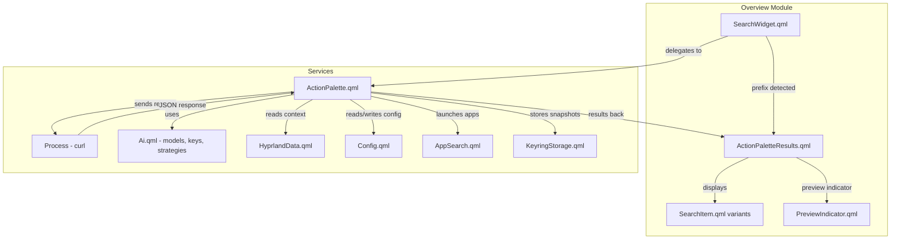
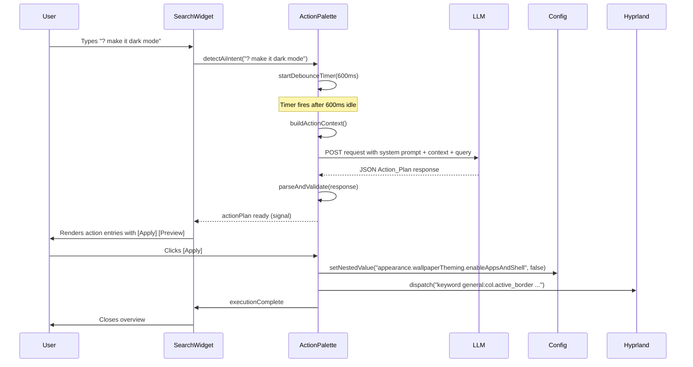

# Design Document: AI Action Palette

## Overview

The AI Action Palette extends the existing overview/launcher search with a new AI-powered mode that transforms natural-language queries into structured desktop actions. When the user types a configurable prefix (default `?`) followed by a query, the system bypasses normal search results (apps, clipboard, emoji, math, commands, web) and instead sends the query to the configured LLM with a structured-output system prompt. The LLM returns a JSON `Action_Plan` containing proposed operations that are validated, rendered as launcher-style entries, and executable with preview/apply controls.

The design integrates directly into the existing `SearchWidget.qml` model computation, reuses the `Ai.qml` service infrastructure for API communication, and leverages `Config.setNestedValue` for configuration mutations. A new `ActionPalette` service handles request orchestration, parsing, validation, execution, and preview state management.

### Key Design Decisions

1. **Service-based architecture**: A new singleton `ActionPalette.qml` service manages all AI palette state and logic, keeping `SearchWidget.qml` lean. The search widget detects the prefix and delegates to the service.
2. **Non-streaming requests**: Unlike the sidebar chat (which streams), the action palette uses a single non-streaming request with a 30-second timeout, since we need the complete JSON response to validate and display structured actions.
3. **Reuse of API strategy infrastructure**: The existing `ApiStrategy` pattern (Gemini/OpenAI/Mistral) is reused, but with a separate `Process` instance and custom system prompt — no interference with sidebar chat state.
4. **Preview via in-memory config mutation**: Preview mode calls `Config.setNestedValue` (which updates the runtime QML object tree) without triggering the `FileView.writeAdapter()` persistence. A snapshot-restore pattern provides rollback.

## Architecture



### Data Flow



## Components and Interfaces

### New Files

| File | Type | Purpose |
|------|------|---------|
| `services/ActionPalette.qml` | Singleton Service | Core state machine: request lifecycle, parsing, validation, execution, preview |
| `modules/overview/ActionPaletteResults.qml` | QML Component | UI delegate for rendering action plan results in the search list |
| `modules/overview/PreviewIndicator.qml` | QML Component | Floating bar shown during preview mode with Commit/Revert buttons |
| `modules/overview/ActionApprovalDialog.qml` | QML Component | Shell command approval prompt (consistent with sidebar's existing gate) |

### Modified Files

| File | Change |
|------|--------|
| `modules/common/Config.qml` | Add `search.prefix.ai` (default `"?"`) and `search.aiDebounceMs` (default `600`) to `JsonObject search` |
| `modules/overview/SearchWidget.qml` | Add AI prefix detection branch in `ScriptModel.values`, delegate to `ActionPalette` service |
| `services/qmldir` | Register `ActionPalette` singleton |

### ActionPalette Service Interface

```qml
// services/ActionPalette.qml
Singleton {
    id: root

    // === State ===
    property int state: ActionPalette.Idle
    // States: Idle, Debouncing, Loading, Ready, Executing, Previewing, Error
    enum State { Idle, Debouncing, Loading, Ready, Executing, Previewing, Error }

    property var actionPlan: null        // Parsed Action_Plan object or null
    property string errorMessage: ""     // Human-readable error
    property bool canRetry: false        // Whether retry is available
    property string lastQuery: ""        // Last submitted query text

    // Preview state
    property var configSnapshot: null    // Captured config state before preview
    property bool previewActive: false

    // === Signals ===
    signal actionPlanReady()
    signal executionComplete()
    signal executionFailed(string actionType, int index, string reason)
    signal previewStarted()
    signal previewEnded()
    signal approvalRequired(string command, int actionIndex)

    // === Public API ===
    function submitQuery(queryText: string): void
    function cancelRequest(): void
    function retry(): void
    function applyPlan(): void
    function previewPlan(): void
    function commitPreview(): void
    function revertPreview(): void
    function approveCommand(actionIndex: int): void
    function rejectCommand(): void

    // === Internal ===
    function buildActionContext(): object
    function buildSystemPrompt(): string
    function parseResponse(responseText: string): object
    function validateActionPlan(plan: object): object
    function validateAction(action: object): object
    function executeAction(action: object, index: int): bool
    function captureConfigSnapshot(): object
    function restoreConfigSnapshot(snapshot: object): void
    function getNestedValue(key: string): var
}
```

### Action_Plan Schema

```json
{
    "summary": "string (max 200 chars from LLM, displayed truncated to 120)",
    "actions": [
        {
            "type": "config.set",
            "key": "appearance.transparency",
            "value": true
        },
        {
            "type": "shell.exec",
            "command": "hyprctl keyword general:gaps_out 5"
        },
        {
            "type": "hyprland.dispatch",
            "dispatcher": "workspace",
            "args": "3"
        },
        {
            "type": "app.launch",
            "id": "org.kde.dolphin"
        }
    ]
}
```

### SearchWidget Integration Point

The existing `ScriptModel.values` computation in `SearchWidget.qml` gains a new early-return branch:

```qml
values: {
    if (root.searchingText == "") return [];

    // AI Action Palette — highest priority prefix check
    const aiPrefix = Config.options.search.prefix.ai;
    if (root.searchingText.startsWith(aiPrefix)) {
        const afterPrefix = root.searchingText.slice(aiPrefix.length);
        if (afterPrefix.length === 0 || afterPrefix.trim().length === 0) {
            // Show placeholder hint
            return [{
                name: Translation.tr("Type a natural-language request..."),
                type: Translation.tr("AI Action"),
                materialSymbol: "auto_awesome",
                execute: () => {}
            }];
        }
        if (afterPrefix.startsWith(" ") && afterPrefix.trim().length > 0) {
            // Delegate to ActionPalette service — return its current results
            return ActionPalette.currentResults;
        }
    }

    // ... existing prefix checks (clipboard, emojis) and app search ...
}
```

## Data Models

### ActionPlan (parsed result)

```javascript
{
    summary: String,          // max 500 chars (validated)
    actions: [ActionItem],    // 0-50 items (validated)
    raw: String               // original JSON string for round-trip
}
```

### ActionItem (individual action)

```javascript
{
    type: String,             // "config.set" | "shell.exec" | "hyprland.dispatch" | "app.launch"
    valid: Boolean,           // passes schema validation
    warning: String | null,   // non-null if unrecognized type or missing params
    // Type-specific fields:
    key: String,              // config.set
    value: Any,               // config.set
    currentValue: Any | undefined, // config.set — looked up at display time
    command: String,          // shell.exec
    dispatcher: String,       // hyprland.dispatch
    args: String,             // hyprland.dispatch
    id: String                // app.launch
}
```

### ConfigSnapshot (for preview/rollback)

```javascript
{
    entries: [
        { key: "appearance.transparency", previousValue: false },
        { key: "bar.borderless", previousValue: true }
    ]
}
```

### Display Results Model

The `ActionPalette.currentResults` property returns a list compatible with the existing `SearchItem` delegate format:

```javascript
[
    // Summary entry (index 0)
    {
        name: "Enable dark mode with transparency",  // truncated to 120 chars
        type: "AI Action Plan",
        materialSymbol: "auto_awesome",
        clickActionName: "",
        execute: () => {},
        actions: [
            { name: "Apply", icon: "play_arrow", execute: () => ActionPalette.applyPlan() },
            { name: "Preview", icon: "visibility", execute: () => ActionPalette.previewPlan() }
        ]
    },
    // Per-action entries
    {
        name: "appearance.transparency: false → true",
        type: "config.set",
        materialSymbol: "settings",
        execute: () => {}
    },
    // ...
]
```

## Correctness Properties

*A property is a characteristic or behavior that should hold true across all valid executions of a system — essentially, a formal statement about what the system should do. Properties serve as the bridge between human-readable specifications and machine-verifiable correctness guarantees.*

### Property 1: AI Prefix Classification

*For any* search input string and any valid AI prefix configuration (1-3 non-whitespace characters), the classifier SHALL identify the input as an AI intent if and only if the input starts with the prefix followed by a space and at least one non-whitespace character. When the AI prefix conflicts with another search prefix, AI classification SHALL take priority.

**Validates: Requirements 1.1, 1.5**

### Property 2: Prefix Configuration Validation

*For any* string value, the `search.prefix.ai` validator SHALL accept the value if and only if it is 1 to 3 characters in length and is not composed entirely of whitespace.

**Validates: Requirements 1.2**

### Property 3: Local-Only Policy Gate

*For any* model endpoint URL and `policies.ai` value of `2`, the policy gate SHALL block the request if and only if the endpoint does not contain the substring "localhost".

**Validates: Requirements 2.5**

### Property 4: Action_Plan Round-Trip

*For any* valid Action_Plan object (with summary ≤ 500 characters and 0-50 valid actions), serializing to JSON then parsing back SHALL produce a deeply equal object.

**Validates: Requirements 3.5, 3.1**

### Property 5: Action Schema Validation

*For any* JSON object presented as a Proposed_Action, the validator SHALL mark it as valid if and only if it has a `type` field matching one of `["config.set", "shell.exec", "hyprland.dispatch", "app.launch"]` and contains all required parameters for that type (`config.set` requires `key` and `value`; `shell.exec` requires `command`; `hyprland.dispatch` requires `dispatcher` and `args`; `app.launch` requires `id`).

**Validates: Requirements 3.3, 3.4**

### Property 6: Summary Truncation

*For any* summary string, the displayed text SHALL equal the original if it is 120 characters or fewer, and SHALL equal the first 120 characters followed by "…" if it exceeds 120 characters.

**Validates: Requirements 4.1**

### Property 7: Action Display Completeness

*For any* valid Proposed_Action, the rendered display string SHALL contain: for `config.set` the key and proposed value; for `shell.exec` the command string; for `hyprland.dispatch` the dispatcher and args; for `app.launch` the app identifier.

**Validates: Requirements 4.2**

### Property 8: Sequential Execution Order

*For any* Action_Plan with N actions, execution SHALL process actions at indices 0 through N-1 in strictly ascending order, and no action at index i+1 SHALL begin before action at index i completes or fails.

**Validates: Requirements 5.1**

### Property 9: Config Rollback on Failure

*For any* Action_Plan containing `config.set` actions where action at index K fails, all `config.set` actions at indices < K SHALL have their previous values captured, and invoking undo SHALL restore each key to its captured previous value.

**Validates: Requirements 5.8**

### Property 10: Preview Filters Only config.set

*For any* Action_Plan containing a mix of action types, activating preview SHALL apply only actions where `type === "config.set"`, and the count of applied changes SHALL equal the count of `config.set` actions in the plan.

**Validates: Requirements 6.1**

### Property 11: Preview Revert Restores State

*For any* set of `config.set` actions applied during preview, reverting (whether via explicit [Revert], overview close, or failure) SHALL restore every modified config key to its exact pre-preview value.

**Validates: Requirements 6.4, 6.5, 6.6**

### Property 12: Debounce Configuration Validation

*For any* value assigned to `search.aiDebounceMs`, the effective debounce duration SHALL be the assigned value if it is an integer in [100, 5000], otherwise it SHALL be 600.

**Validates: Requirements 7.4, 7.5**

## Error Handling

### Request Errors

| Error | Detection | User-Visible Behavior |
|-------|-----------|----------------------|
| Network failure | curl exit code ≠ 0, no JSON output | "Request failed — check your network connection" + [Retry] |
| Timeout (30s) | Timer expires, process still running | Kill process, "Request timed out" + [Retry] |
| Invalid JSON | `JSON.parse` throws | "LLM returned malformed response" + [Retry] |
| Schema mismatch | Missing `summary` or `actions` not array | "Response doesn't match expected format" + [Retry] |
| AI disabled (policies.ai = 0) | Config check before request | "AI is disabled by policies.ai configuration" |
| Local-only policy violation | Endpoint check | "Online models are disallowed by policies.ai configuration" |
| No API key | `Ai.currentModelHasApiKey` is false | "Set an API key via /key in the AI sidebar" |
| No model selected | `Ai.currentModelId` empty/invalid | "Select a model in the AI sidebar" |

### Execution Errors

| Error | Detection | Recovery |
|-------|-----------|----------|
| Config key write failure | `setNestedValue` exception | Stop execution, offer undo of prior changes |
| App not found | No desktop entry matches `id` | Mark action failed, stop, offer undo |
| Shell command rejected | User clicks [Reject] | Stop execution, display cancellation message |
| Shell command timeout (30s) | Timer expires | Kill process, mark failed, offer undo |
| Shell command non-zero exit | Process exit code ≠ 0 | Mark failed, stop, offer undo |

### Preview Errors

| Error | Detection | Recovery |
|-------|-----------|----------|
| Config.set fails during preview | Exception from setNestedValue | Revert all already-applied preview changes, exit preview, show error |
| Overview closed during preview | `GlobalStates.overviewOpen` becomes false | Auto-revert via Connections handler |

## Testing Strategy

### Property-Based Tests (fast-check)

The project will use **fast-check** for JavaScript/TypeScript property-based testing of the pure logic functions extracted from the QML service. The parsing, validation, prefix detection, truncation, and config snapshot logic can be isolated into a testable JS module.

- **Library**: fast-check (JavaScript PBT framework)
- **Minimum iterations**: 100 per property
- **Tag format**: `Feature: ai-action-palette, Property {N}: {title}`

Properties to implement as PBT:
1. AI prefix classification
2. Prefix config validation
3. Local-only policy gate
4. Action_Plan round-trip
5. Action schema validation
6. Summary truncation
7. Action display completeness
8. Sequential execution order (model-based)
9. Config rollback on failure
10. Preview filters only config.set
11. Preview revert restores state
12. Debounce config validation

### Unit Tests (example-based)

- Placeholder hint display when prefix-only is typed (1.3)
- Action context assembly contains required fields (2.3)
- Policies.ai = 0 blocks requests (2.4)
- Empty actions array shows summary without buttons (3.6, 4.5)
- Config.set transition display format `old → new` (4.3)
- New config key indicator (4.4)
- Shell.exec approval prompt appears (5.3)
- Rejection stops execution (5.4)
- Successful completion closes overview (5.10)
- Preview floating indicator appears (6.2)
- Commit persists changes (6.3)
- No API key shows guidance message (8.3)
- Invalid model shows guidance message (8.6)

### Integration Tests

- Full request cycle with mocked LLM response
- Debounce timer fires correctly after idle period (7.1)
- In-flight request cancellation on text change (7.2)
- Request cancellation on prefix removal (7.3)
- Model change propagates to next request (8.5)
- Config prefix change takes effect immediately (1.4)
- Timeout triggers process kill (2.6, 5.9)
