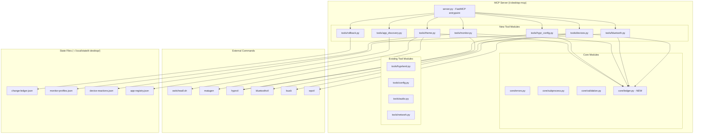

# Design Document: AI Desktop Control

## Overview

This feature extends the ii-desktop-mcp Python server with seven new tool modules that give the AI comprehensive desktop environment control: Material You theming, Hyprland runtime configuration, disaster recovery (rollback), monitor layout management, Bluetooth device management, application integration discovery, and device awareness with event-driven reactions.

All mutating tools share a central **Change Ledger** module that records reversible state changes, enabling a unified rollback system. The design preserves the existing `register(mcp)` pattern used by current tool modules, adds a new `core/ledger.py` shared module, and introduces no changes to the Quickshell McpClient.qml dispatch pipeline (the new tools are discovered automatically via MCP tool discovery).

### Design Goals

- **Safe experimentation**: Every mutation is recorded and reversible via the Change Ledger
- **Consistent patterns**: New modules follow the same `register(mcp: FastMCP)` pattern as existing tools (network.py, config.py, etc.)
- **No arbitrary execution**: Tools call specific binaries (hyprctl, bluetoothctl, switchwall.sh, matugen) via the existing `run_command` helper — never `shell=True`
- **Minimal coupling**: Each tool module is self-contained; shared state flows only through the ledger
- **Rate limiting**: Theme changes are throttled to prevent resource exhaustion

## Architecture



### Key Architectural Decisions

1. **Shared Ledger Module (`core/ledger.py`)**: Rather than each tool managing its own undo state, a single `ChangeLedger` class handles persistence, FIFO eviction, and entry lookup. Tool modules import it and call `ledger.record(...)` before applying mutations.

2. **Separate `tools/hypr_config.py` from existing `tools/hyprland.py`**: The existing module wraps raw hyprctl commands (list_monitors, dispatch_command, set_keyword). The new module adds higher-level tools with validation, denylists, and ledger integration (hypr_set_option, hypr_add_window_rule, hypr_set_animation). This avoids breaking existing tool behavior.

3. **Rate Limiter for Theme Tools**: A simple token-bucket in `tools/theme.py` enforces the 5-per-minute limit. No external dependency needed.

4. **Device Reactions via asyncio Tasks**: The `devices.py` module spawns a background polling loop (every 5 seconds) that compares device state against the previous snapshot, triggering configured reaction tools when changes are detected.

5. **Bluetooth via `bluetoothctl` subprocess**: Rather than D-Bus bindings (which add a heavy dependency), we use `bluetoothctl` in scripted mode. This matches the project's existing pattern of subprocess-based tool integration.

## Components and Interfaces

### core/ledger.py — Change Ledger

```python
class ChangeLedger:
    """Persistent rolling history of reversible changes."""
    
    LEDGER_PATH = Path("~/.local/state/ii-desktop/change-ledger.json")
    MAX_ENTRIES = 50
    
    async def record(self, tool_name: str, params: dict, previous_state: dict, description: str) -> str:
        """Record a change entry. Returns the UUID of the new entry."""
    
    async def get_entries(self) -> list[ChangeEntry]:
        """Return all entries in reverse chronological order."""
    
    async def get_by_id(self, entry_id: str) -> ChangeEntry | None:
        """Look up a specific entry by UUID."""
    
    async def remove(self, entry_id: str) -> bool:
        """Remove an entry after successful rollback."""
    
    async def remove_many(self, entry_ids: list[str]) -> None:
        """Remove multiple entries (batch rollback)."""
```

### tools/theme.py — Material You Theming

| Tool | Parameters | Returns |
|------|-----------|---------|
| `theme_apply_wallpaper` | `path: str`, `scheme?: str` | Success status, applied palette summary |
| `theme_apply_color` | `color: str`, `scheme?: str` | Success status, applied palette summary |
| `theme_get_current` | (none) | Current palette, wallpaper path, scheme |

Internally calls `switchwall.sh --image <path> --type <scheme>` or `switchwall.sh --color <hex> --type <scheme>`. Reads current state from `~/.config/illogical-impulse/config.json` and `~/.local/state/quickshell/user/generated/colors.json`.

### tools/hypr_config.py — Hyprland Runtime Configuration

| Tool | Parameters | Returns |
|------|-----------|---------|
| `hypr_set_option` | `keyword: str`, `value: str` | Previous value, new value |
| `hypr_get_option` | `keyword: str` | Current runtime value |
| `hypr_add_window_rule` | `rule: str`, `match: str` | Confirmation |
| `hypr_remove_window_rule` | `rule: str`, `match: str` | Confirmation |
| `hypr_set_animation` | `name: str`, `enabled: bool`, `speed?: float`, `curve?: str`, `style?: str` | Previous config, new config |

The keyword denylist (`DANGEROUS_KEYWORDS`) blocks: `exec`, `exec-once`, `bind`, `unbind`, `plugin`, `source`.

### tools/rollback.py — Disaster Recovery

| Tool | Parameters | Returns |
|------|-----------|---------|
| `rollback_last` | `count?: int (1-50, default 1)` | List of rolled-back entries |
| `rollback_by_id` | `id: str` | Rolled-back entry details |
| `rollback_list` | (none) | All ledger entries (id, timestamp, description, tool) |

The `RollbackEngine` maps each tool name to an inverse operation function. It does NOT record rollbacks as new ledger entries.

### tools/monitor.py — Monitor Layout Control

| Tool | Parameters | Returns |
|------|-----------|---------|
| `monitor_list` | (none) | JSON array of monitor info |
| `monitor_set` | `name: str`, `resolution?: str`, `refresh_rate?: float`, `position?: str`, `scale?: float` | Previous and new config |
| `monitor_save_profile` | `profile_name: str` | Confirmation |
| `monitor_load_profile` | `profile_name: str` | Applied profile details |

### tools/bluetooth.py — Bluetooth Device Management

| Tool | Parameters | Returns |
|------|-----------|---------|
| `bluetooth_status` | (none) | Adapter state, paired devices list |
| `bluetooth_scan` | `duration?: int (default 10, max 30)` | Discovered devices |
| `bluetooth_connect` | `address: str` | Connection result |
| `bluetooth_disconnect` | `address: str` | Disconnection result |
| `bluetooth_remove` | `address: str` | Removal result |

### tools/app_discovery.py — Application Integration Discovery

| Tool | Parameters | Returns |
|------|-----------|---------|
| `apps_discover_interfaces` | `rescan?: bool (default false)` | Full app registry |
| `apps_get_interface` | `app_name: str` | Single app's integration details |

### tools/devices.py — Device Awareness and Reactions

| Tool | Parameters | Returns |
|------|-----------|---------|
| `devices_list` | `category?: str (default "all")` | Device registry by category |
| `devices_set_reaction` | `event: str`, `action: str`, `action_args: dict` | Confirmation |
| `devices_list_reactions` | (none) | All configured reactions |
| `devices_remove_reaction` | `event: str` | Confirmation |

## Data Models

### ChangeEntry (core/ledger.py)

```python
@dataclass
class ChangeEntry:
    id: str              # UUID4
    timestamp: str       # ISO 8601
    tool_name: str       # e.g. "theme_apply_wallpaper"
    params: dict         # Parameters passed to the tool
    previous_state: dict # Sufficient state to reverse the change
    description: str     # Human-readable summary
```

**JSON representation** (`~/.local/state/ii-desktop/change-ledger.json`):
```json
{
  "entries": [
    {
      "id": "550e8400-e29b-41d4-a716-446655440000",
      "timestamp": "2025-01-15T14:30:00Z",
      "tool_name": "theme_apply_wallpaper",
      "params": {"path": "/home/user/Pictures/forest.jpg", "scheme": "tonalSpot"},
      "previous_state": {
        "wallpaper_path": "/home/user/Pictures/ocean.jpg",
        "scheme": "vibrant"
      },
      "description": "Changed wallpaper to forest.jpg with tonalSpot scheme"
    }
  ]
}
```

### MonitorProfile (`~/.local/state/ii-desktop/monitor-profiles.json`)

```json
{
  "profiles": {
    "desk-setup": {
      "monitors": [
        {
          "name": "DP-1",
          "resolution": "2560x1440",
          "refresh_rate": 144.0,
          "position": "0x0",
          "scale": 1.0
        },
        {
          "name": "HDMI-A-1",
          "resolution": "1920x1080",
          "refresh_rate": 60.0,
          "position": "2560x0",
          "scale": 1.0
        }
      ],
      "saved_at": "2025-01-15T14:30:00Z"
    }
  }
}
```

### AppIntegrationRegistry (`~/.local/state/ii-desktop/app-registry.json`)

```json
{
  "last_scan": "2025-01-15T14:30:00Z",
  "applications": [
    {
      "name": "Firefox",
      "desktop_entry_id": "firefox",
      "interfaces": [
        {
          "type": "cli",
          "details": {"command": "firefox", "args": ["--new-tab"]}
        }
      ],
      "operations": ["Open URL", "New tab", "New window"]
    },
    {
      "name": "Spotify",
      "desktop_entry_id": "spotify",
      "interfaces": [
        {
          "type": "dbus",
          "details": {
            "bus_name": "org.mpris.MediaPlayer2.spotify",
            "object_path": "/org/mpris/MediaPlayer2"
          }
        }
      ],
      "operations": ["Play", "Pause", "Next", "Previous", "Set volume"]
    }
  ]
}
```

### DeviceReactions (`~/.local/state/ii-desktop/device-reactions.json`)

```json
{
  "reactions": {
    "monitor_connected": {
      "action": "monitor_load_profile",
      "action_args": {"profile_name": "desk-setup"}
    },
    "bluetooth_connected": {
      "action": "audio_set_volume",
      "action_args": {"target": "@DEFAULT_AUDIO_SINK@", "volume": 50}
    }
  }
}
```

### Inverse Operations Map (tools/rollback.py)

Each tool name maps to an inverse function:

| Tool | Inverse Operation |
|------|-------------------|
| `theme_apply_wallpaper` | Call switchwall with `previous_state.wallpaper_path` and `previous_state.scheme` |
| `theme_apply_color` | Call switchwall with `previous_state.wallpaper_path` (restores wallpaper-based theme) |
| `hypr_set_option` | `hyprctl keyword <keyword> <previous_state.value>` |
| `hypr_add_window_rule` | `hyprctl keyword windowrulev2 unset,<match>` |
| `hypr_set_animation` | `hyprctl keyword animation <previous_state.animation_string>` |
| `monitor_set` | `hyprctl keyword monitor <previous_state.monitor_string>` |
| `monitor_load_profile` | Re-apply `previous_state.monitor_configs` for each monitor |
| `bluetooth_connect` | `bluetoothctl disconnect <address>` |
| `bluetooth_disconnect` | `bluetoothctl connect <address>` |
| `config_set` | Write `previous_state.value` back to config key |
| `audio_set_volume` | Set volume to `previous_state.volume` and mute to `previous_state.mute` |

### Security Constraints

- **Keyword denylist** (hypr_config.py): `{"exec", "exec-once", "bind", "unbind", "plugin", "source"}`
- **Path validation** (theme.py): Rejects `..` traversal, symlinks outside `$HOME`, non-image extensions
- **Allowed image extensions**: `.png`, `.jpg`, `.jpeg`, `.webp`, `.bmp`, `.gif`, `.tiff`
- **Hex color validation**: Must match `^#[0-9A-Fa-f]{6}$`
- **Rate limiting** (theme.py): Token bucket — 5 tokens, 1 token per 12 seconds refill
- **No Bluetooth secrets**: PIN/pairing keys are never included in tool responses
- **Monitor validation**: Resolution/refresh checked against `hyprctl monitors -j` available modes


## Correctness Properties

*A property is a characteristic or behavior that should hold true across all valid executions of a system — essentially, a formal statement about what the system should do. Properties serve as the bridge between human-readable specifications and machine-verifiable correctness guarantees.*

### Property 1: Ledger records all mutations before returning

*For any* invocation of a mutating tool (theme_apply_wallpaper, theme_apply_color, hypr_set_option, hypr_add_window_rule, hypr_set_animation, monitor_set, monitor_load_profile, bluetooth_connect, bluetooth_disconnect, config_set, audio_set_volume), the Change_Ledger SHALL contain a new entry with the tool name, parameters, and captured previous state, and this entry SHALL be written before the mutation is applied to the system.

**Validates: Requirements 1.8, 2.2, 2.5, 2.8, 4.3, 5.9, 8.1**

### Property 2: Ledger FIFO eviction at capacity

*For any* sequence of N change recordings where N > 50, the Change_Ledger SHALL contain exactly 50 entries, the entries SHALL be the 50 most recent by timestamp, and the oldest entries SHALL have been evicted.

**Validates: Requirements 3.2**

### Property 3: Change entry structural completeness

*For any* recorded Change_Entry, it SHALL contain all required fields: a valid UUID4 `id`, an ISO 8601 `timestamp`, a non-empty `tool_name`, a `params` dict, a `previous_state` dict with at least one key, and a non-empty `description` string.

**Validates: Requirements 3.3**

### Property 4: Rollback reversal round-trip

*For any* Change_Entry recorded in the ledger, performing a rollback (by ID or by last-N) SHALL restore the system to the state captured in `previous_state`. Specifically: if the tool was `hypr_set_option`, then after rollback `hyprctl getoption` returns the previous value; if the tool was `theme_apply_wallpaper`, the wallpaper path is restored.

**Validates: Requirements 3.4, 3.5, 3.6, 3.7, 8.2**

### Property 5: Rollback removes entries on success

*For any* successful rollback operation (rollback_last or rollback_by_id), the targeted Change_Entry(ies) SHALL be removed from the ledger, and the ledger size SHALL decrease by the number of entries rolled back.

**Validates: Requirements 3.5, 3.7**

### Property 6: Failed rollback preserves entries

*For any* rollback operation where the inverse command fails (returns an error), the Change_Entry SHALL remain in the ledger unchanged, and the error SHALL be reported to the caller.

**Validates: Requirements 3.8**

### Property 7: Rollbacks are not recorded as new entries

*For any* rollback operation (regardless of success or failure), the ledger SHALL NOT gain new entries as a result of the rollback itself.

**Validates: Requirements 3.10**

### Property 8: Non-existent identifier returns not_found

*For any* tool invocation that references a non-existent identifier (rollback ID not in ledger, monitor name not connected, profile name not saved, app name not in registry), the tool SHALL return an error response with code "not_found".

**Validates: Requirements 3.11, 4.5, 4.8, 6.6**

### Property 9: Invalid hex color rejection

*For any* string that does not match the pattern `^#[0-9A-Fa-f]{6}$`, the `theme_apply_color` tool SHALL return an error response with code "validation_error".

**Validates: Requirements 1.6**

### Property 10: Path traversal and extension validation

*For any* file path containing ".." sequences OR having an extension not in {.png, .jpg, .jpeg, .webp, .bmp, .gif, .tiff}, the `theme_apply_wallpaper` tool SHALL reject the path before attempting to use it.

**Validates: Requirements 9.2, 9.3**

### Property 11: Hyprland keyword denylist enforcement

*For any* keyword string that starts with or contains a segment matching the denylist set {"exec", "exec-once", "bind", "unbind", "plugin", "source"}, the `hypr_set_option` tool SHALL return an error with code "validation_error" and SHALL NOT invoke hyprctl.

**Validates: Requirements 9.5**

### Property 12: Theme rate limiting

*For any* sequence of more than 5 theme change requests (theme_apply_wallpaper or theme_apply_color) within a 60-second window, the requests beyond the 5th SHALL be rejected with a rate-limit error, and no subprocess SHALL be spawned for the rejected requests.

**Validates: Requirements 9.8**

### Property 13: Monitor command construction merges parameters

*For any* monitor_set invocation where some parameters are specified and others are omitted, the constructed `hyprctl keyword monitor` command SHALL use the specified parameters for provided values and the current runtime values for omitted parameters, producing a complete valid monitor string.

**Validates: Requirements 4.4**

### Property 14: Bluetooth response sanitization

*For any* bluetoothctl output that contains PIN codes, link keys, or pairing keys (matching patterns like "Key:", "PIN:", or hex key strings in info output), the tool response SHALL NOT contain those sensitive values.

**Validates: Requirements 9.4**

### Property 15: Device list category filtering

*For any* valid category parameter ("monitors", "audio", "input", "usb", "bluetooth"), the `devices_list` tool SHALL return only devices belonging to that category. When category is "all", all devices SHALL be returned.

**Validates: Requirements 7.1**

### Property 16: Device reaction persistence round-trip

*For any* reaction configured via `devices_set_reaction`, listing reactions via `devices_list_reactions` SHALL include that reaction with its event, action, and action_args intact. After `devices_remove_reaction` for that event, listing SHALL no longer include it.

**Validates: Requirements 7.3, 7.5, 7.6**

### Property 17: Corrupt ledger recovery

*For any* malformed JSON content in the change-ledger.json file, the ledger module SHALL: move the corrupt file to a `.bak` suffix, log a warning, and create a fresh empty ledger — without crashing or losing the ability to record new entries.

**Validates: Requirements 8.5**

### Property 18: Ledger ordering is reverse chronological

*For any* set of entries in the Change_Ledger, `rollback_list` SHALL return them sorted by timestamp descending (newest first).

**Validates: Requirements 3.9**

### Property 19: Monitor resolution validation against available modes

*For any* monitor_set invocation specifying a resolution or refresh_rate, the tool SHALL verify the combination exists in the monitor's available modes (from `hyprctl monitors -j`). If not available, it SHALL return a validation_error without applying changes.

**Validates: Requirements 9.6**

## Error Handling

### Error Response Patterns

All tools use the existing `error_response(code, message, details?)` pattern from `core/errors.py`. Standard codes:

| Code | When Used |
|------|-----------|
| `not_found` | Monitor name not connected, profile not saved, app not in registry, rollback ID missing, image path not found |
| `validation_error` | Invalid hex color, denylisted keyword, path traversal, unsupported resolution, rate limit exceeded |
| `unavailable` | Bluetooth adapter off, external command not in PATH |
| `internal_error` | Subprocess failure, bluetoothctl error, JSON write failure |
| `timeout` | Command exceeds timeout (5s default, 30s for BT scan) |

### Graceful Degradation

- **Corrupt ledger**: Backed up to `.bak`, fresh ledger started — no data loss for future operations
- **Missing state directory**: Created on first write (`os.makedirs(exist_ok=True)`)
- **Failed reaction dispatch**: Logged via `logger.warning()`, notification emitted, reaction stays configured
- **Partial app discovery**: Returns whatever was found before timeout, with `partial: true` flag

### Rollback Error Handling

When an inverse operation fails during multi-entry rollback (`rollback_last` with count > 1):
1. Stop processing at the failed entry
2. Return which entries were successfully rolled back and which failed
3. Successfully rolled-back entries are removed from the ledger
4. The failed entry (and any unprocessed entries) remain in the ledger

## Testing Strategy

### Property-Based Testing

This feature is well-suited to property-based testing. The core logic (ledger management, input validation, command construction, rate limiting) is pure or near-pure and benefits from wide input coverage.

**Library**: [Hypothesis](https://hypothesis.readthedocs.io/) (Python) — already available in the project's test environment (`.hypothesis/` directory exists).

**Configuration**: Minimum 100 examples per property test (`@settings(max_examples=100)`).

**Tag format**: Each test is tagged with a comment referencing the design property:
```python
# Feature: ai-desktop-control, Property 2: Ledger FIFO eviction at capacity
```

### Test Organization

```
tests/
├── test_ledger.py           # Properties 1-8, 17, 18
├── test_theme_validation.py # Properties 9, 10, 12
├── test_hypr_config.py      # Property 11, 13
├── test_rollback.py         # Properties 4, 5, 6, 7
├── test_monitor.py          # Property 13, 19
├── test_bluetooth.py        # Property 14
├── test_devices.py          # Properties 15, 16
└── test_integration.py      # Example-based integration tests
```

### Unit Tests (Example-Based)

Complement property tests for:
- Specific command construction examples (switchwall flags, hyprctl keyword syntax)
- Bluetooth scan command with explicit duration
- App discovery parsing of specific D-Bus/CLI output formats
- Error message content verification
- Edge cases: empty ledger rollback, rate limiter token refill timing

### Integration Tests

For behaviors requiring real subprocess interaction:
- App discovery D-Bus enumeration (requires session bus)
- Device polling loop lifecycle (start/stop)
- End-to-end theme change with mock filesystem

### Mocking Strategy

- **Subprocess calls**: Mock `run_command` from `core/subprocess.py` to test logic without side effects
- **Filesystem**: Use `tmp_path` fixture for ledger/profile/reaction files
- **Time**: Mock `time.time()` for rate limiter tests
- **hyprctl output**: Fixture-based JSON responses for monitor/option parsing

