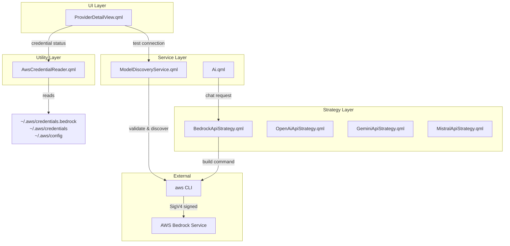

# Design Document: Bedrock Provider

## Overview

This design adds AWS Bedrock as a first-class AI provider in the Quickshell AI system. Bedrock is architecturally distinct from existing providers because it cannot use curl with simple bearer tokens — instead it delegates all API calls to the `aws` CLI tool, which handles SigV4 request signing internally. This means the integration touches several layers:

1. A new `BedrockApiStrategy` that constructs `aws bedrock-runtime converse-stream` commands instead of curl commands
2. A branching path in `Ai.qml`'s requester that uses the `aws` CLI process instead of curl when `api_format === "bedrock"`
3. Bedrock-specific validation and model discovery in `ModelDiscoveryService` using `aws bedrock list-foundation-models`
4. A credentials file reader that detects `~/.aws/credentials.bedrock` or `~/.aws/credentials` and reads region from `~/.aws/config`
5. A custom UI section in `ProviderDetailView` showing credential status, region, and a "Test Connection" button instead of an API key text field

The Converse API stream format differs from OpenAI's SSE format: it emits newline-delimited JSON objects with event types like `messageStart`, `contentBlockDelta`, `messageStop`, and `metadata`.

## Architecture



### Key Architectural Decisions

**Decision 1: `auth_type: "aws_cli"` as a new auth category**

The existing `auth_type` values (`bearer`, `x-api-key`, `query_param`, `none`) all map to HTTP header construction for curl. Bedrock's SigV4 signing is handled entirely by the `aws` CLI, so a new sentinel value `"aws_cli"` signals that authentication is delegated to the CLI tool rather than constructed by the application.

**Decision 2: Separate execution path in Ai.qml for Bedrock**

The existing `requester` Process builds a curl command string. Rather than trying to shoehorn `aws` CLI commands into the curl builder, the design adds a parallel `bedrockRequester` Process that runs `aws bedrock-runtime converse-stream`. The entry point (`makeRequest`) checks `api_format` and dispatches to the appropriate path.

**Decision 3: AwsCredentialReader as a reusable utility singleton**

Credential detection (file existence checks, parsing) is needed by both `ProviderDetailView` (to show status) and `ModelDiscoveryService` (to set `AWS_SHARED_CREDENTIALS_FILE`). A dedicated singleton avoids duplication and provides a single source of truth for AWS configuration state.

**Decision 4: Environment variable injection instead of config file manipulation**

The `AWS_SHARED_CREDENTIALS_FILE` environment variable tells the `aws` CLI which credentials file to use. This is cleaner than modifying the user's `~/.aws/credentials` and works with both the custom `credentials.bedrock` format and standard credentials.

## Components and Interfaces

### 1. BedrockApiStrategy.qml

**Location:** `configs/quickshell/services/ai/BedrockApiStrategy.qml`

Implements the `ApiStrategy` interface. Unlike other strategies that produce curl-compatible data, this strategy produces `aws` CLI command arguments.

```qml
import QtQuick

ApiStrategy {
    // Sentinel — not used for HTTP, signals CLI-based invocation
    function buildEndpoint(model: AiModel): string {
        return "aws-bedrock-converse";
    }

    // Returns the Converse API message format as a JS object
    function buildRequestData(model, messages, systemPrompt, temperature, tools) {
        // Convert messages to Bedrock Converse format:
        // { role: "user"|"assistant", content: [{ text: "..." }] }
        // System prompt goes in top-level "system" array, not in messages
    }

    // Not used for Bedrock — auth is via AWS_SHARED_CREDENTIALS_FILE env var
    function buildAuthorizationHeader(apiKeyEnvVarName): string {
        return "";
    }

    // Parses newline-delimited JSON events from converse-stream stdout
    function parseResponseLine(line, message) {
        // Handle: messageStart, contentBlockDelta, messageStop, metadata
    }

    function onRequestFinished(message) {
        return {};
    }

    function reset() {}
}
```

**Key behaviors:**
- `buildRequestData` converts the internal message array to Bedrock's format where each message's `content` is an array of content blocks: `[{"text": "..."}]`
- System prompt is excluded from messages and returned separately for the caller to pass as `--system`
- `parseResponseLine` handles the four event types from `converse-stream --output json`

### 2. AwsCredentialReader.qml (Singleton)

**Location:** `configs/quickshell/services/AwsCredentialReader.qml`

Detects and reads AWS credential files and region configuration.

```qml
pragma Singleton
import QtQuick
import Quickshell
import Quickshell.Io

Singleton {
    id: root

    // State properties
    property string credentialsFilePath: ""
    property bool credentialsDetected: false
    property string region: "us-west-2"
    property bool awsCliAvailable: false
    property string statusMessage: ""

    // Checks performed on component completion:
    // 1. Verify `aws` exists on PATH
    // 2. Check ~/.aws/credentials.bedrock existence
    // 3. Fall back to ~/.aws/credentials
    // 4. Parse ~/.aws/config for region
}
```

**File detection order:**
1. `~/.aws/credentials.bedrock` (preferred, project-specific two-line format)
2. `~/.aws/credentials` (standard AWS SDK format)

**Region resolution:**
1. Parse `~/.aws/config` for `[default]` profile's `region = <value>`
2. Default to `us-west-2` if not found

### 3. ModelDiscoveryService.qml Additions

**Changes to existing file:**

- Add `"bedrock"` entry to `providerConfigs` with `auth_type: "aws_cli"`, `requires_key: false`, `api_format: "bedrock"`
- Add `bedrockValidationProcess` Process component for `aws bedrock list-foundation-models --max-results 1`
- Add `bedrockDiscoveryProcess` Process component for full model listing
- Add `parseBedrockModelList(responseBody)` function that filters for ON_DEMAND + ACTIVE models
- Add `mapBedrockModelToAiModel(modelData)` function

**New provider config entry:**
```javascript
"bedrock": {
    name: "AWS Bedrock",
    icon: "aws-bedrock-symbolic",
    key_id: "bedrock",
    requires_key: false,
    auth_type: "aws_cli",
    api_format: "bedrock",
    supports_balance: false
}
```

**Bedrock-specific validation flow:**
Instead of calling `buildValidationCommand` (which builds curl), bedrock validation uses a dedicated Process:
```
aws bedrock list-foundation-models --max-results 1 --region <region> --output json
```
with `AWS_SHARED_CREDENTIALS_FILE` set in the process environment.

**Bedrock-specific discovery flow:**
```
aws bedrock list-foundation-models --region <region> --output json
```
Response parsing filters by:
- `inferenceTypesSupported` contains `"ON_DEMAND"`
- `modelLifecycle.status === "ACTIVE"`

### 4. Ai.qml Additions

**Changes to existing file:**

- Add `bedrockApiStrategy` Component property
- Register `"bedrock"` in the `apiStrategies` map
- Add `bedrockRequester` Process component that runs `aws bedrock-runtime converse-stream`
- Modify `requester.makeRequest()` to branch: if `api_format === "bedrock"`, delegate to `bedrockRequester`

**bedrockRequester Process:**
```qml
Process {
    id: bedrockRequester
    property AiMessageData message
    property ApiStrategy currentStrategy

    // Command built dynamically:
    // aws bedrock-runtime converse-stream
    //   --model-id <modelId>
    //   --messages '<json>'
    //   --system '<json>'
    //   --region <region>
    //   --output json
    //
    // Environment: AWS_SHARED_CREDENTIALS_FILE=<credPath>

    stdout: SplitParser {
        onRead: data => {
            // Parse each JSON event line via BedrockApiStrategy.parseResponseLine
        }
    }

    onExited: (exitCode, exitStatus) => {
        // exitCode 0 → mark complete
        // non-zero → append stderr as error, mark failed
    }
}
```

### 5. ProviderDetailView.qml Additions

**Changes to existing file:**

Add a Bedrock-specific section (visible when `config.auth_type === "aws_cli"`) that shows:
- Credential file path (read-only)
- Credential detection status (detected / not found with instructions)
- Region display (read-only)
- AWS CLI availability status
- "Test Connection" button (replaces API key input)

The existing API key input section remains hidden for Bedrock (`requires_key: false`).

### 6. Policy Integration

The existing `policies.ai` system in `Config.options.policies.ai`:
- `0` = AI disabled entirely → Bedrock hidden (same as all providers)
- `1` = Full mode → Bedrock visible
- `2` = Local-only → Bedrock hidden (it's a remote cloud service)

This is handled by the existing provider list filtering logic — Bedrock models don't have `localhost` in their endpoint, so the local-only check naturally excludes them.

## Data Models

### Bedrock Provider Config (in providerConfigs registry)

| Field | Value | Notes |
|-------|-------|-------|
| name | "AWS Bedrock" | Display name |
| icon | "aws-bedrock-symbolic" | SVG icon reference |
| key_id | "bedrock" | Provider identifier |
| requires_key | false | File-based auth, not API key |
| auth_type | "aws_cli" | New auth type for CLI delegation |
| api_format | "bedrock" | New format identifier |
| supports_balance | false | No credit balance API |

### AiModel properties for discovered Bedrock models

| Property | Source | Example |
|----------|--------|---------|
| name | `modelName` (formatted) | "Claude Sonnet 4" |
| icon | "aws-bedrock-symbolic" | — |
| description | "AWS Bedrock \| <modelId>" | "AWS Bedrock \| anthropic.claude-sonnet-4-20250514-v1:0" |
| endpoint | "aws-bedrock-converse" | Sentinel value |
| model | `modelId` from API | "anthropic.claude-sonnet-4-20250514-v1:0" |
| requires_key | false | — |
| key_id | "bedrock" | — |
| api_format | "bedrock" | — |

### Bedrock Converse API Message Format

**Input (to `converse-stream`):**
```json
{
  "messages": [
    { "role": "user", "content": [{ "text": "Hello" }] },
    { "role": "assistant", "content": [{ "text": "Hi there" }] }
  ],
  "system": [{ "text": "You are helpful." }]
}
```

**Output (from `converse-stream`, newline-delimited JSON):**
```
{"messageStart":{"role":"assistant"}}
{"contentBlockStart":{"contentBlockIndex":0,"start":{}}}
{"contentBlockDelta":{"contentBlockIndex":0,"delta":{"text":"Hello"}}}
{"contentBlockDelta":{"contentBlockIndex":0,"delta":{"text":" there!"}}}
{"contentBlockStop":{"contentBlockIndex":0}}
{"messageStop":{"stopReason":"end_turn"}}
{"metadata":{"usage":{"inputTokens":12,"outputTokens":5,"totalTokens":17},"metrics":{"latencyMs":234}}}
```

### AwsCredentialReader State

| Property | Type | Description |
|----------|------|-------------|
| credentialsFilePath | string | Absolute path to detected credentials file |
| credentialsDetected | bool | Whether a valid credentials file was found |
| region | string | AWS region (default: "us-west-2") |
| awsCliAvailable | bool | Whether `aws` binary is on PATH |
| statusMessage | string | Human-readable status for UI display |


## Correctness Properties

*A property is a characteristic or behavior that should hold true across all valid executions of a system — essentially, a formal statement about what the system should do. Properties serve as the bridge between human-readable specifications and machine-verifiable correctness guarantees.*

### Property 1: Model list parsing preserves model identity

*For any* valid `modelSummaries` JSON array where each entry has a `modelId` and `modelName` field, parsing and mapping to AiModel objects SHALL produce models where each `model` property exactly equals the source `modelId`, `api_format` is `"bedrock"`, `icon` is `"aws-bedrock-symbolic"`, and `endpoint` is `"aws-bedrock-converse"`.

**Validates: Requirements 4.2, 5.1, 5.2, 5.3, 5.5, 5.6**

### Property 2: Model list filtering retains only ON_DEMAND ACTIVE models

*For any* array of model summary objects with arbitrary `inferenceTypesSupported` arrays and `modelLifecycle.status` values, the filtered output SHALL contain only models where `inferenceTypesSupported` includes `"ON_DEMAND"` AND `modelLifecycle.status` equals `"ACTIVE"`, and no qualifying model SHALL be excluded.

**Validates: Requirements 4.3**

### Property 3: Model name formatting produces capitalized human-friendly names

*For any* string containing dashes, colons, or spaces, the `formatModelName` function SHALL produce output where each word is capitalized, dashes and colons are replaced with spaces, trailing "Latest" is removed, and parameter count suffixes (e.g., "7b") are formatted as "(7B)".

**Validates: Requirements 5.4**

### Property 4: buildRequestData produces valid Bedrock Converse message format

*For any* array of messages with `role` ("user" or "assistant") and non-empty `rawContent` strings, `buildRequestData` SHALL produce output where each message has `role` matching the input role and `content` is an array containing exactly one object `{"text": <rawContent>}`.

**Validates: Requirements 6.2**

### Property 5: System prompt is separated from message array

*For any* non-empty system prompt string and any messages array, `buildRequestData` SHALL return the system prompt in a top-level `system` field as `[{"text": <systemPrompt>}]`, and no element in the returned `messages` array SHALL have role `"system"`.

**Validates: Requirements 6.3**

### Property 6: Stream event parsing concatenates all delta text

*For any* sequence of valid Converse API event lines (including `messageStart`, `contentBlockDelta`, and `messageStop` events), calling `parseResponseLine` for each line in order SHALL result in `message.content` equaling the exact concatenation of all `contentBlockDelta.delta.text` values in the sequence, preserving order.

**Validates: Requirements 6.5, 10.2**

### Property 7: AWS region parsing from config file

*For any* string representing a valid AWS config file containing a `[default]` section with a `region = <value>` line, the region parser SHALL extract exactly the `<value>` string (trimmed of whitespace). If no `[default]` section or no `region` line exists, the result SHALL be `"us-west-2"`.

**Validates: Requirements 7.1, 7.2**

## Error Handling

### AWS CLI Not Found

- **Detection:** `which aws` returns non-zero exit code on initialization
- **Behavior:** Set `awsCliAvailable = false`, display error message in UI, disable all Bedrock operations
- **Recovery:** User installs `aws-cli` package, restarts shell or re-opens provider panel

### Credentials File Not Found

- **Detection:** File existence check via Process running `test -f <path>`
- **Behavior:** Display instructional message with expected file format
- **Recovery:** User creates `~/.aws/credentials.bedrock` with access key (line 1) and secret key (line 2)

### Connection Validation Failure

- **Detection:** `aws bedrock list-foundation-models --max-results 1` exits non-zero
- **Behavior:** Capture stderr, display as error message in validation state
- **Common errors:**
  - `InvalidSignatureException` → credentials are malformed or expired
  - `AccessDeniedException` → IAM user lacks `bedrock:ListFoundationModels` permission
  - `Could not connect` → network issue or wrong region

### Model Discovery Failure

- **Detection:** Full listing command exits non-zero
- **Behavior:** Set discovered models to empty array, show error
- **Recovery:** User fixes credentials/permissions, clicks refresh

### Chat Stream Errors

- **Detection:** `aws bedrock-runtime converse-stream` exits non-zero
- **Behavior:** Capture stderr, append to message as error indicator, mark message as done with error state
- **Common errors:**
  - `ThrottlingException` → rate limited, show retry message
  - `ModelNotReadyException` → model not available in region
  - `ValidationException` → malformed request (bug in message formatting)

### Malformed Stream Output

- **Detection:** `JSON.parse()` throws on a line from converse-stream
- **Behavior:** Log warning, skip the malformed line, continue parsing subsequent lines
- **Rationale:** A single garbled line shouldn't abort an otherwise successful stream

## Testing Strategy

### Property-Based Tests (PBT)

**Library:** [fast-check](https://github.com/dubzzz/fast-check) (JavaScript/TypeScript)

Since the QML code contains pure functions that can be extracted and tested independently in a JS test harness, property-based testing is appropriate for the data transformation and parsing logic.

**Configuration:** Minimum 100 iterations per property test.

**Tests to implement:**

1. **Model list parsing & mapping** — Generate random `modelSummaries` arrays, verify `mapBedrockModelToAiModel` produces correct AiModel fields
   - Tag: `Feature: bedrock-provider, Property 1: Model list parsing preserves model identity`

2. **Model filtering** — Generate arrays with random inference types and lifecycle statuses, verify filter output
   - Tag: `Feature: bedrock-provider, Property 2: Model list filtering retains only ON_DEMAND ACTIVE models`

3. **Name formatting** — Generate strings with dashes, colons, numbers+b suffixes, verify formatting rules
   - Tag: `Feature: bedrock-provider, Property 3: Model name formatting produces capitalized human-friendly names`

4. **Message format conversion** — Generate message arrays with user/assistant roles and arbitrary content, verify Bedrock format
   - Tag: `Feature: bedrock-provider, Property 4: buildRequestData produces valid Bedrock Converse message format`

5. **System prompt separation** — Generate prompts and message arrays, verify system field and message array exclusion
   - Tag: `Feature: bedrock-provider, Property 5: System prompt is separated from message array`

6. **Stream event parsing** — Generate sequences of converse-stream events, verify content concatenation
   - Tag: `Feature: bedrock-provider, Property 6: Stream event parsing concatenates all delta text`

7. **Region config parsing** — Generate AWS config file contents with varying structure, verify region extraction
   - Tag: `Feature: bedrock-provider, Property 7: AWS region parsing from config file`

### Unit Tests (Example-Based)

- Provider config has correct static fields (Requirements 1.1–1.4)
- `parseResponseLine` with `messageStop` returns `{ finished: true }` (Requirement 6.6)
- `buildAuthorizationHeader` returns empty string (Requirement 6.1 interface compliance)
- Policy filtering: bedrock hidden when `policies.ai` is 0 or 2, visible when 1 (Requirements 8.1–8.3)
- Validation command construction includes `--max-results 1 --region <region>` (Requirement 3.2)

### Integration Tests

- Full credential detection flow with mock filesystem (Requirements 2.1–2.6)
- Validation process exit code handling (Requirements 3.3–3.5)
- Model discovery triggers after validation success (Requirement 4.1)
- Chat subprocess lifecycle: start, stream, exit (Requirements 10.1, 10.3–10.5)

### Edge Case Tests

- Both credential files missing → error message (Requirement 2.4)
- AWS CLI not on PATH → error and disabled state (Requirements 9.2–9.3)
- Model discovery command failure → empty list + error (Requirement 4.5)
- Chat subprocess non-zero exit → error in message (Requirement 10.4)
- Config file without `[default]` section → default region (Requirement 7.2)
