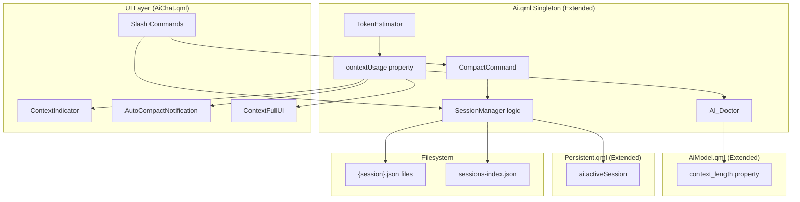

# Design Document: Chat Context Management

## Overview

This design extends the existing `Ai.qml` singleton and sidebar chat UI with multi-session management, token-based context window tracking, a `/compact` slash command for conversation summarization, and proactive context limit handling with model upgrade suggestions.

The implementation builds on the existing patterns:
- **Persistence**: `Persistent.qml` with `JsonAdapter` / `JsonObject` for state that survives restarts
- **File storage**: `FileView` + `Directories.aiChats` for per-session JSON files
- **Slash commands**: The `allCommands` array in `AiChat.qml` for command routing
- **UI patterns**: `StatusItem`, `MaterialSymbol`, `StyledText`, `Appearance.*` theming

The current `Ai.qml` already has `saveChat`/`loadChat` functions and a `savedChats` list. This feature formalizes those into a proper session management system with lifecycle tracking, context awareness, and intelligent compaction.

## Architecture



## Components and Interfaces

### TokenEstimator (in Ai.qml)

A pure function added to the `Ai.qml` singleton:

```qml
function estimateTokens(text) {
    return Math.ceil(text.length / 4);
}
```

### Context Usage Tracking (in Ai.qml)

New properties on the Ai singleton:

```qml
// Computed context usage in tokens
readonly property int contextTokens: {
    let total = estimateTokens(root.systemPrompt);
    for (const id of root.messageIDs) {
        const msg = root.messageByID[id];
        if (msg) total += estimateTokens(msg.rawContent);
    }
    return total;
}

// Context window limit from current model
readonly property int contextLimit: models[currentModelId]?.context_length ?? 128000

// Usage as a fraction 0.0 to 1.0+
readonly property real contextUsageRatio: contextLimit > 0 ? contextTokens / contextLimit : 0

// Whether sending is blocked
readonly property bool contextFull: contextUsageRatio >= 1.0
```

### AiModel.qml Extension

Add `context_length` property:

```qml
QtObject {
    // ... existing properties ...
    property int context_length: 128000  // Default 128k
}
```

Each model definition in `Ai.qml` sets this based on the actual model's context window (e.g., Gemini 2.5 Flash = 1048576, DeepSeek R1 = 65536).

### SessionManager Logic (in Ai.qml)

New properties and functions:

```qml
property string activeSessionName: Persistent.states?.ai?.activeSession ?? "Chat 1"
property var sessionsIndex: ({})  // Loaded from sessions-index.json

function newSession(name) { ... }
function switchSession(name) { ... }
function listSessions() { ... }
function deleteSession(name) { ... }
function saveCurrentSession() { ... }
function loadSession(name) { ... }
function getNextDefaultName() { ... }
function saveSessionsIndex() { ... }
function loadSessionsIndex() { ... }
```

### CompactCommand (in Ai.qml)

```qml
property bool compacting: false

function compactChat(focusInstruction) {
    // 1. Set compacting = true
    // 2. Build summarization request with focus instruction
    // 3. Send to current model
    // 4. On success: replace messages with summary, set compacting = false
    // 5. On failure: preserve messages, show error, set compacting = false
}
```

The summarization system prompt:

```
Summarize the following conversation concisely, preserving key context, decisions, and any code or technical details. {focusInstruction}
```

### AI_Doctor (in Ai.qml)

```qml
readonly property var largerContextModels: {
    const currentLimit = root.contextLimit;
    return root.modelList.filter(id => {
        const model = root.models[id];
        return model && model.context_length > currentLimit;
    });
}
```

### Persistent.qml Extension

Add `activeSession` to the existing `ai` JsonObject:

```qml
property JsonObject ai: JsonObject {
    property string model
    property real temperature: 0.5
    property string activeSession: "Chat 1"
}
```

### Slash Commands (in AiChat.qml)

New commands added to `allCommands`:

| Command | Arguments | Description |
|---------|-----------|-------------|
| `/new` | `[name]` | Create new session |
| `/switch` | `<name>` | Switch to named session |
| `/list` | — | List all sessions |
| `/delete` | `<name>` | Delete a session |
| `/compact` | `[focus]` | Compact conversation |

### UI Components

#### ContextIndicator (new component in aiChat/)

A `StatusItem`-style widget in the status bar row showing:
- Token count as percentage text
- Colored progress segment (linear indicator)
- Color thresholds: default → `Appearance.colors.colSubtext`, 70% → `Appearance.m3colors.m3tertiary`, 90% → `Appearance.m3colors.m3error`

```qml
component ContextIndicator: RowLayout {
    property real usage: Ai.contextUsageRatio
    property color indicatorColor: usage > 0.9 ? Appearance.m3colors.m3error
                                  : usage > 0.7 ? Appearance.m3colors.m3tertiary
                                  : Appearance.colors.colSubtext
    // ... progress bar and percentage text
}
```

#### AutoCompactNotification (inline in AiChat.qml)

A dismissible banner above the input area:
- Appears when contextUsageRatio crosses 0.85 for the first time
- Contains dismiss button and "Compact now" action button
- Non-blocking: input remains enabled

#### ContextFullUI (inline in AiChat.qml)

Replaces/overlays the input area when `contextFull` is true:
- Shows "Context window full" message
- Lists models with larger context (from AI_Doctor)
- Shows compact button with optional focus text field
- Blocks normal message input

## Data Models

### Session JSON File (`{session-name}.json`)

Same format as existing `saveChat` output — an array of message objects:

```json
[
  {
    "role": "user",
    "rawContent": "Hello",
    "model": "",
    "thinking": false,
    "done": true,
    "annotations": [],
    "annotationSources": [],
    "functionName": "",
    "functionCall": null,
    "functionResponse": "",
    "visibleToUser": true
  }
]
```

### Sessions Index (`sessions-index.json`)

```json
{
  "sessions": [
    {
      "name": "Chat 1",
      "createdAt": 1719500000,
      "lastModified": 1719501234
    },
    {
      "name": "Nix debugging",
      "createdAt": 1719502000,
      "lastModified": 1719503456
    }
  ]
}
```

### Persistent State (in `states.json`)

```json
{
  "ai": {
    "model": "gemini-2.5-flash",
    "temperature": 0.5,
    "activeSession": "Chat 1"
  }
}
```

## Correctness Properties

*A property is a characteristic or behavior that should hold true across all valid executions of a system — essentially, a formal statement about what the system should do. Properties serve as the bridge between human-readable specifications and machine-verifiable correctness guarantees.*

### Property 1: Token estimation is deterministic ceiling division

*For any* string of any length, `estimateTokens(str)` SHALL equal `Math.ceil(str.length / 4)`, and for the empty string it SHALL return 0.

**Validates: Requirements 2.1**

### Property 2: Context usage is the sum of all message tokens plus system prompt

*For any* message list and system prompt, `contextTokens` SHALL equal `estimateTokens(systemPrompt) + sum(estimateTokens(msg.rawContent) for msg in messages)`.

**Validates: Requirements 2.2**

### Property 3: Context indicator color follows threshold rules

*For any* context usage ratio value, the indicator color SHALL be: error color when ratio > 0.9, warning color when ratio > 0.7, and default color otherwise.

**Validates: Requirements 2.6, 2.7**

### Property 4: New session creation produces empty history

*For any* valid session name (non-empty, no path separators), creating a new session SHALL result in an empty message list and the active session name matching the provided name.

**Validates: Requirements 1.1**

### Property 5: Default session naming follows sequential pattern

*For any* set of existing sessions, when no name is provided to `/new`, the generated name SHALL be "Chat {N}" where N is the smallest positive integer not already used as a suffix in existing "Chat {N}" names.

**Validates: Requirements 1.2**

### Property 6: Session switch round-trip preserves messages

*For any* two sessions with arbitrary message histories, switching from session A to session B and back to session A SHALL restore session A's original message list (content and order).

**Validates: Requirements 1.3**

### Property 7: Session list contains all sessions with metadata

*For any* set of created sessions, the `/list` output SHALL contain every session name and its last-modified timestamp.

**Validates: Requirements 1.4**

### Property 8: Deleting a non-active session reduces session count by one

*For any* session list with more than one session, deleting a non-active session SHALL reduce the session count by exactly one and the deleted session SHALL no longer appear in the list.

**Validates: Requirements 1.5**

### Property 9: Session serialization round-trip preserves data

*For any* session with arbitrary messages, serializing to JSON and deserializing SHALL produce an equivalent message list (same roles, content, and metadata).

**Validates: Requirements 1.8, 6.1**

### Property 10: Compact with focus includes focus in prompt

*For any* non-empty focus instruction string, the summarization request payload SHALL contain that focus instruction.

**Validates: Requirements 3.2**

### Property 11: Successful compact replaces history with single summary message

*For any* conversation and any summary response string, after successful compaction the message list SHALL contain exactly one system-role message whose content equals the summary.

**Validates: Requirements 3.3**

### Property 12: Failed compact preserves original messages

*For any* message history, if compaction fails (network error or empty response), the message list SHALL remain identical to the pre-compaction state.

**Validates: Requirements 3.5**

### Property 13: Context full blocks message sending

*For any* state where `contextTokens >= contextLimit`, the system SHALL prevent sending new user messages.

**Validates: Requirements 4.1**

### Property 14: AI_Doctor suggests only models with larger context

*For any* set of model configurations, the suggested models list SHALL contain only models whose `context_length` is strictly greater than the current model's `context_length`.

**Validates: Requirements 4.2**

### Property 15: Auto-compact notification triggers on threshold crossing

*For any* sequence of messages that causes `contextUsageRatio` to cross 0.85 from below, the notification SHALL trigger. After dismissal or after compacting below 0.85 and re-crossing, it SHALL trigger again.

**Validates: Requirements 5.1, 5.5**

### Property 16: Non-blocking notification allows continued message sending

*For any* state where the auto-compact notification is visible and `contextUsageRatio < 1.0`, the system SHALL accept and send user messages without interruption.

**Validates: Requirements 5.4**

### Property 17: Sessions index contains all session metadata

*For any* set of sessions, the `sessions-index.json` SHALL contain an entry for each session with its name, creation timestamp, and last-modified timestamp.

**Validates: Requirements 6.5**

## Error Handling

| Scenario | Handling |
|----------|----------|
| `/compact` network failure | Preserve original messages, show error via `interfaceRole` message, set `compacting = false` |
| `/compact` returns empty response | Treat as failure, preserve messages |
| `/delete` active session | Reject with error message, no state change |
| `/switch` to non-existent session | Show error message listing available sessions |
| `/new` with invalid name (contains `/`, `\`, or is empty after trim) | Reject with error message |
| Session file corrupted on load | Catch JSON parse error, create fresh default session, show warning |
| `sessions-index.json` missing or corrupt | Rebuild from existing `.json` files in `aiChats` directory |
| Model's `context_length` is 0 or negative | Fall back to 128000 default |
| Token estimation on `null`/`undefined` content | Return 0 |

## Testing Strategy

### Property-Based Tests (using fast-check)

Each correctness property above gets a dedicated property-based test with a minimum of 100 iterations. Tests target the pure logic functions extracted from the QML:

- **Token estimation** (Property 1): Pure function, trivial to test
- **Context usage calculation** (Property 2): Mock message list, verify sum
- **Color threshold logic** (Property 3): Generate random ratios
- **Session CRUD operations** (Properties 4–9): Generate random names and message arrays
- **Compact logic** (Properties 10–12): Generate random messages and responses
- **Blocking/notification thresholds** (Properties 13–16): Generate various fill levels
- **Index serialization** (Property 17): Generate random session metadata

Tag format: `Feature: chat-context-management, Property {N}: {property text}`

### Unit Tests (example-based)

- Default model `context_length` is 128000 (Requirement 2.4)
- Context indicator renders percentage text (Requirement 2.5)
- Compact without arguments uses general summarization prompt (Requirement 3.1)
- Context-full UI shows compact button (Requirement 4.3)
- Model switch from AI_Doctor unblocks sending (Requirement 4.4)
- No larger models hides suggestion section (Requirement 4.5)
- Dismiss button hides notification for session (Requirement 5.2)
- "Compact now" button triggers `/compact` (Requirement 5.3)
- Startup restores last active session (Requirement 1.7)
- Startup with missing session creates default (Requirement 6.4)
- Active session stored in `Persistent.states.ai.activeSession` (Requirement 6.2)

### Integration Tests

- Full save/load cycle through `FileView` and filesystem
- Quickshell restart restores active session state
- Compact command sends request and processes streaming response

### Test Infrastructure

Since the QML logic is JavaScript-based, property tests can be written in JavaScript/TypeScript using `fast-check` against extracted pure functions. The QML-specific integration (bindings, `FileView`, `Process`) is tested via example-based integration tests using Quickshell's test harness or manual verification.

Pure functions to extract for testing:
- `estimateTokens(text: string): number`
- `getContextColor(ratio: number): string`
- `getNextDefaultName(existingNames: string[]): string`
- `filterLargerContextModels(models: Model[], currentLimit: number): Model[]`
- `shouldShowNotification(ratio: number, previouslyShown: boolean, dismissed: boolean): boolean`
- `serializeSession(messages: Message[]): string`
- `deserializeSession(json: string): Message[]`
