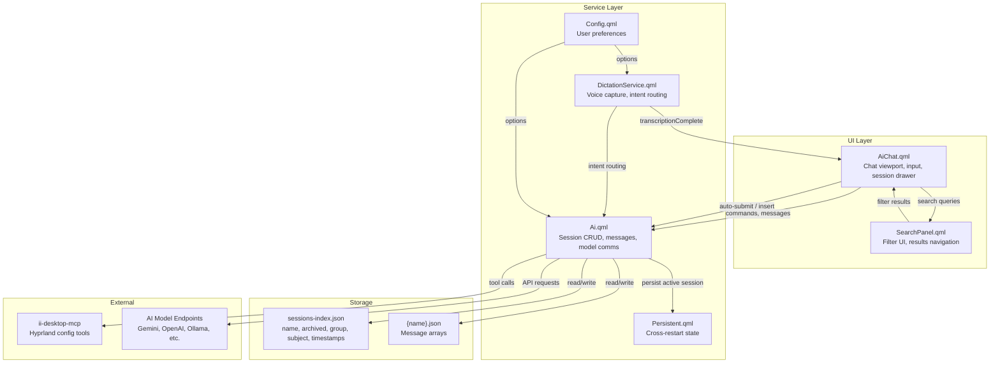
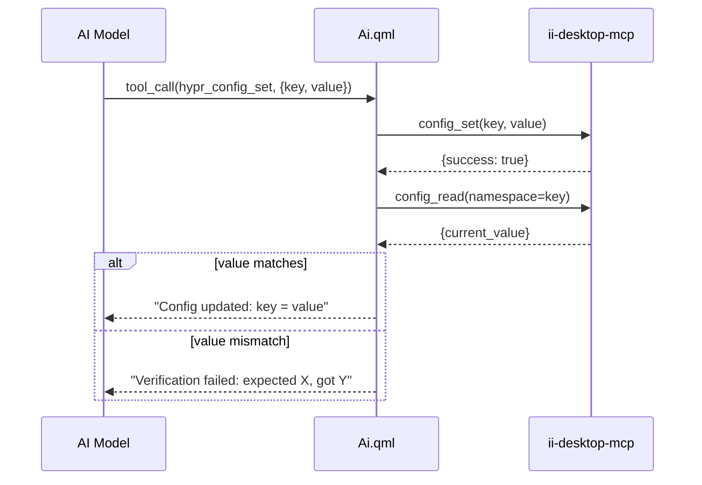

# Design Document: Chat Session Overhaul

## Overview

This design describes the end-state architecture for the Quickshell sidebar chat system, transforming it from a basic session-aware chat into a fully-featured session management platform with search, archiving, smart dictation routing, and HyprMCP integration.

The system is built on Quickshell's QML runtime with `pragma Singleton` services. The core architectural principle is: **Ai.qml owns all session state and persistence logic; AiChat.qml owns presentation and user interaction; DictationService.qml owns voice input routing.** Each component communicates through QML property bindings, signals, and direct function calls on the singletons.

### Key Design Decisions

1. **Session metadata enrichment** — Extend the sessions-index.json schema to include `archived`, `group`, and `subject` fields, enabling filtering and organization without separate storage.
2. **Pure-logic extraction for testability** — Extract search filtering, session validation, context formatting, and dictation routing logic into a standalone JS module (`tests/js/src/chat-session-logic.js`) that mirrors the QML logic but can be tested with vitest + fast-check.
3. **HyprMCP as tool-call pipeline** — Integrate HyprMCP endpoints as AI function calls with a mandatory read-back verification step, using the existing `handleFunctionCall` pattern in Ai.qml.
4. **BottomToTop ListView retained** — The existing `verticalLayoutDirection: ListView.BottomToTop` already achieves bottom-anchoring. The overhaul adds explicit scroll-position guards for the 10px threshold and animation cancellation.

## Architecture



### Modification vs. Creation Summary

| Component | Status | Changes |
|-----------|--------|---------|
| `Ai.qml` | **Modify** | Add purge, /summarize, archive/unarchive/group/subject, HyprMCP tool handlers, search index, enhanced session metadata |
| `AiChat.qml` | **Modify** | Add scroll-position guards, search toolbar, auto-submit routing, enhanced session drawer (purge, archive UI) |
| `DictationService.qml` | **Modify** | Add smart routing toggle integration, Free Dictation auto-submit signal differentiation |
| `Config.qml` | **Modify** | Add `dictation.smartRouting` option |
| `Persistent.qml` | **No change** | Already stores `ai.activeSession` |
| `SearchPanel.qml` | **Create** | New component for search filters and navigation |
| `chat-session-logic.js` | **Create** | Extracted pure logic for testing |
| `chat-session-logic.test.js` | **Create** | Property-based tests |

## Components and Interfaces

### Ai.qml (Service Singleton) — Extended API

```typescript
// New/modified public functions
function purgeSession(name: string): void
function summarizeToNewChat(focusInstruction?: string): void
function archiveSession(name: string): void
function unarchiveSession(name: string): void
function setSessionGroup(name: string, group: string): void
function setSessionSubject(name: string, subject: string): void
function searchMessages(query: string, filters: SearchFilters): SearchResult[]
function handleHyprMCPTool(name: string, args: object): void

// New properties
property var searchResults: []
property int searchIndex: -1

// New signal
signal sessionSwitchStarted()   // Emitted before clearing messages
signal sessionSwitchCompleted() // Emitted after new messages loaded
```

### AiChat.qml — Enhanced Viewport

```typescript
// New properties
property bool searchOpen: false
property real scrollThreshold: 10  // pixels from bottom for auto-scroll

// Scroll position management
readonly property bool isNearBottom: {
    messageListView.contentY <= scrollThreshold
    // (BottomToTop: contentY=0 is at the bottom)
}

// Dictation routing (modified Connections block)
Connections {
    target: DictationService
    function onTranscriptionComplete(text) {
        if (text.trim().length === 0) return;  // 10.4
        if (Ai.activeSessionName === "Free Dictation") {
            Ai.sendUserMessage(text);           // 10.1
            messageInputField.text = "";        // 10.3
        } else {
            // Insert at cursor (existing behavior)  // 10.2
            ...
        }
    }
}
```

### SearchPanel.qml — New Component

```typescript
// Properties
property string keyword: ""
property var dateRange: { start: null, end: null }
property string subjectFilter: ""
property string groupFilter: ""
property int currentMatchIndex: 0
property int totalMatches: 0

// Functions
function nextMatch(): void    // wraps at end
function prevMatch(): void    // wraps at start
function clearSearch(): void
```

### HyprMCP Tool Integration

The existing `handleFunctionCall` in Ai.qml is extended with three new tools:

```javascript
// Tool definitions added to root.tools for each API format
{
    "name": "hypr_config_read",
    "description": "Read Quickshell or Hyprland config via HyprMCP",
    "parameters": { "type": "object", "properties": { "namespace": { "type": "string" } } }
},
{
    "name": "hypr_config_set",
    "description": "Set a Quickshell config value via HyprMCP with read-back verification",
    "parameters": { "type": "object", "properties": {
        "key": { "type": "string" }, "value": { "type": "string" }
    }, "required": ["key", "value"] }
},
{
    "name": "hypr_set_keyword",
    "description": "Set a Hyprland keyword (runtime) via HyprMCP with read-back verification",
    "parameters": { "type": "object", "properties": {
        "keyword": { "type": "string" }, "value": { "type": "string" }
    }, "required": ["keyword", "value"] }
}
```

Each `config_set` / `set_keyword` call follows a **write → read-back → report** pipeline:



The MCP server is accessed via `curl` to `http://localhost:7580` (the ii-desktop-mcp HTTP endpoint), using the same Process + SplitParser pattern as existing tool calls.

## Data Models

### sessions-index.json (Enhanced Schema)

```json
{
  "sessions": [
    {
      "name": "Chat 1",
      "createdAt": 1719000000,
      "lastModified": 1719003600,
      "archived": false,
      "group": "",
      "subject": ""
    },
    {
      "name": "Free Dictation",
      "createdAt": 1719000000,
      "lastModified": 1719005000,
      "archived": false,
      "group": "",
      "subject": "",
      "protected": true
    }
  ]
}
```

**New fields:**
- `archived` (boolean, default false) — Whether session appears in archive section
- `group` (string, default "") — Group label for categorization (1-64 chars when set)
- `subject` (string, default "") — Topic/subject description (1-128 chars when set)
- `protected` (boolean, optional) — If true, rename is disallowed (used for Free Dictation)

### Message Object (unchanged)

```json
{
  "role": "user|assistant|system|interface",
  "rawContent": "...",
  "model": "gemini-2.0-flash",
  "thinking": false,
  "done": true,
  "annotations": [],
  "annotationSources": [],
  "functionName": "",
  "functionCall": null,
  "functionResponse": "",
  "visibleToUser": true
}
```

### SearchFilters Type

```typescript
interface SearchFilters {
  keyword: string;        // min 2 chars, case-insensitive substring
  dateStart?: number;     // Unix timestamp (seconds)
  dateEnd?: number;       // Unix timestamp (seconds)
  subject?: string;       // case-insensitive substring match on session subject
  group?: string;         // exact match on session group
}

interface SearchResult {
  messageIndex: number;   // index within messageIDs
  matchStart: number;     // character offset of keyword match in rawContent
  matchEnd: number;       // character offset end
}
```

### Config.qml Addition

```qml
property JsonObject dictation: JsonObject {
    // ... existing properties ...
    property bool smartRouting: false  // Smart Dictation Routing toggle
}
```

### Context Meter Display Format

The context meter displays: `"{percentage}% of {limit}"` where limit is formatted as:
- `≥ 1,000,000` → `"{n/1000000}M"` (e.g., "1M")
- `≥ 1,000` → `"{n/1000}k"` (e.g., "128k")
- `< 1,000` → raw number

## Correctness Properties

*A property is a characteristic or behavior that should hold true across all valid executions of a system — essentially, a formal statement about what the system should do. Properties serve as the bridge between human-readable specifications and machine-verifiable correctness guarantees.*

### Property 1: Session save/load round-trip

*For any* valid list of message objects (with role, rawContent, model fields), saving the session via `saveCurrentSession()` and then loading it via `loadSession(name)` SHALL produce a message list where each message has the same role and rawContent in the same order as the original.

**Validates: Requirements 2.3**

### Property 2: Session switch persists active name

*For any* valid session name that exists in the sessions index, after `switchSession(name)` completes successfully, the value of `Persistent.states.ai.activeSession` SHALL equal that name.

**Validates: Requirements 2.1**

### Property 3: Session switch clears previous messages

*For any* two distinct sessions A and B where both exist in the index, after switching from A to B, the active message store SHALL contain zero messages that were in session A's message list (i.e., `messageIDs.length` equals the count of messages in session B's file, and all message contents match B's file).

**Validates: Requirements 3.2**

### Property 4: Failed session load preserves current state

*For any* valid current session state (messageIDs, messageByID, activeSessionName), if `loadSession(targetName)` fails (file missing, invalid JSON, or empty), the messageIDs, messageByID, and activeSessionName SHALL remain identical to their pre-call values.

**Validates: Requirements 3.5**

### Property 5: Purge clears messages but preserves index entry

*For any* session that exists in the sessions index with N ≥ 0 messages, after `purgeSession(name)` completes, the session's persisted file SHALL contain an empty JSON array (`[]`), and the sessions index SHALL still contain an entry with the same name, createdAt, group, subject, and archived values.

**Validates: Requirements 4.1**

### Property 6: Rename updates state correctly

*For any* session with oldName that exists in the sessions index, and any valid newName (non-empty, no `/` or `\`, not already in index), after `renameSession(oldName, newName)`, the sessions index SHALL contain an entry with name equal to newName and no entry with name equal to oldName. If oldName was the active session, `Persistent.states.ai.activeSession` SHALL equal newName.

**Validates: Requirements 4.2**

### Property 7: Rename validation rejects invalid names

*For any* string that is (a) empty or whitespace-only, (b) contains `/` or `\` characters, or (c) already exists as a name in the sessions index, calling `renameSession(oldName, invalidName)` SHALL leave the sessions index and Persistent_State unchanged.

**Validates: Requirements 4.6, 4.7**

### Property 8: Failed compact preserves messages

*For any* message list state (messageIDs and messageByID), if the compaction LLM request fails (non-zero exit code or empty response), the messageIDs and messageByID SHALL remain identical to their pre-compact values.

**Validates: Requirements 5.3**

### Property 9: Context meter format

*For any* valid contextUsageRatio (0.0–1.0+) and contextLimit (positive integer), the formatted context meter string SHALL contain the percentage as `Math.round(ratio * 100)` followed by `"% of "` followed by the limit formatted as `"{n}k"` for limits ≥ 1000 or `"{n}M"` for limits ≥ 1,000,000.

**Validates: Requirements 5.4**

### Property 10: Auto-compact threshold crossing detection

*For any* sequence of contextUsageRatio values applied to a session, `autoCompactShown` SHALL become true if and only if the ratio transitions from below 0.85 to at or above 0.85 for the first time since the session was loaded (or since `autoCompactDismissed` was reset).

**Validates: Requirements 5.5**

### Property 11: Keyword search filter correctness

*For any* keyword string of length ≥ 2 and any list of messages, every message in the search result set SHALL contain the keyword as a case-insensitive substring of its rawContent, and every message NOT in the result set SHALL NOT contain the keyword as a case-insensitive substring.

**Validates: Requirements 6.2**

### Property 12: Date range filter correctness

*For any* date range (startDate, endDate) where at least one is provided, and any list of timestamped messages, every message in the filtered result SHALL have a timestamp within [startDate, endDate] (inclusive), treating missing bounds as unbounded.

**Validates: Requirements 6.3**

### Property 13: Search navigation wrapping

*For any* non-empty list of N search results, calling `nextMatch()` when `currentMatchIndex === N-1` SHALL set `currentMatchIndex` to 0, and calling `prevMatch()` when `currentMatchIndex === 0` SHALL set `currentMatchIndex` to N-1.

**Validates: Requirements 6.6**

### Property 14: Archive/unarchive round-trip

*For any* session in the active list, archiving it SHALL set `archived=true` and exclude it from the active list, and subsequently unarchiving it SHALL set `archived=false` and restore it to the active list, with all other metadata (name, group, subject, timestamps) unchanged.

**Validates: Requirements 7.1, 7.2**

### Property 15: Group label validation and assignment

*For any* string of length 1–64 that is not purely whitespace, `setSessionGroup(name, group)` SHALL update the session's group field to that string. *For any* string that is empty, whitespace-only, or longer than 64 characters, the session's group field SHALL remain unchanged.

**Validates: Requirements 7.3, 7.4**

### Property 16: Subject assignment

*For any* string of length 1–128 that is not purely whitespace, `setSessionSubject(name, subject)` SHALL update the session's subject field to that string. *For any* string that is empty, whitespace-only, or longer than 128 characters, the session's subject field SHALL remain unchanged.

**Validates: Requirements 7.5**

### Property 17: Active session deletion rejection

*For any* active session (where `activeSessionName === name`), calling `deleteSession(name)` SHALL leave the sessions index unchanged and SHALL NOT remove the session's file.

**Validates: Requirements 7.7**

### Property 18: Group headers alphabetical ordering

*For any* set of sessions with assigned group labels, when listed for display, the group section headers SHALL appear in case-insensitive alphabetical order.

**Validates: Requirements 7.9**

### Property 19: Intent classifier returns valid classification

*For any* non-empty text string, `_classifyIntent(text)` SHALL return exactly one of `"command"`, `"dictation"`, or `"ambiguous"` — never undefined, null, or any other value.

**Validates: Requirements 8.1**

### Property 20: Dictation routing by active session

*For any* non-empty, non-whitespace transcribed text: if `activeSessionName === "Free Dictation"`, the text SHALL be submitted as a user message; if `activeSessionName !== "Free Dictation"`, the text SHALL be inserted into the input field without submission. *For any* empty or whitespace-only text, neither submission nor input field modification SHALL occur regardless of active session.

**Validates: Requirements 10.1, 10.2, 10.4**

### Property 21: HyprMCP verification mismatch reporting

*For any* (expected, actual) value pair where `expected !== actual` after a config_set read-back, the resulting message SHALL contain both the expected value and the actual value as substrings.

**Validates: Requirements 9.4**

## Error Handling

| Scenario | Behavior | Recovery |
|----------|----------|----------|
| Session file missing on load | Display error, stay on current session | User can create new or pick another |
| Session file corrupted JSON | Display error, stay on current session | User can purge or delete |
| Compact/summarize LLM failure | Preserve messages, show error | User retries or switches model |
| HyprMCP unreachable | Show error with reason in chat | User checks if MCP service is running |
| HyprMCP read-back mismatch | Show expected vs actual values | User can retry or manually adjust |
| Rename to duplicate name | Reject, show inline error | User picks different name |
| Rename to invalid chars | Reject silently (validation) | User corrects input |
| Delete active session | Reject with error message | User switches first |
| Intent classification timeout | Default to normal message send | Transparent fallback |
| Search with < 2 chars | Don't execute, show minimum length hint | User adds characters |
| Context at 100% | Block input, show compact/switch options | User compacts or switches model |

### QML-Specific Error Patterns

- **Process exit codes** — All curl/subprocess operations check `exitCode !== 0` before processing stdout
- **JSON parse safety** — All `JSON.parse()` calls are wrapped in try/catch with fallback behavior
- **FileView reload failures** — Handled via `onLoadFailed` signal with explicit recovery paths
- **Property binding safety** — Optional chaining via `?.` and `??` fallbacks for null/undefined paths

## Testing Strategy

### Test Framework

- **vitest** with **fast-check** (already configured at `tests/js/`)
- Pure logic extracted into `tests/js/src/chat-session-logic.js`
- Property tests in `tests/js/src/chat-session-logic.test.js`

### Property-Based Tests (PBT)

Each correctness property above is implemented as a fast-check property test with minimum 100 iterations. Tests are tagged with the format:

```
Feature: chat-session-overhaul, Property {N}: {title}
```

**PBT covers:**
- Session CRUD operations (save/load round-trip, rename validation, purge invariants)
- Search filtering logic (keyword, date, group, subject filters)
- Navigation wrapping arithmetic
- Context meter formatting
- Auto-compact threshold detection
- Dictation routing logic
- Intent classifier output validity
- Archive/unarchive round-trip
- Group/subject validation

### Unit Tests (Example-Based)

- Viewport scroll positioning (mock contentY values)
- Session drawer UI state (purge/rename visibility for Free Dictation vs regular)
- Context-full overlay display trigger
- HyprMCP tool call → curl command construction
- Empty state handling (no sessions, no messages)

### Integration Tests

- Compact flow with mocked LLM response (success and failure paths)
- Summarize-to-new-chat with mocked model-generated title
- HyprMCP read-back verification pipeline
- Smart dictation routing with mocked AI classification

### What is NOT Tested with PBT

- QML rendering and layout (visual inspection, manual QA)
- Actual LLM API responses (integration tests with mocks)
- File I/O timing (FileView is a Quickshell abstraction)
- Process execution (pw-record, curl) — tested via integration

### Test File Organization

```
tests/js/src/
├── chat-session-logic.js          # Extracted pure functions
├── chat-session-logic.test.js     # Property + unit tests
└── chat-session-integration.test.js  # Integration tests with mocks
```
