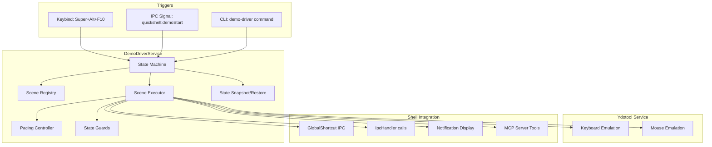
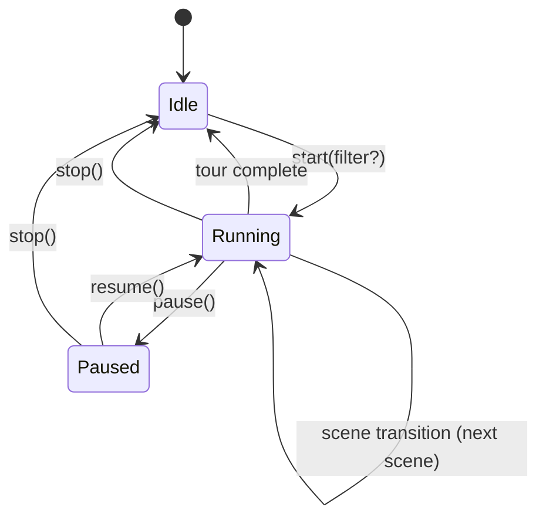
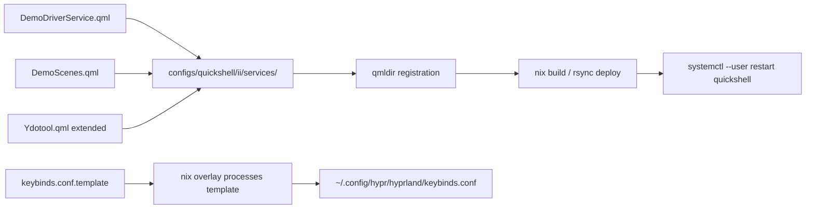

# Design Document: Desktop Demo Driver

## Overview

The Desktop Demo Driver is a QML-based orchestration engine integrated into the Quickshell desktop shell that programmatically demonstrates every feature of the Hyprland/Quickshell environment. It extends the existing `Ydotool` singleton service with mouse emulation, introduces a scene-based execution engine with configurable pacing, and provides multiple trigger mechanisms (keybind, IPC, CLI).

The system is architected as three cooperating QML singletons:
- **Ydotool** (extended) — low-level input emulation via ydotool daemon
- **DemoDriverService** — scene orchestration, state machine, pacing
- **DemoScenes** — scene definitions with metadata and action sequences

Each scene is a declarative list of timed actions (IPC signals, key emulation, mouse moves, MCP queries) that the driver executes sequentially with configurable inter-action delays.

## Architecture

### High-Level System Diagram



### State Machine Diagram



### Deployment Flow



## Components and Interfaces

### Component 1: Ydotool Service (Extended)

**File:** `configs/quickshell/ii/services/Ydotool.qml`

The existing singleton is extended with mouse emulation functions. All functions delegate to `ydotool` CLI via `Quickshell.execDetached()` and return synchronously (fire-and-forget). Error detection happens via a Process component that checks ydotool availability on startup.

#### Interface (Low-Level Design)

```qml
pragma Singleton
import Quickshell
import Quickshell.Io
import QtQuick

Singleton {
    id: root

    // Existing keyboard properties
    property int shiftMode: 0
    property list<int> shiftKeys: [42, 54]
    property list<int> altKeys: [56, 100]
    property list<int> ctrlKeys: [29, 97]

    // New: ydotool daemon availability
    property bool available: false
    property string lastError: ""

    // Existing keyboard functions (unchanged)
    function releaseAllKeys() { /* ... */ }
    function releaseShiftKeys() { /* ... */ }
    function press(keycode) { /* ... */ }
    function release(keycode) { /* ... */ }

    // NEW: Mouse emulation functions
    function moveMouse(x: int, y: int): void {
        if (!root.available) { _logUnavailable("moveMouse"); return; }
        Quickshell.execDetached(["ydotool", "mousemove", "--absolute",
            "-x", x.toString(), "-y", y.toString()])
    }

    function moveMouseRelative(dx: int, dy: int): void {
        if (!root.available) { _logUnavailable("moveMouseRelative"); return; }
        Quickshell.execDetached(["ydotool", "mousemove",
            "-x", dx.toString(), "-y", dy.toString()])
    }

    function click(button: int): void {
        if (!root.available) { _logUnavailable("click"); return; }
        // ydotool click: button codes 0xC0=left, 0xC1=right, 0xC2=middle
        var code = [0xC0, 0xC1, 0xC2][button] || 0xC0
        Quickshell.execDetached(["ydotool", "click",
            code.toString(16).toUpperCase()])
    }

    function doubleClick(button: int): void {
        if (!root.available) { _logUnavailable("doubleClick"); return; }
        var code = [0xC0, 0xC1, 0xC2][button] || 0xC0
        Quickshell.execDetached(["ydotool", "click", "--repeat", "2",
            "--next-delay", "50", code.toString(16).toUpperCase()])
    }

    function scroll(direction: string, amount: int): void {
        if (!root.available) { _logUnavailable("scroll"); return; }
        // direction: "up", "down", "left", "right"
        var dx = 0, dy = 0
        switch (direction) {
            case "up":    dy = -amount; break
            case "down":  dy = amount;  break
            case "left":  dx = -amount; break
            case "right": dx = amount;  break
        }
        Quickshell.execDetached(["ydotool", "mousemove",
            "--wheel", "-x", dx.toString(), "-y", dy.toString()])
    }

    function drag(startX: int, startY: int, endX: int, endY: int,
                  button: int): void {
        if (!root.available) { _logUnavailable("drag"); return; }
        // Multi-step: move to start, press, move to end, release
        var code = [0xC0, 0xC1, 0xC2][button] || 0xC0
        Quickshell.execDetached(["bash", "-c",
            "ydotool mousemove --absolute -x " + startX + " -y " + startY +
            " && sleep 0.05" +
            " && ydotool mousedown " + code.toString(16).toUpperCase() +
            " && sleep 0.05" +
            " && ydotool mousemove --absolute -x " + endX + " -y " + endY +
            " && sleep 0.05" +
            " && ydotool mouseup " + code.toString(16).toUpperCase()
        ])
    }

    // NEW: Combo key press (e.g., Super+1, Super+Alt+3)
    function keyCombo(keycodes: list<int>): void {
        if (!root.available) { _logUnavailable("keyCombo"); return; }
        // Press all keys, then release in reverse
        var args = ["ydotool", "key", "--key-delay", "20"]
        for (var i = 0; i < keycodes.length; i++)
            args.push(keycodes[i] + ":1")
        for (var j = keycodes.length - 1; j >= 0; j--)
            args.push(keycodes[j] + ":0")
        Quickshell.execDetached(args)
    }

    // Internal: check ydotool availability on load
    function _logUnavailable(fn) {
        root.lastError = "ydotool unavailable, cannot execute: " + fn
        console.warn("[Ydotool] " + root.lastError)
    }

    // Availability check process
    Process {
        id: checkProcess
        command: ["ydotool", "--help"]
        onExited: (exitCode, exitStatus) => {
            root.available = (exitCode === 0)
            if (!root.available)
                console.warn("[Ydotool] ydotoold not running or ydotool not found")
        }
    }
    Component.onCompleted: checkProcess.running = true
}
```

### Component 2: DemoDriverService

**File:** `configs/quickshell/ii/services/DemoDriverService.qml`

The core orchestration singleton. Manages state machine, pacing, scene execution queue, state guards, and desktop state snapshot/restore.

#### Interface (Low-Level Design)

```qml
pragma Singleton
pragma ComponentBehavior: Bound
import Quickshell
import Quickshell.Io
import Quickshell.Hyprland
import QtQuick
import qs.modules.common
import qs.services

Singleton {
    id: root

    // ─── State Enum ───
    enum State { Idle, Running, Paused }

    // ─── Public Properties ───
    property int state: DemoDriverService.State.Idle
    property string currentSceneName: ""
    property string currentSceneDescription: ""
    property int scenesCompleted: 0
    property int scenesTotal: 0
    property real speedMultiplier: 1.0

    // Pacing configuration
    property int actionDelay: 800      // ms between actions within a scene
    property int sceneDelay: 2000      // ms between scenes in a tour
    readonly property real minSpeed: 0.5
    readonly property real maxSpeed: 3.0

    // ─── Signals ───
    signal sceneStarted(string name, string description)
    signal sceneCompleted(string name, bool success)
    signal tourStarted(int totalScenes)
    signal tourCompleted(bool cancelled)

    // ─── Desktop State Snapshot ───
    property var _preState: null  // {workspace, zoom, volume, muted, darkMode}

    // ─── Execution Queue ───
    property var _queue: []       // Array of scene objects to execute
    property int _queueIndex: 0
    property var _currentActions: []  // Actions within current scene
    property int _actionIndex: 0

    // ─── Public API ───

    /** Start full tour or filtered subset */
    function start(filter?: string, filterType?: string): void {
        // filterType: "scene" | "category" | undefined (full tour)
        if (root.state !== DemoDriverService.State.Idle) stop()

        _captureDesktopState()
        root.speedMultiplier = Math.max(root.minSpeed,
                                Math.min(root.maxSpeed, root.speedMultiplier))

        var scenes = DemoScenes.getScenes(filter, filterType)
        root._queue = scenes
        root._queueIndex = 0
        root.scenesTotal = scenes.length
        root.scenesCompleted = 0
        root.state = DemoDriverService.State.Running
        root.tourStarted(scenes.length)
        _executeNextScene()
    }

    /** Stop current execution and restore state */
    function stop(): void {
        _actionTimer.stop()
        _sceneTimer.stop()
        root.state = DemoDriverService.State.Idle
        root.currentSceneName = ""
        _restoreDesktopState()
        root.tourCompleted(true)
    }

    /** Pause execution */
    function pause(): void {
        if (root.state === DemoDriverService.State.Running) {
            _actionTimer.stop()
            root.state = DemoDriverService.State.Paused
        }
    }

    /** Resume execution */
    function resume(): void {
        if (root.state === DemoDriverService.State.Paused) {
            root.state = DemoDriverService.State.Running
            _advanceAction()
        }
    }

    /** Toggle: start full tour or stop if running */
    function toggle(): void {
        if (root.state === DemoDriverService.State.Idle) start()
        else stop()
    }

    /** Get scene list as JSON for CLI/MCP query */
    function listScenes(): string {
        return JSON.stringify(DemoScenes.registry)
    }

    /** Compute total tour duration estimate */
    function estimatedDuration(): int {
        var total = 0
        for (var i = 0; i < DemoScenes.registry.length; i++) {
            total += DemoScenes.registry[i].duration
        }
        total += (DemoScenes.registry.length - 1) * root.sceneDelay
        return Math.round(total / root.speedMultiplier)
    }
```


    // ─── Internal: Scene Execution ───

    function _executeNextScene(): void {
        if (root._queueIndex >= root._queue.length) {
            // Tour complete
            root.state = DemoDriverService.State.Idle
            root.currentSceneName = ""
            _restoreDesktopState()
            root.tourCompleted(false)
            return
        }

        var scene = root._queue[root._queueIndex]

        // State guard check
        if (!_checkGuards(scene)) {
            console.warn("[DemoDriver] Guard failed for: " + scene.name)
            root.sceneCompleted(scene.name, false)
            root._queueIndex++
            root.scenesCompleted++
            _sceneTimer.interval = _effectiveDelay(root.sceneDelay)
            _sceneTimer.start()
            return
        }

        root.currentSceneName = scene.name
        root.currentSceneDescription = scene.description
        root._currentActions = scene.actions
        root._actionIndex = 0
        root.sceneStarted(scene.name, scene.description)
        _advanceAction()
    }

    function _advanceAction(): void {
        if (root.state !== DemoDriverService.State.Running) return
        if (root._actionIndex >= root._currentActions.length) {
            // Scene complete — verify post-conditions
            _verifyPostConditions(root._queue[root._queueIndex])
            root.sceneCompleted(root.currentSceneName, true)
            root._queueIndex++
            root.scenesCompleted++
            _sceneTimer.interval = _effectiveDelay(root.sceneDelay)
            _sceneTimer.start()
            return
        }

        var action = root._currentActions[root._actionIndex]
        _executeAction(action)
        root._actionIndex++
        _actionTimer.interval = _effectiveDelay(
            action.delay !== undefined ? action.delay : root.actionDelay)
        _actionTimer.start()
    }

    function _executeAction(action): void {
        switch (action.type) {
            case "ipc":
                Quickshell.execDetached(["quickshell", "-c", "ii",
                    "ipc", "call", action.target, action.method || "toggle"])
                break
            case "globalShortcut":
                Quickshell.execDetached(["hyprctl", "dispatch", "global",
                    "quickshell:" + action.name])
                break
            case "key":
                Ydotool.keyCombo(action.keycodes)
                break
            case "mouseMove":
                Ydotool.moveMouse(action.x, action.y)
                break
            case "mouseMoveRelative":
                Ydotool.moveMouseRelative(action.dx, action.dy)
                break
            case "click":
                Ydotool.click(action.button || 0)
                break
            case "scroll":
                Ydotool.scroll(action.direction, action.amount)
                break
            case "drag":
                Ydotool.drag(action.startX, action.startY,
                             action.endX, action.endY, action.button || 0)
                break
            case "notify":
                _sendNotification(action.title, action.body)
                break
            case "mcp":
                _executeMcpAction(action)
                break
            case "exec":
                Quickshell.execDetached(action.command)
                break
        }
    }

    function _effectiveDelay(baseDelay: int): int {
        return Math.round(baseDelay / root.speedMultiplier)
    }

    // ─── Timers ───
    Timer {
        id: _actionTimer
        repeat: false
        onTriggered: root._advanceAction()
    }

    Timer {
        id: _sceneTimer
        repeat: false
        onTriggered: root._executeNextScene()
    }
```


#### State Guards (Low-Level)

```qml
    // ─── State Guards ───

    function _checkGuards(scene): bool {
        if (!scene.guards) return true
        for (var i = 0; i < scene.guards.length; i++) {
            var guard = scene.guards[i]
            switch (guard.type) {
                case "ydotool":
                    if (!Ydotool.available) {
                        _sendNotification("Demo Driver",
                            "ydotoold not running — cannot run: " + scene.name)
                        return false
                    }
                    break
                case "window":
                    // Check hyprctl clients for required window class
                    // (synchronous check via cached HyprlandData)
                    if (!_windowExists(guard.windowClass)) return false
                    break
                case "audioUnmuted":
                    // Auto-resolve: unmute if muted
                    if (Audio.sink && Audio.sink.muted) {
                        Quickshell.execDetached(["wpctl", "set-mute",
                            "@DEFAULT_AUDIO_SINK@", "0"])
                    }
                    break
            }
        }
        return true
    }

    function _windowExists(windowClass: string): bool {
        var clients = Hyprland.clients
        for (var i = 0; i < clients.length; i++) {
            if (clients[i].class === windowClass) return true
        }
        return false
    }

    function _verifyPostConditions(scene): void {
        // If scene toggled a shell module, ensure it's closed
        if (scene.closesModule) {
            var moduleState = _getModuleState(scene.closesModule)
            if (moduleState === true) {
                // Force close via IPC
                Quickshell.execDetached(["hyprctl", "dispatch", "global",
                    "quickshell:" + scene.closesModule + "Close"])
            }
        }
    }

    function _getModuleState(moduleName: string): bool {
        switch (moduleName) {
            case "sidebarLeft": return GlobalStates.sidebarLeftOpen
            case "sidebarRight": return GlobalStates.sidebarRightOpen
            case "overview": return GlobalStates.overviewOpen
            case "session": return GlobalStates.sessionOpen
            case "osk": return GlobalStates.oskOpen
            case "mediaControls": return GlobalStates.mediaControlsOpen
            default: return false
        }
    }
```

#### Desktop State Snapshot/Restore (Low-Level)

```qml
    // ─── State Snapshot ───

    function _captureDesktopState(): void {
        root._preState = {
            workspace: Hyprland.focusedWorkspace?.id ?? 1,
            zoom: GlobalStates.screenZoom,
            // Volume stored as percentage via Audio service
            volume: Audio.sink?.volume ?? 0.5,
            muted: Audio.sink?.muted ?? false,
            // Dark mode detection via Quickshell config
            darkMode: true  // read from gsettings or Config
        }
        // Read dark mode from gsettings
        _darkModeCheck.running = true
    }

    function _restoreDesktopState(): void {
        if (!root._preState) return
        var s = root._preState

        // Restore workspace
        Quickshell.execDetached(["hyprctl", "dispatch", "workspace",
            s.workspace.toString()])

        // Restore zoom
        GlobalStates.screenZoom = s.zoom

        // Restore volume + mute
        Quickshell.execDetached(["wpctl", "set-volume",
            "@DEFAULT_AUDIO_SINK@", s.volume.toString()])
        Quickshell.execDetached(["wpctl", "set-mute",
            "@DEFAULT_AUDIO_SINK@", s.muted ? "1" : "0"])

        root._preState = null
    }

    Process {
        id: _darkModeCheck
        command: ["gsettings", "get", "org.gnome.desktop.interface", "color-scheme"]
        stdout: SplitParser {
            onRead: line => {
                if (root._preState)
                    root._preState.darkMode = (line.indexOf("dark") !== -1)
            }
        }
    }
```


#### Trigger Mechanisms (Low-Level)

```qml
    // ─── Triggers ───

    // Keybind trigger (Super+Alt+F10) — toggle behavior
    GlobalShortcut {
        name: "demoToggle"
        description: "Toggle desktop demo tour"
        onPressed: root.toggle()
    }

    // IPC trigger: quickshell ipc call demo start [sceneName]
    IpcHandler {
        target: "demo"

        function start(sceneName): void {
            if (sceneName && sceneName.length > 0) {
                // Determine if it's a category or scene name
                if (DemoScenes.categories.indexOf(sceneName) !== -1)
                    root.start(sceneName, "category")
                else
                    root.start(sceneName, "scene")
            } else {
                root.start()
            }
        }

        function stop(): void { root.stop() }
        function pause(): void { root.pause() }
        function resume(): void { root.resume() }

        function list(): string { return root.listScenes() }

        function speed(multiplier): void {
            root.speedMultiplier = Math.max(root.minSpeed,
                Math.min(root.maxSpeed, parseFloat(multiplier)))
        }
    }

    // GlobalShortcut for IPC-based start
    GlobalShortcut {
        name: "demoStart"
        description: "Start desktop demo via IPC"
        onPressed: root.start()
    }

    GlobalShortcut {
        name: "demoStop"
        description: "Stop desktop demo via IPC"
        onPressed: root.stop()
    }
```

#### Notification Helper

```qml
    function _sendNotification(title: string, body: string): void {
        Quickshell.execDetached(["notify-send", "-a", "Desktop Demo",
            "-t", "3000", title, body])
    }
```

#### MCP Tool Integration

```qml
    function _executeMcpAction(action): void {
        // Execute MCP tool via ii-desktop-mcp CLI
        // The result is displayed as a notification
        _mcpProcess.command = ["python3", "-c",
            "import json, subprocess; " +
            "r = subprocess.run(['ii-desktop-mcp', 'call', '" + action.tool + "'" +
            (action.args ? ", '--args', '" + JSON.stringify(action.args) + "'" : "") +
            "], capture_output=True, text=True); " +
            "print(r.stdout[:200])"]
        _mcpProcess.running = true
    }

    Process {
        id: _mcpProcess
        stdout: SplitParser {
            onRead: line => {
                root._sendNotification("MCP: " + root.currentSceneName, line)
            }
        }
    }
}
```

### Component 3: DemoScenes Registry

**File:** `configs/quickshell/ii/services/DemoScenes.qml`

A singleton that defines all available scenes as a declarative registry. Each scene is a JavaScript object with metadata and an `actions` array.

#### Interface (Low-Level Design)

```qml
pragma Singleton
import Quickshell
import QtQuick

Singleton {
    id: root

    // Valid categories
    readonly property var categories: ["shell", "workspace", "window",
                                        "utility", "app-launch", "mcp"]

    // Scene registry — array of scene definition objects
    readonly property var registry: [
        // ─── Shell Module Scenes ───
        {
            name: "sidebar-left",
            description: "Open and close the AI/chat left sidebar",
            category: "shell",
            duration: 4000,
            closesModule: "sidebarLeft",
            guards: [{ type: "ydotool" }],
            actions: [
                { type: "globalShortcut", name: "sidebarLeftToggle" },
                { type: "notify", title: "Left Sidebar",
                  body: "AI chat, providers, and tools" },
                { delay: 3000 },
                { type: "globalShortcut", name: "sidebarLeftToggle" }
            ]
        },
        {
            name: "sidebar-right",
            description: "Open and close the notifications/calendar sidebar",
            category: "shell",
            duration: 4000,
            closesModule: "sidebarRight",
            guards: [],
            actions: [
                { type: "globalShortcut", name: "sidebarRightToggle" },
                { type: "notify", title: "Right Sidebar",
                  body: "Notifications, calendar, and system info" },
                { delay: 3000 },
                { type: "globalShortcut", name: "sidebarRightToggle" }
            ]
        },
        {
            name: "overview",
            description: "Open the app launcher / overview",
            category: "shell",
            duration: 4000,
            closesModule: "overview",
            guards: [],
            actions: [
                { type: "globalShortcut", name: "overviewToggle" },
                { type: "notify", title: "Overview",
                  body: "App launcher, window switcher, clipboard, emoji" },
                { delay: 3000 },
                { type: "globalShortcut", name: "overviewClose" }
            ]
        },
        // ... (remaining shell scenes follow same pattern)
        // cheatsheet, media-controls, on-screen-keyboard, session-menu,
        // clipboard-history, emoji-picker, bar-toggle, dock

        // ─── Workspace Scenes ───
        {
            name: "workspace-switching",
            description: "Switch through workspaces 1-5",
            category: "workspace",
            duration: 8000,
            guards: [{ type: "ydotool" }],
            actions: [
                // Super+1 through Super+5 (keycodes: Super=125, 1=2..5=6)
                { type: "key", keycodes: [125, 2] },  // Super+1
                { type: "key", keycodes: [125, 3] },  // Super+2
                { type: "key", keycodes: [125, 4] },  // Super+3
                { type: "key", keycodes: [125, 5] },  // Super+4
                { type: "key", keycodes: [125, 6] },  // Super+5
                { type: "key", keycodes: [125, 2] }   // Back to Super+1
            ]
        },
        // ... workspace-overview, window-move-workspace, workspace-scroll,
        //     special-workspace

        // ─── Window Management Scenes ───
        {
            name: "window-tile-float",
            description: "Toggle window between tiled and floating mode",
            category: "window",
            duration: 6000,
            guards: [{ type: "ydotool" }],
            actions: [
                // Super+Alt+Space (Super=125, Alt=56, Space=57)
                { type: "key", keycodes: [125, 56, 57] },
                { type: "notify", title: "Floating",
                  body: "Window is now floating — drag to move" },
                { type: "drag", startX: 400, startY: 300,
                  endX: 700, endY: 400, button: 0, delay: 1500 },
                { type: "key", keycodes: [125, 56, 57] }
            ]
        },
        // ... window-fullscreen, window-focus, window-resize, window-close

        // ─── Utility Scenes ───
        // screenshot, color-picker, zoom, wallpaper, light-dark-toggle

        // ─── App Launch Scenes ───
        // launch-terminal, launch-browser, launch-file-manager, launch-from-overview

        // ─── MCP Integration Scenes ───
        {
            name: "mcp-system-info",
            description: "Query system hardware info via MCP",
            category: "mcp",
            duration: 4000,
            guards: [],
            actions: [
                { type: "mcp", tool: "system_info", args: {} },
                { delay: 3000 }
            ]
        }
        // ... mcp-audio-control, mcp-workspace-query, mcp-network-status,
        //     mcp-clipboard, mcp-diagnostics
    ]

    // ─── Query Functions ───

    function getScenes(filter?: string, filterType?: string): var {
        if (!filter) return root.registry

        if (filterType === "category") {
            return root.registry.filter(s => s.category === filter)
        }
        if (filterType === "scene") {
            return root.registry.filter(s => s.name === filter)
        }
        return root.registry
    }

    function getCategories(): var {
        return root.categories
    }

    function getSceneByName(name: string): var {
        return root.registry.find(s => s.name === name) || null
    }

    function getTotalDuration(speedMultiplier: real): int {
        var total = 0
        for (var i = 0; i < root.registry.length; i++) {
            total += root.registry[i].duration
        }
        total += Math.max(0, root.registry.length - 1) * 2000
        return Math.round(total / speedMultiplier)
    }
}
```

### Component 4: CLI Wrapper

**File:** `configs/quickshell/ii/scripts/demo-driver.sh` (Nix-wrapped as `demo-driver` binary)

A shell script that calls into the Quickshell IPC interface for external triggering.

```bash
#!/usr/bin/env bash
# demo-driver — CLI interface to the Desktop Demo Driver
# Usage: demo-driver [start|stop|pause|resume|list|speed <N>] [--scene <name>] [--category <cat>]

set -euo pipefail

QS_CONFIG="ii"
IPC_CMD="quickshell -c $QS_CONFIG ipc call"

case "${1:-start}" in
    start)
        SCENE="${2:-}"
        if [[ -n "$SCENE" ]]; then
            $IPC_CMD demo start "$SCENE"
        else
            $IPC_CMD demo start
        fi
        ;;
    stop)    $IPC_CMD demo stop ;;
    pause)   $IPC_CMD demo pause ;;
    resume)  $IPC_CMD demo resume ;;
    list)    $IPC_CMD demo list ;;
    speed)   $IPC_CMD demo speed "${2:-1.0}" ;;
    *)
        echo "Usage: demo-driver [start|stop|pause|resume|list|speed <N>] [scene-or-category]"
        exit 1
        ;;
esac
```

### Component 5: Nix Integration

**File:** `modules/components/quickshell-service.nix` (extended)

The demo-driver CLI is packaged as a `writeShellScriptBin` derivation and added to `home.packages`. The keybind is added to `keybinds.conf.template`.

#### Keybind Template Addition

```conf
# Demo Driver
bindd = Super+Alt, F10, Toggle desktop demo, global, quickshell:demoToggle # Toggle desktop demo
```

#### Nix Package Addition

```nix
(writeShellScriptBin "demo-driver" (builtins.readFile
  "${inputs.dots-hyprland}/configs/quickshell/ii/scripts/demo-driver.sh"))
```

## Data Models

### Scene Definition Schema

```typescript
interface SceneDefinition {
    name: string              // Unique kebab-case identifier
    description: string       // Human-readable description
    category: SceneCategory   // One of the valid categories
    duration: number          // Estimated duration in milliseconds
    closesModule?: string     // Module to verify closed after scene
    guards?: Guard[]          // Pre-execution checks
    actions: Action[]         // Ordered list of actions
}

type SceneCategory = "shell" | "workspace" | "window" | "utility" | "app-launch" | "mcp"

interface Guard {
    type: "ydotool" | "window" | "audioUnmuted"
    windowClass?: string      // For type="window"
}

interface Action {
    type: "ipc" | "globalShortcut" | "key" | "mouseMove" | "mouseMoveRelative"
        | "click" | "scroll" | "drag" | "notify" | "mcp" | "exec"
    delay?: number            // Override default action delay (ms)
    // Type-specific fields:
    target?: string           // ipc: IpcHandler target
    method?: string           // ipc: function name
    name?: string             // globalShortcut: shortcut name
    keycodes?: number[]       // key: array of keycodes for combo
    x?: number; y?: number    // mouseMove: absolute coords
    dx?: number; dy?: number  // mouseMoveRelative: offsets
    button?: number           // click/drag: 0=left, 1=right, 2=middle
    direction?: string        // scroll: "up"|"down"|"left"|"right"
    amount?: number           // scroll: scroll amount
    startX?: number; startY?: number  // drag: start coords
    endX?: number; endY?: number      // drag: end coords
    title?: string; body?: string     // notify: notification content
    tool?: string             // mcp: tool name
    args?: object             // mcp: tool arguments
    command?: string[]        // exec: shell command array
}
```

### Desktop State Snapshot Schema

```typescript
interface DesktopStateSnapshot {
    workspace: number         // Active workspace ID
    zoom: number              // Screen zoom factor (1.0 = normal)
    volume: number            // Sink volume (0.0 - 1.5)
    muted: boolean            // Sink mute state
    darkMode: boolean         // Whether dark mode is active
}
```

### Scene Registry Query Response (JSON)

```json
{
    "scenes": [
        {
            "name": "sidebar-left",
            "description": "Open and close the AI/chat left sidebar",
            "category": "shell",
            "duration": 4000
        }
    ],
    "categories": ["shell", "workspace", "window", "utility", "app-launch", "mcp"],
    "totalDuration": 95000,
    "sceneCount": 28
}
```

## Correctness Properties

*A property is a characteristic or behavior that should hold true across all valid executions of a system — essentially, a formal statement about what the system should do. Properties serve as the bridge between human-readable specifications and machine-verifiable correctness guarantees.*

### Property 1: Mouse/Scroll Command Construction

*For any* valid coordinate pair (x, y), relative offset (dx, dy), or scroll (direction, amount), the Ydotool service SHALL construct a ydotool command string whose arguments correctly encode the requested movement parameters.

**Validates: Requirements 1.1, 1.2, 1.5**

### Property 2: Drag Sequence Ordering

*For any* drag operation with start coordinates (startX, startY), end coordinates (endX, endY), and button, the constructed command sequence SHALL always follow the order: move-to-start → mouse-down → move-to-end → mouse-up.

**Validates: Requirements 1.6**

### Property 3: Scene Registry Invariants

*For any* scene in the Scene_Registry, it SHALL have all required metadata fields (name, description, category, duration) and its category SHALL be one of the valid categories ("shell", "workspace", "window", "utility", "app-launch", "mcp").

**Validates: Requirements 2.1, 13.1**

### Property 4: Execution Filter Correctness

*For any* execution filter (none, scene name, or category name), the Demo_Driver SHALL execute exactly the matching subset of scenes in their registry-defined order, with no duplicates and no omissions.

**Validates: Requirements 2.2, 2.3, 2.4**

### Property 5: Scene Lifecycle Signals

*For any* scene execution (successful or failed), the Demo_Driver SHALL emit exactly one sceneStarted signal (with correct name and description) before execution and exactly one sceneCompleted signal (with correct name and success status) after execution.

**Validates: Requirements 2.5, 2.6**

### Property 6: Failure Skip and Continuation

*For any* scene that fails during a Tour (guard failure or execution error), the Demo_Driver SHALL skip to the next scene and continue executing the remaining tour — the total scenes executed plus skipped SHALL equal the original queue length.

**Validates: Requirements 2.8**

### Property 7: Pacing Delay with Speed Scaling

*For any* base delay value (action or scene level) and speed multiplier in [0.5, 3.0], the effective pause duration SHALL equal `base_delay / speed_multiplier` (rounded to nearest millisecond).

**Validates: Requirements 3.1, 3.2, 3.3**

### Property 8: Speed Multiplier Clamping

*For any* real number input to the speed multiplier setter, the resulting speedMultiplier property value SHALL be clamped to the range [0.5, 3.0].

**Validates: Requirements 3.4**

### Property 9: CLI Argument Parsing

*For any* valid CLI argument combination (scene name, category name, or speed multiplier), the demo-driver CLI SHALL correctly parse and dispatch the corresponding IPC call with the right parameters.

**Validates: Requirements 10.3**

### Property 10: Running Tour Replacement

*For any* running tour state and any new start trigger (with or without filter), the Demo_Driver SHALL stop the current tour and begin the newly requested demonstration — the final state after replacement SHALL be Running with the new queue.

**Validates: Requirements 10.5**

### Property 11: Unresolvable Guard Skip

*For any* scene whose State_Guard check fails and cannot be automatically resolved, the Demo_Driver SHALL skip the scene, emit a sceneCompleted(name, false) signal, log the failure reason, and advance to the next scene.

**Validates: Requirements 11.3**

### Property 12: Desktop State Restoration

*For any* captured pre-tour desktop state (workspace, zoom, volume, mute, dark mode), after tour completion or cancellation the Demo_Driver SHALL restore all state fields to their pre-tour values.

**Validates: Requirements 11.4, 11.7**

### Property 13: Post-Scene Module Cleanup

*For any* scene that opens a shell module (sidebar, overview, cheatsheet, etc.), the State_Guard SHALL verify the module is closed at scene end — if the module remains open, the guard SHALL force-close it before advancing.

**Validates: Requirements 11.6**

### Property 14: Scene Metadata JSON Round-Trip

*For any* scene metadata object in the registry, serializing to JSON and parsing back SHALL produce an equivalent object with all fields preserved.

**Validates: Requirements 13.3**

### Property 15: Total Tour Duration Computation

*For any* set of scene durations and inter-scene delay configuration, the computed total tour duration SHALL equal `sum(all scene durations) + (scene_count - 1) * inter_scene_delay`, scaled by the speed multiplier.

**Validates: Requirements 13.4**

## Error Handling

### Error Categories and Responses

| Error Source | Detection | Response | Recovery |
|---|---|---|---|
| ydotool daemon unavailable | `Process` exit code check on service load | Set `Ydotool.available = false`, show notification | Skip all scenes requiring ydotool, retry check on next trigger |
| ydotool command failure | N/A (fire-and-forget via execDetached) | Retry once after 500ms via action-level retry logic | If retry fails, mark action as failed, continue scene |
| Scene guard failure (unresolvable) | Guard check returns false | Log reason, emit sceneCompleted(false), skip scene | Advance to next scene in queue |
| Scene guard failure (auto-resolvable) | Guard detects fixable state (e.g., muted audio) | Auto-fix (unmute), then proceed | Transparent to user |
| IPC call failure | Target module not responding | Log warning, action treated as completed | Continue — module may already be in desired state |
| MCP tool call failure | Process exits non-zero | Show error notification, mark action as failed | Continue scene — non-critical |
| Tour cancelled mid-scene | Stop signal received | Halt action timer, restore desktop state | Clean return to Idle |
| Invalid scene/category name | getScenes returns empty array | Show notification "No matching scenes", stay Idle | No-op, user can retry |
| Quickshell restart during tour | Service restarts (state lost) | State resets to Idle naturally | User must re-trigger |

### Retry Strategy

For keyboard/mouse emulation commands (Requirements 11.5):

```qml
// Pseudocode for action-level retry
function _executeActionWithRetry(action): void {
    _executeAction(action)
    // If the action type supports verification (e.g., module state check)
    // and fails, schedule a single retry after 500ms
    if (action.verifiable && !_verifyActionResult(action)) {
        _retryTimer.interval = 500
        _retryAction = action
        _retryTimer.start()
    }
}
```

### Graceful Degradation

- If ydotool is unavailable: shell module scenes that use only IPC/GlobalShortcut still work (no mouse needed). Workspace/window scenes that rely on keyboard emulation are skipped.
- If MCP server is unavailable: MCP category scenes are skipped, all other categories work.
- If notifications fail: demo still runs, just without narration overlays.

## Testing Strategy

### Dual Testing Approach

This feature uses both **unit/example tests** and **property-based tests** for comprehensive coverage.

#### Property-Based Tests (PBT)

**Library:** [Hypothesis](https://hypothesis.readthedocs.io/) (Python) — already used in this repo (`.hypothesis/` directory present)

Property tests validate the 15 correctness properties defined above. They target the pure logic layers:
- Command construction (Ydotool argument building)
- Scene filtering/ordering logic
- Pacing/timing math
- State snapshot/restore symmetry
- JSON serialization round-trips
- CLI argument parsing

**Configuration:**
- Minimum 100 iterations per property test
- Each test tagged with: `# Feature: desktop-demo-driver, Property N: <title>`
- Tests located in: `tests/test_demo_driver_properties.py`

**Test Structure:** Extract the pure logic from QML into testable Python functions that mirror the QML logic (command construction, filtering, timing math). The QML implementation follows these same algorithms.

#### Unit Tests (Example-Based)

Unit tests cover specific scenarios and edge cases:
- Ydotool click with each button value (0, 1, 2)
- Double-click command generation
- Scene execution state transitions (Idle → Running → Idle)
- Pause/resume behavior
- Cancellation mid-tour
- Guard auto-resolution (unmute audio)
- Guard failure with no auto-resolution
- Retry after emulation failure

#### Integration Tests

Integration tests verify the actual IPC signal flow and scene execution against a running Quickshell instance:
- Each shell module scene opens/closes correctly
- Workspace switching via keyboard emulation works
- MCP tool calls return valid data
- Keybind trigger starts/stops the tour
- CLI wrapper dispatches correct IPC calls

These run manually against the live desktop (not in CI).

### Test File Layout

```
tests/
├── test_demo_driver_properties.py   # PBT: 15 properties
├── test_demo_driver_unit.py         # Example-based unit tests
└── conftest.py                      # Shared fixtures (scene generators, etc.)
```

### Key Design Decisions

1. **QML singleton pattern** — follows existing DictationService/VoiceAgentService conventions with `pragma Singleton`, state enums, Process components, and GlobalShortcut handlers.

2. **GlobalShortcut for IPC triggers** — the demo driver uses the same `hyprctl dispatch global quickshell:demoToggle` pattern as all other modules, integrable with the keybinds template.

3. **IpcHandler for programmatic control** — enables CLI and MCP tool access via `quickshell -c ii ipc call demo start/stop/list`.

4. **Fire-and-forget execution** — keyboard/mouse commands use `Quickshell.execDetached()` (non-blocking). Timing is managed by QML Timers, not by waiting for process completion.

5. **Separate DemoScenes singleton** — keeps scene definitions cleanly separated from orchestration logic, making it easy to add/remove/reorder scenes without touching the engine.

6. **Speed multiplier divides delays** — `effectiveDelay = baseDelay / multiplier`. A 2.0x multiplier makes the demo run twice as fast (half the delays).

7. **State restoration on any exit** — whether the tour completes naturally, is cancelled, or fails, the pre-tour desktop state is always restored.

8. **Nix packaging as writeShellScriptBin** — the CLI wrapper follows the same pattern as `voice-agent-stream`, `quickshell-restart`, etc. in `quickshell-service.nix`.
