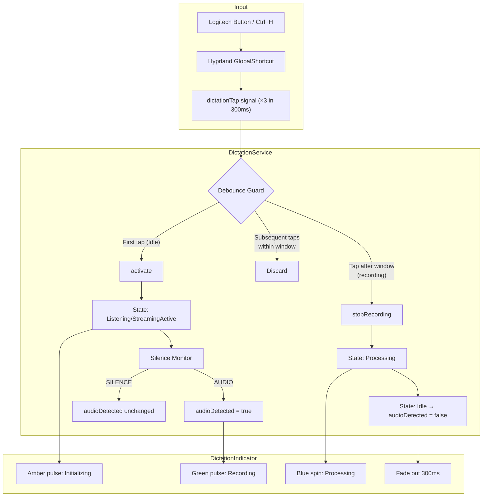

# Design Document: Dictation Debounce & Indicator Enhancement

## Overview

This feature addresses a hardware-induced bug where the Logitech Dictation button fires `Ctrl+H` three times in ~300ms, causing DictationService to receive three `dictationTap` signals and enter a start→stop→reset loop. The solution adds a timer-based debounce guard to suppress duplicate activations, and enhances the DictationIndicator with color-coded visual states so users always know what the dictation system is doing.

**Key changes:**
1. **DictationService** gains a debounce Timer that suppresses taps within a configurable window after the first activation
2. **DictationService** exposes an `audioDetected` boolean driven by the existing silence monitor
3. **DictationIndicator** gets three distinct color states: amber (initializing), green (recording with audio), blue (processing)
4. **DictationIndicator** gains a fade-out dismissal animation

## Architecture



## Components and Interfaces

### 1. Debounce Guard (in DictationService.qml)

A `Timer` component and a boolean gate that filters incoming `dictationTap` signals.

**New properties:**
| Property | Type | Default | Description |
|----------|------|---------|-------------|
| `debounceMs` | `int` | `500` | Configurable debounce window in milliseconds |
| `_debounceActive` | `bool` | `false` | Internal flag — true while debounce timer is running |
| `audioDetected` | `bool` | `false` | True after first "AUDIO" report in current session |

**New component:**
```qml
Timer {
    id: debounceTimer
    interval: root.debounceMs
    repeat: false
    onTriggered: {
        root._debounceActive = false
    }
}
```

**Modified `onKeyTap()` logic:**
```qml
function onKeyTap() {
    // If debounce is active, discard the tap
    if (root._debounceActive) {
        console.log("[DictationService] DEBOUNCE: tap discarded")
        return
    }

    // If currently recording, tap stops (existing behavior)
    if (root.state === DictationService.State.Listening ||
        root.state === DictationService.State.StreamingActive) {
        stopRecording()
        return
    }

    // Activate and start debounce guard
    if (root.debounceMs > 0) {
        root._debounceActive = true
        debounceTimer.restart()
    }
    activate()
}
```

### 2. audioDetected Property (in DictationService.qml)

The existing `silenceMonitor` Process already emits "AUDIO" or "SILENCE" lines. The modification adds an `audioDetected` flag that flips on the first "AUDIO" report after activation and resets on transition to Idle.

**Modified silence monitor stdout handler:**
```qml
stdout: SplitParser {
    onRead: data => {
        if (data.trim() === "AUDIO") {
            if (!root.audioDetected) {
                root.audioDetected = true
            }
            root.resetSilenceTimer()
        }
    }
}
```

**Reset in `_setState()`:**
```qml
function _setState(newState, context) {
    var oldState = root.state
    root.state = newState
    _logTransition(oldState, newState, context)

    // Reset audioDetected when returning to Idle
    if (newState === DictationService.State.Idle) {
        root.audioDetected = false
    }
}
```

### 3. DictationIndicator Visual States

The existing indicator gets enhanced with three color-coded sub-states using the `audioDetected` property:

| Visual State | Condition | Icon | Color | Animation |
|-------------|-----------|------|-------|-----------|
| Initializing | `state ∈ {Listening, StreamingActive}` AND `!audioDetected` | `mic` | Amber (`#FFA000`) | Pulsing opacity |
| Recording | `state ∈ {Listening, StreamingActive}` AND `audioDetected` | `mic` | Green (`#4CAF50`) | Steady pulse |
| Processing | `state === Processing` | `progress_activity` | Blue (`#2196F3`) | Rotation |
| Error | `state === Error` | `error` | Red (existing) | None |

**Color logic in indicator mic icon:**
```qml
color: {
    if (DictationService.state === DictationService.State.Listening ||
        DictationService.state === DictationService.State.StreamingActive) {
        return DictationService.audioDetected ? "#4CAF50" : "#FFA000"
    }
    return Appearance.m3colors.m3error  // fallback (error state)
}
```

**Border color also changes to match:**
```qml
border.color: {
    if (DictationService.state === DictationService.State.Processing)
        return "#2196F3"
    if (DictationService.state === DictationService.State.Listening ||
        DictationService.state === DictationService.State.StreamingActive) {
        return DictationService.audioDetected ? "#4CAF50" : "#FFA000"
    }
    return Appearance.m3colors.m3error
}
```

### 4. Fade-Out Dismissal

When dictation completes (Processing→Idle) or error dismisses, the indicator fades out rather than vanishing instantly.

```qml
opacity: (root.isActive || root.hasResponseText || root.isAwaitingApproval) ? 1.0 : 0.0

Behavior on opacity {
    NumberAnimation {
        duration: 300
        easing.type: Easing.OutCubic
    }
}

// Delay actual hiding until fade completes
visible: opacity > 0 && !GlobalStates.screenLocked
```

### 5. Indicator Positioning (unchanged from existing)

The indicator already uses the correct layer and positioning. This design preserves:
- `WlrLayershell.layer: WlrLayer.Overlay`
- `exclusiveZone: 0`
- `anchors { top: true; right: true }`
- Offset: `Appearance.sizes.hyprlandGapsOut + Appearance.sizes.barHeight + 8`

No keyboard focus is set (PanelWindow with Overlay layer does not receive focus by default in Quickshell/wlr-layer-shell).

## Data Models

### State Machine (existing, unchanged)

```
Idle → Listening (batch) | StreamingActive (streaming)
Listening/StreamingActive → Processing (stop)
Processing → Idle (success) | Error (failure)
Error → Idle (timeout/dismiss)
```

### New Properties on DictationService

```typescript
interface DictationServiceExtensions {
    debounceMs: number       // default 500, configurable
    _debounceActive: boolean // internal, true during debounce window
    audioDetected: boolean   // true after first AUDIO in session
}
```

### Indicator Visual State (derived, not stored)

```typescript
type IndicatorVisualState = "initializing" | "recording" | "processing" | "error" | "hidden"

function deriveVisualState(serviceState: State, audioDetected: boolean): IndicatorVisualState {
    if (serviceState === Idle) return "hidden"
    if (serviceState === Error) return "error"
    if (serviceState === Processing) return "processing"
    if (serviceState === Listening || serviceState === StreamingActive) {
        return audioDetected ? "recording" : "initializing"
    }
}
```

## Correctness Properties

*A property is a characteristic or behavior that should hold true across all valid executions of a system — essentially, a formal statement about what the system should do. Properties serve as the bridge between human-readable specifications and machine-verifiable correctness guarantees.*

### Property 1: Debounce Filtering

*For any* sequence of N dictation tap signals arriving within the debounce window after the first activation from Idle, only the first tap SHALL cause a state transition (Idle → Listening/StreamingActive), and all subsequent taps within the window SHALL be discarded without state change.

**Validates: Requirements 1.1, 1.2, 1.3**

### Property 2: Debounce Bypass When Disabled

*For any* sequence of dictation tap signals with `debounceMs` set to 0, every tap SHALL be processed immediately — no tap is suppressed regardless of timing relative to other taps.

**Validates: Requirements 2.2**

### Property 3: Stop Preserves After Debounce Expiry

*For any* dictation tap signal arriving after the debounce window has expired, if DictationService is in Listening or StreamingActive state, the tap SHALL cause a transition to Processing state (stop behavior preserved).

**Validates: Requirements 1.4**

### Property 4: audioDetected Lifecycle

*For any* dictation session, `audioDetected` SHALL be false upon entering Listening/StreamingActive, SHALL become true upon the first "AUDIO" report from the silence monitor, and SHALL reset to false upon any transition to Idle — regardless of the path taken to reach Idle.

**Validates: Requirements 8.1, 8.2**

## Error Handling

| Scenario | Behavior |
|----------|----------|
| Debounce timer fails to start (QML engine issue) | `_debounceActive` defaults to false, allowing all taps through (fail-open) |
| Silence monitor exits unexpectedly | `audioDetected` remains at its last value; indicator stays in current visual state. Existing silenceMonitor `running` binding restarts it if state is still Listening |
| Multiple rapid state transitions | `_setState()` always resets `audioDetected` on Idle, preventing stale state |
| Error state while debounce active | Debounce timer continues independently; error dismiss timer (2s) transitions to Idle, which naturally allows re-activation |
| `debounceMs` changed while timer running | Timer uses binding to `root.debounceMs` — QML Timer picks up new interval on next restart, not mid-run (safe) |

## Testing Strategy

### Unit Tests (Example-Based)

- **Debounce default value**: Verify `debounceMs` initializes to 500
- **Visual state amber**: Verify indicator shows amber when state=Listening, audioDetected=false
- **Visual state green**: Verify indicator shows green when state=Listening, audioDetected=true
- **Visual state blue**: Verify indicator shows blue spinner when state=Processing
- **Fade-out animation**: Verify opacity animation duration is between 200–500ms
- **Error display timer**: Verify error shows for 2 seconds before fade begins
- **Layer config**: Verify WlrLayer.Overlay and exclusiveZone=0

### Property-Based Tests

Property-based testing applies to the debounce state machine logic and audioDetected lifecycle, which are pure state transition functions with well-defined input spaces.

**Library**: Python `hypothesis` (already in use in this project based on `.hypothesis/` directory)

**Configuration**: Minimum 100 iterations per property test.

**Tag format**: `Feature: dictation-debounce-indicator, Property {N}: {description}`

| Property | Test Description | Generator |
|----------|-----------------|-----------|
| 1: Debounce Filtering | Generate random tap sequences with timestamps within [0, debounceMs]. Simulate state machine. Assert only first tap transitions from Idle. | `st.lists(st.integers(min_value=0, max_value=500))` for tap timings |
| 2: Debounce Bypass | Generate tap sequences with debounceMs=0. Assert all taps are processed (no suppression). | `st.lists(st.integers(min_value=0, max_value=100))` for tap timings |
| 3: Stop After Debounce | Generate debounce durations, then a tap arriving after expiry while in recording state. Assert state transitions to Processing. | `st.integers(min_value=1, max_value=2000)` for debounceMs, `st.integers()` for post-expiry delay |
| 4: audioDetected Lifecycle | Generate sequences of "AUDIO"/"SILENCE" reports and state transitions. Assert audioDetected is false at start, true after first AUDIO, and false after Idle. | `st.lists(st.sampled_from(["AUDIO", "SILENCE"]))` for monitor reports |

### Integration Tests

- End-to-end: Fire 3 rapid taps via `hyprctl dispatch` → verify only one dictation session starts
- Silence monitor integration: Start recording, speak, verify `audioDetected` flips in real audio environment
- Visual regression: Screenshot indicator in each color state for manual review
