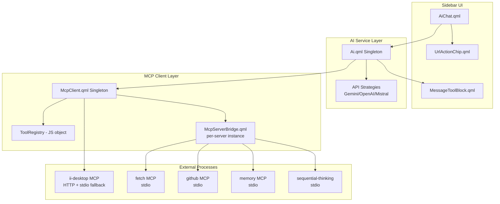

# Design Document: MCP Sidebar Integration

## Overview

This design integrates the full Model Context Protocol (MCP) ecosystem into the Quickshell AI sidebar chat. Currently, the sidebar has 3 hardcoded HyprMCP tools dispatched via `curl` to a localhost HTTP endpoint. This feature replaces that with a unified MCP client that:

1. Manages MCP server lifecycles (spawn, idle shutdown, respawn)
2. Dynamically discovers tools via the MCP `tools/list` protocol
3. Dispatches tool calls over stdio JSON-RPC to any configured MCP server
4. Converts MCP tool schemas into per-provider function declarations (Gemini, OpenAI, Mistral)
5. Migrates existing HyprMCP (ii-desktop) tools to the unified client
6. Adds URL detection with inline fetch-and-summarize capability
7. Renders tool results in collapsible, syntax-highlighted blocks

The existing `handleFunctionCall()` if/else chain remains for built-in tools (shell commands, config, search mode switch). MCP tools are a fallback path after built-in matching fails.

## Architecture



### Key Architectural Decisions

1. **McpClient as a separate singleton** — keeps MCP lifecycle logic out of the already-large Ai.qml. Registered in `services/qmldir`, accessible as `McpClient`.

2. **Per-server McpServerBridge instances** — each MCP server gets its own `Process` component with `SplitParser` on stdout. This matches the existing pattern (like `hyprMcpProc`) but generalizes it. Each bridge manages its own pending request map, idle timer, and lifecycle state.

3. **ii-desktop hybrid transport** — the ii-desktop server currently runs as an HTTP daemon on port 7580. The client tries HTTP first (fast path), falls back to stdio spawn if HTTP is unreachable. This preserves compatibility during the migration period.

4. **Tool Registry as a plain JS object** — no need for a QML model since the registry is consumed programmatically (to build function declarations). It maps `toolName → { server, schema, description }`.

5. **Built-in tools take priority** — the dispatch path checks built-in names first, then falls to `McpClient.callTool()`. This preserves all existing behavior and avoids breaking changes.

6. **Lazy server spawning** — servers are not started on sidebar init. They're spawned on first tool call targeting them. This reduces resource usage (most sessions won't use all servers). The idle timeout (5 min) reclaims resources.

## Components and Interfaces

### McpClient.qml (Singleton)

```qml
// services/McpClient.qml
Singleton {
    id: root
    
    // Public API
    property var toolRegistry: ({})  // toolName → { serverName, description, inputSchema }
    property var serverStates: ({})  // serverName → "disconnected"|"connecting"|"connected"|"error"|"disabled"
    property var autoApproveList: [] // Flat list of tool names that don't need confirmation
    
    // Signals
    signal toolsChanged()          // Emitted when toolRegistry is updated
    signal serverStateChanged(string serverName, string state)
    
    // Methods
    function initialize()                          // Read mcp.json, register servers
    function callTool(toolName, args) → Promise    // Dispatch tool call, returns result
    function getToolDeclarations(format) → Array   // Build provider-specific declarations
    function isToolAutoApproved(toolName) → bool   // Check auto-approve status
    function setServerDisabled(name, disabled)     // Toggle server enabled/disabled
    function getServerStatus() → Array             // For UI status display
}
```

### McpServerBridge.qml (Component, one per server)

```qml
// services/mcp/McpServerBridge.qml
Item {
    id: bridge
    
    property string serverName: ""
    property string serverCommand: ""
    property list<string> serverArgs: []
    property var serverEnv: ({})
    property int timeout: 30000
    property string transport: "stdio"  // "stdio" or "http"
    property string httpEndpoint: ""    // For HTTP transport
    
    property string state: "disconnected"  // disconnected, connecting, connected, error
    property var pendingRequests: ({})     // id → { resolve, reject, timer }
    property int nextRequestId: 1
    property var discoveredTools: []
    
    // Idle management
    property int idleTimeoutMs: 300000  // 5 minutes
    property var lastActivityTimestamp: 0
    
    function spawn() → Promise          // Start process, complete handshake
    function shutdown()                  // Graceful shutdown with force-kill fallback
    function sendRequest(method, params) → Promise  // Send JSON-RPC request
    function discoverTools() → Promise  // Send tools/list, populate discoveredTools
}
```

### Integration Points in Ai.qml

```javascript
// In the tools property — append MCP tools dynamically
property var tools: {
    // ... existing static tools ...
    // McpClient.getToolDeclarations(format) merged at runtime
}

// In handleFunctionCall — fallback to MCP
function handleFunctionCall(name, args, message) {
    if (name === "switch_to_search_mode") { /* existing */ }
    else if (name === "get_shell_config") { /* existing */ }
    // ... other built-in tools ...
    else if (McpClient.toolRegistry[name]) {
        // MCP tool dispatch
        handleMcpToolCall(name, args, message);
    }
    else {
        root.addMessage(Translation.tr("Unknown function call: %1").arg(name), "assistant");
    }
}

function handleMcpToolCall(name, args, message) {
    // Check auto-approve
    if (!McpClient.isToolAutoApproved(name)) {
        message.functionPending = true;
        message.pendingMcpTool = name;
        message.pendingMcpArgs = args;
        return;
    }
    executeMcpTool(name, args);
}
```

### MessageToolBlock.qml (New UI component)

A collapsible block similar to `MessageThinkBlock.qml` but specialized for tool results:

- Header shows "Tool: [name]" with Material Design 3 color roles
- Success: `secondaryContainer` background
- Error: `error` color role background  
- Body: syntax-highlighted JSON or plain text
- Loading state: spinner + tool name while pending
- Truncation: cap at 500 lines with overflow indicator

### UrlActionChip.qml (New UI component)

Inline chip rendered adjacent to detected URLs in user messages:

- Two actions: "Fetch with AI" icon button, "Open" icon button
- Fetch invokes `McpClient.callTool("mcp_fetch_fetch", { url })` 
- Open invokes `Qt.openUrlExternally(url)`
- Only shows "Fetch with AI" if the fetch server is configured

## Data Models

### MCP Configuration (mcp.json)

```json
{
  "mcpServers": {
    "ii-desktop": {
      "command": "uvx",
      "args": ["ii-desktop-mcp"],
      "env": {},
      "autoApprove": ["config_read", "audio_status", "network_status", "system_info"],
      "timeout": 30000,
      "disabled": false
    },
    "fetch": {
      "command": "uvx",
      "args": ["mcp-fetch"],
      "env": {},
      "autoApprove": ["fetch"],
      "timeout": 30000,
      "disabled": false
    },
    "github": {
      "command": "npx",
      "args": ["-y", "@modelcontextprotocol/server-github"],
      "env": { "GITHUB_PERSONAL_ACCESS_TOKEN": "..." },
      "autoApprove": ["search_repositories", "get_file_contents"],
      "timeout": 30000,
      "disabled": false
    }
  }
}
```

### Tool Registry Entry

```javascript
{
  "mcp_fetch_fetch": {
    serverName: "fetch",
    originalName: "fetch",  // Name as reported by server
    description: "Fetches a URL and returns content as markdown",
    inputSchema: {
      type: "object",
      properties: {
        url: { type: "string", description: "URL to fetch" },
        max_length: { type: "integer", default: 5000 },
        raw: { type: "boolean", default: false }
      },
      required: ["url"]
    }
  }
}
```

### Tool Name Mapping

Tool names are prefixed with the server identifier to avoid conflicts:
- Server "fetch" tool "fetch" → `mcp_fetch_fetch`
- Server "github" tool "search_repositories" → `mcp_github_search_repositories`
- Server "ii-desktop" tool "config_read" → `mcp_ii_desktop_config_read`

Exception: if a tool name is globally unique across all servers, it MAY be used without prefix (configurable, but defaulting to always-prefix for safety).

### JSON-RPC Message Format

**Request:**
```json
{"jsonrpc": "2.0", "id": 1, "method": "tools/call", "params": {"name": "fetch", "arguments": {"url": "https://example.com"}}}
```

**Response:**
```json
{"jsonrpc": "2.0", "id": 1, "result": {"content": [{"type": "text", "text": "...page content..."}], "isError": false}}
```

**Initialization Handshake:**
```json
{"jsonrpc": "2.0", "id": 0, "method": "initialize", "params": {"protocolVersion": "2024-11-05", "capabilities": {}, "clientInfo": {"name": "ii-sidebar", "version": "1.0.0"}}}
```

### Provider-Specific Tool Declaration Formats

**Gemini:**
```javascript
[{ "functionDeclarations": [
  { name: "mcp_fetch_fetch", description: "...", parameters: { type: "object", properties: {...}, required: [...] } }
]}]
```

**OpenAI:**
```javascript
[
  { name: "mcp_fetch_fetch", description: "...", parameters: { type: "object", properties: {...}, required: [...] } }
]
```

**Mistral:**
```javascript
[
  { type: "function", function: { name: "mcp_fetch_fetch", description: "...", parameters: { type: "object", properties: {...}, required: [...] } } }
]
```

## Correctness Properties

*A property is a characteristic or behavior that should hold true across all valid executions of a system — essentially, a formal statement about what the system should do. Properties serve as the bridge between human-readable specifications and machine-verifiable correctness guarantees.*

### Property 1: Config parsing filters disabled servers

*For any* MCP configuration object containing N server entries with varying `disabled` fields, parsing the config SHALL produce a registered server list containing exactly those entries where `disabled` is not `true`, preserving all other fields (command, args, env, timeout, autoApprove) unchanged.

**Validates: Requirements 1.1, 10.1**

### Property 2: Tool registry population from tools/list

*For any* tools/list response containing a mix of valid tool entries (with name, description, and parseable inputSchema) and invalid entries (missing name or unparseable schema), the Tool Registry SHALL contain exactly the valid entries with correct name, description, and schema, and SHALL skip all invalid entries.

**Validates: Requirements 2.2, 2.7**

### Property 3: Tool-to-server mapping invariant

*For any* state of the Tool Registry, every registered tool entry SHALL have a non-empty `serverName` field that corresponds to a known MCP server from the configuration.

**Validates: Requirements 2.4**

### Property 4: Function declarations include all registered tools

*For any* Tool Registry state and any provider format, the generated function declarations SHALL include one entry for every tool in the registry plus one entry for every built-in tool, with no omissions or duplicates.

**Validates: Requirements 2.3, 7.1**

### Property 5: Name collision prefixing

*For any* set of MCP servers where two or more servers expose tools with identical original names, the Tool Registry SHALL assign each conflicting tool a name prefixed with its server identifier (e.g., `servername_toolname`), and the resulting registry SHALL contain no duplicate tool names.

**Validates: Requirements 2.5, 8.7**

### Property 6: JSON-RPC request serialization

*For any* valid tool call (tool name + arguments object), the serialized JSON-RPC request SHALL be a single line of valid UTF-8 JSON terminated by exactly one `\n` character, not exceeding 1 MB, and SHALL contain the fields `jsonrpc: "2.0"`, a numeric `id`, `method: "tools/call"`, and `params` containing the tool name and arguments.

**Validates: Requirements 4.1, 3.1**

### Property 7: JSON-RPC serialization round-trip

*For any* valid JSON-RPC request object, serializing to a string and then parsing back SHALL produce a semantically equivalent object (same keys, same values, same nesting).

**Validates: Requirements 4.8**

### Property 8: Response correlation under concurrency

*For any* set of up to 32 concurrently pending requests (each with a unique id) and a set of responses arriving in arbitrary order, each response SHALL resolve exactly the pending request whose id matches, regardless of arrival order, and no pending request SHALL be resolved by a non-matching response.

**Validates: Requirements 4.3, 4.5**

### Property 9: Malformed stdout lines discarded

*For any* string written to stdout that is either not valid JSON or does not conform to JSON-RPC 2.0 structure (missing `jsonrpc` field or missing both `id` and `method`), the MCP Bridge SHALL discard the line without affecting any pending request's state.

**Validates: Requirements 4.4**

### Property 10: Auto-approve decision

*For any* tool name, if the tool name appears in the server's autoApprove list, the tool SHALL be executed without user confirmation; if it does not appear in the autoApprove list, the system SHALL request user approval before execution.

**Validates: Requirements 3.5, 3.6**

### Property 11: Tool response parsing

*For any* valid JSON-RPC response to a tools/call request, if `isError` is false the parsed result content SHALL be delivered as the function response text; if `isError` is true the error content SHALL be delivered as a function error response. In both cases the response SHALL be correlated to the correct pending request by id.

**Validates: Requirements 3.2, 3.8**

### Property 12: URL detection

*For any* message string containing zero or more URLs matching `https://`, `http://`, or `www.` prefixes (each up to 2048 characters in length), the URL Detector SHALL identify all such URLs and return their positions and text, with no false negatives for conforming URLs and no matches exceeding 2048 characters.

**Validates: Requirements 5.1, 5.6**

### Property 13: Fetch content truncation

*For any* string returned by the fetch tool, if its length exceeds 8000 characters, the content included in the conversation context SHALL be truncated to exactly 8000 characters; if 8000 or fewer, it SHALL be included in full.

**Validates: Requirements 5.3**

### Property 14: Tool result line truncation

*For any* tool result text, if the line count exceeds 500, the displayed output SHALL be truncated to 500 lines with a truncation indicator showing the total line count; if 500 or fewer, it SHALL be displayed in full.

**Validates: Requirements 6.6**

### Property 15: Tool result block ordering and cap

*For any* sequence of N tool calls within one assistant turn, the rendered tool blocks SHALL appear in invocation order and SHALL contain at most 20 blocks (additional calls beyond 20 are not rendered as blocks).

**Validates: Requirements 6.5**

### Property 16: JSON content detection

*For any* tool result content string, if the string is valid JSON (parseable without error), it SHALL be rendered in a syntax-highlighted code block with language "json"; if not valid JSON, it SHALL be rendered as plain text within the tool block.

**Validates: Requirements 6.2**

### Property 17: Dispatch priority

*For any* function call name, if the name matches a built-in tool, the built-in handler SHALL be invoked regardless of whether the same name exists in the Tool Registry; if no built-in match exists and the name is in the Tool Registry, the MCP dispatch path SHALL be used; if neither matches, an unknown-function error SHALL be reported.

**Validates: Requirements 7.2, 7.3**

### Property 18: Built-in name conflict rejection

*For any* MCP tool whose name is an exact case-sensitive match with a built-in tool name, the Tool Registry SHALL reject registration of that tool and SHALL not overwrite or shadow the built-in tool.

**Validates: Requirements 7.4**

### Property 19: Schema conversion to provider formats

*For any* tool in the Tool Registry and any target provider format (Gemini, OpenAI, Mistral), converting the tool's MCP schema to the provider format SHALL produce a declaration with the correct structure: Gemini wraps in `functionDeclarations` array, OpenAI produces flat objects with `name`/`description`/`parameters`, Mistral wraps in `{type: "function", function: {...}}`.

**Validates: Requirements 9.1, 9.2, 9.3**

### Property 20: Schema property preservation

*For any* MCP tool input schema containing properties with names, types, descriptions, and required field arrays, converting to any provider format SHALL preserve all property names, all types, all descriptions, and the complete required array without modification.

**Validates: Requirements 9.5**

### Property 21: Timeout value clamping

*For any* timeout field value in an MCP server configuration entry, if the value is between 1000 and 300000 (inclusive), it SHALL be used as the server timeout; if outside this range, the default of 30000 SHALL be used instead.

**Validates: Requirements 10.3, 10.7**

### Property 22: Environment variable application

*For any* MCP server entry with an `env` field containing key-value string pairs, all key-value pairs SHALL be set as environment variables in the spawned process, and no environment variable from the `env` field SHALL be missing from the process environment.

**Validates: Requirements 10.2**

### Property 23: Write operation read-back verification

*For any* successful write tool call (config_set or set_keyword) to the ii-desktop server, the MCP Client SHALL perform a subsequent config_read call for the affected namespace and compare the returned value against the written value before reporting success.

**Validates: Requirements 8.6**

## Error Handling

### Server Lifecycle Errors

| Error Condition | Response | Recovery |
|----------------|----------|----------|
| MCP server fails to start (command not found) | Mark server as `error`, log stderr output | Allow re-spawn on next tool call |
| Initialization handshake timeout (10s) | Terminate process, report to Sidebar_AI | Mark as `error`, allow retry |
| Unexpected process exit | Mark `unavailable`, log exit code | Re-spawn on next tool call |
| Graceful shutdown timeout (5s) | Force-kill (SIGKILL) | Clean up pending requests |

### Communication Errors

| Error Condition | Response | Recovery |
|----------------|----------|----------|
| Malformed JSON on stdout | Discard line, log warning (first 200 chars) | Continue reading |
| Request timeout (configurable, default 30s) | Reject pending request with timeout error | Remove from pending queue |
| Server exits with pending requests | Reject all pending with disconnect error | Mark server unavailable |
| Request exceeds 1MB | Reject before sending, return size error | Caller can retry with smaller payload |

### Tool Execution Errors

| Error Condition | Response | Recovery |
|----------------|----------|----------|
| Tool call returns `isError: true` | Deliver error content as function response | LLM can retry or explain |
| Unknown tool name (no registry match) | Display "Unknown function" message | Continue conversation |
| User rejects tool approval | Deliver rejection notice to LLM | Conversation continues |
| ii-desktop HTTP unreachable | Fall back to stdio spawn | Transparent to user |

### Configuration Errors

| Error Condition | Response | Recovery |
|----------------|----------|----------|
| mcp.json missing | Operate with built-in tools only, log warning | User can create file |
| mcp.json malformed JSON | Operate with built-in tools only, log warning | User can fix file |
| Invalid timeout value | Use default 30000ms, log warning | Transparent to user |
| Missing env vars in server config | Spawn with available env, may fail at runtime | Server reports error |

## Testing Strategy

### Property-Based Testing

This feature has significant pure logic suitable for property-based testing: config parsing, JSON-RPC serialization/deserialization, tool registry management, schema conversion, URL detection, and truncation logic.

**Library**: Python `hypothesis` (matches existing test infrastructure in the workspace)

**Configuration**: Minimum 100 iterations per property test.

**Tag format**: `# Feature: mcp-sidebar-integration, Property {N}: {title}`

Properties to implement as PBT:
- Property 1: Config parsing (generate random config objects)
- Property 2: Registry population (generate random tools/list responses)
- Property 5: Name collision prefixing (generate overlapping tool sets)
- Property 6: JSON-RPC serialization (generate random tool calls)
- Property 7: JSON-RPC round-trip (generate random JSON-RPC objects)
- Property 8: Response correlation (generate request/response sequences)
- Property 9: Malformed line discard (generate invalid strings)
- Property 10: Auto-approve decision (generate tool names and approve lists)
- Property 12: URL detection (generate messages with URLs)
- Property 13: Fetch content truncation (generate strings of varying length)
- Property 14: Line truncation (generate multi-line strings)
- Property 16: JSON content detection (generate valid/invalid JSON strings)
- Property 17: Dispatch priority (generate function names)
- Property 19: Schema conversion (generate tool registries)
- Property 20: Schema preservation (generate JSON schemas)
- Property 21: Timeout clamping (generate timeout values)

### Unit Tests (Example-Based)

- Server lifecycle state transitions (spawn → connected → idle → shutdown)
- User approval flow (pending → approve/reject → continue)
- ii-desktop HTTP → stdio fallback
- Tool mode switching ("functions" / "search" / "none")
- Built-in tool preservation across MCP changes

### Integration Tests

- End-to-end tool call with a mock MCP server (stdio)
- ii-desktop tool discovery via tools/list
- Multi-server concurrent tool calls
- Session persistence with tool call history

### Manual Testing

- Visual verification of tool result blocks (styling, collapse, expand)
- URL chip rendering and click behavior
- Server status indicator in sidebar header
- Loading animation during pending tool calls

