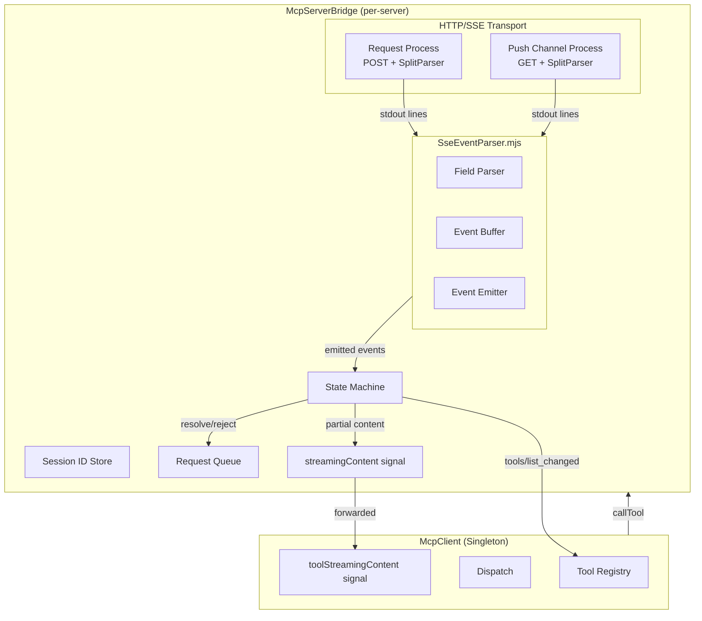
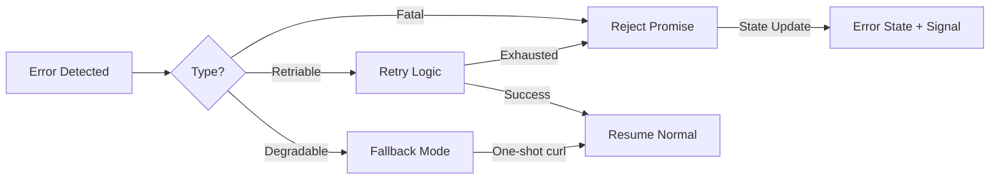
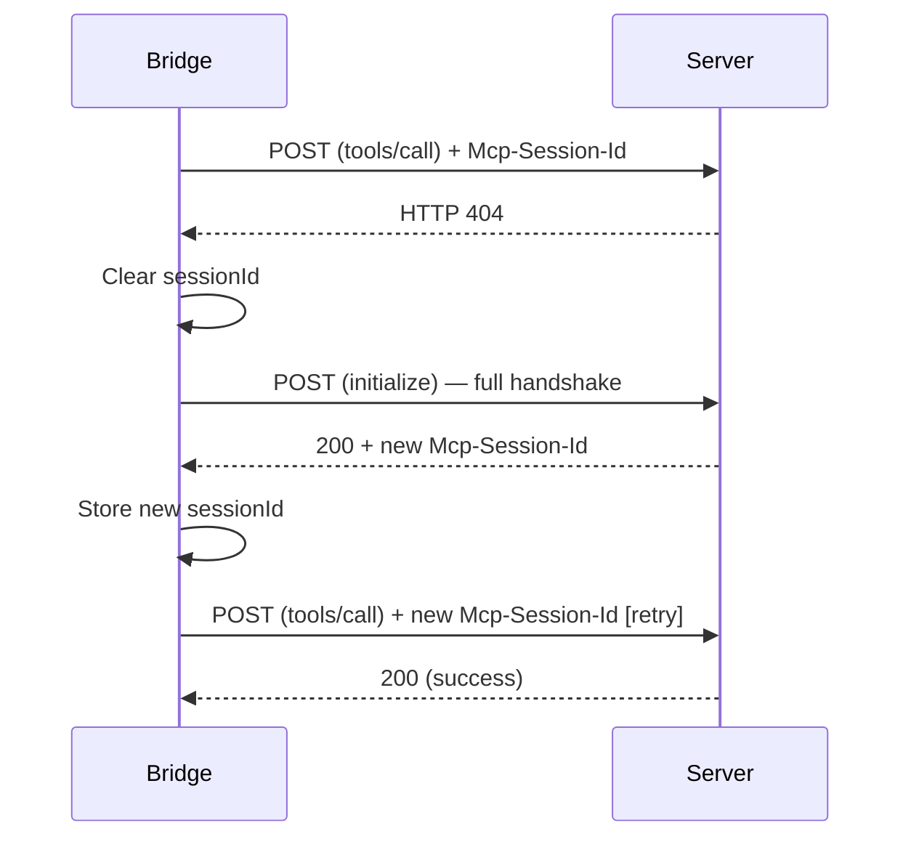

# Design Document: MCP Streamable HTTP with SSE Support

## Overview

This design adds full MCP Streamable HTTP transport with Server-Sent Events (SSE) support to the Quickshell McpServerBridge. The current implementation uses one-shot curl POST requests that buffer entire responses before parsing. This upgrade introduces:

1. **SSE Event Parser** — A standalone JavaScript module that incrementally parses W3C Server-Sent Events streams line-by-line.
2. **Streaming Curl Process** — A persistent `Process` with `SplitParser` (like stdio transport) that delivers curl output incrementally.
3. **Server Push Channel** — A long-lived GET request for receiving server-initiated notifications.
4. **Session Management** — Per-bridge session ID storage and lifecycle (store, attach, invalidate, terminate).
5. **Incremental Result Delivery** — Signals that carry partial tool call results to the UI layer in real time.

The design preserves backward compatibility: servers responding with `application/json` continue to use the existing one-shot path, and the shared `mcp.json` config remains unchanged for VS Code.

## Architecture



### Key Design Decisions

1. **SseEventParser as a JS module (`.mjs`)** rather than a QML component — it's pure logic with no QML bindings needed, making it unit-testable outside the QML engine. Imported via `import "./mcp/SseEventParser.mjs" as SseParser`.

2. **Persistent Process with SplitParser** for streaming curl — mirrors the existing stdio transport pattern. The `SplitParser` delivers each line as it arrives, which maps directly to SSE's line-oriented protocol.

3. **curl `-N` (`--no-buffer`) + `-i` (include headers)** — `-N` disables output buffering for true streaming; `-i` includes HTTP response headers in stdout so we can extract `Content-Type` and `Mcp-Session-Id` without separate stderr parsing.

4. **Header/body separation in the response handler** — The first blank line in curl `-i` output separates headers from body. The bridge's line handler uses a state flag to track whether it's still in the header section.

5. **Single push channel process** — One long-lived GET request per server, restarted on disconnect with exponential backoff. This avoids resource leaks from spawning a new process per notification.

6. **Process slot limiting (2 per server)** — Enforced via a counter + request queue. One slot for the push channel, one for active POST requests. Requests beyond this are queued (max 10) or rejected.

## Components and Interfaces

### SseEventParser.mjs

A pure JavaScript ES module providing the SSE parsing logic.

```javascript
// configs/quickshell/ii/services/mcp/SseEventParser.mjs

/**
 * Creates a new SSE event parser instance.
 * @returns {object} Parser with feedLine(line), end(), and onEvent callback
 */
export function createParser() {
    let eventType = "";
    let dataBuffer = [];
    let lastEventId = "";
    let onEvent = null;   // (event: { type, data, lastEventId }) => void
    let totalDataSize = 0;
    const MAX_DATA_SIZE = 10 * 1024 * 1024; // 10 MB

    function feedLine(line) {
        // Blank line → emit event
        if (line === "" || line === "\r") {
            if (dataBuffer.length > 0) {
                const data = dataBuffer.join("\n");
                const type = eventType || "message";

                let parsedData;
                try {
                    parsedData = JSON.parse(data);
                } catch (e) {
                    parsedData = data; // Pass raw string if not valid JSON
                }

                if (onEvent) {
                    onEvent({ type: type, data: parsedData, lastEventId: lastEventId });
                }
            }
            // Reset buffer
            eventType = "";
            dataBuffer = [];
            totalDataSize = 0;
            return { emitted: true };
        }

        // Comment line
        if (line.startsWith(":")) {
            return { emitted: false };
        }

        // Parse field
        const colonIdx = line.indexOf(":");
        let field, value;
        if (colonIdx === -1) {
            field = line;
            value = "";
        } else {
            field = line.substring(0, colonIdx);
            value = line.substring(colonIdx + 1);
            // Strip single leading space
            if (value.startsWith(" ")) {
                value = value.substring(1);
            }
        }

        switch (field) {
            case "event":
                eventType = value;
                break;
            case "data":
                totalDataSize += value.length + 1; // +1 for newline separator
                if (totalDataSize > MAX_DATA_SIZE) {
                    return { emitted: false, error: "size_limit_exceeded" };
                }
                dataBuffer.push(value);
                break;
            case "id":
                lastEventId = value;
                break;
            case "retry":
                // Ignored for now (could be used for reconnection intervals)
                break;
            default:
                // Unrecognized field — ignore
                break;
        }

        return { emitted: false };
    }

    function end() {
        // Stream ended — discard incomplete event
        eventType = "";
        dataBuffer = [];
        totalDataSize = 0;
    }

    function reset() {
        eventType = "";
        dataBuffer = [];
        totalDataSize = 0;
        lastEventId = "";
    }

    return {
        feedLine,
        end,
        reset,
        get onEvent() { return onEvent; },
        set onEvent(cb) { onEvent = cb; },
        get totalDataSize() { return totalDataSize; }
    };
}
```

### McpServerBridge Additions

New properties and methods added to `McpServerBridge.qml`:

```
// New properties
property string sessionId: ""              // Stored Mcp-Session-Id
property bool sseSupported: false          // Whether server supports SSE
property bool nonSseMarked: false          // Marked non-SSE after 400/405
property int activeProcessCount: 0         // Current curl processes
property var requestQueue: []              // Pending requests when at capacity
property var pushChannelProcess: null      // Reference to push channel Process
property bool pushChannelActive: false     // Whether push channel is running
property int reconnectAttempts: 0          // Push channel reconnect counter
property int reconnectInterval: 1000       // Current backoff interval (ms)
property var streamingAccumulator: ({})    // requestId → accumulated data

// New signals
signal streamingContent(int requestId, string content)
signal progressNotification(string token, real current, real total)
signal pushChannelDisconnected()

// New methods
function _sendStreamingHttpRequest(method, params, customTimeout)  // SSE-aware POST
function _openPushChannel()                                         // Start GET SSE stream
function _closePushChannel()                                        // Terminate push channel
function _handleSseEvent(event, requestContext)                     // Process parsed SSE event
function _handlePushChannelEvent(event)                             // Process push notification
function _attemptPushChannelReconnect()                             // Reconnect with backoff
function _sendSessionDelete()                                       // DELETE on shutdown
function _resetSession()                                            // Clear session, re-handshake
function _buildCurlHeaders()                                        // Build headers including session ID
function _enqueueRequest(method, params, timeout, promise)          // Queue when at capacity
function _processQueue()                                            // Dequeue after slot frees
```

### McpClient Additions

New signals and forwarding logic in `McpClient.qml`:

```
// New signals
signal toolStreamingContent(string toolName, string content)

// In bridge state change handler:
// Connect bridge.streamingContent → root.toolStreamingContent forwarding
```

### Curl Command Patterns

**Streaming POST (tool call with SSE):**
```bash
curl -N -i --connect-timeout 10 --max-time 0 \
  -X POST <endpoint> \
  -H "Content-Type: application/json" \
  -H "Accept: text/event-stream, application/json" \
  -H "Mcp-Session-Id: <session-id>" \
  -d '<json-rpc-body>'
```

**Push Channel GET:**
```bash
curl -N -i --connect-timeout 10 --max-time 0 \
  -X GET <endpoint> \
  -H "Accept: text/event-stream" \
  -H "Mcp-Session-Id: <session-id>"
```

**Session DELETE:**
```bash
curl -s --connect-timeout 5 --max-time 5 \
  -X DELETE <endpoint> \
  -H "Mcp-Session-Id: <session-id>"
```

### Header Parsing State Machine

When a streaming curl process starts with `-i`, the line handler operates in two phases:

```
Phase 1 (Headers): Read lines until blank line
  - Extract Content-Type header
  - Extract Mcp-Session-Id header
  - On blank line → transition to Phase 2

Phase 2 (Body): Route based on Content-Type
  - If text/event-stream → feed lines to SseEventParser
  - If application/json → accumulate lines, parse on process exit
```

## Data Models

### SSE Event (internal representation)

```javascript
{
    type: string,        // "message" (default), or custom event type
    data: object|string, // Parsed JSON or raw string
    lastEventId: string  // Last seen "id:" value
}
```

### Session State (per bridge)

```javascript
{
    sessionId: string|"",     // Current session ID or empty
    sseSupported: boolean,    // Server confirmed SSE support
    nonSseMarked: boolean,    // Server marked non-SSE after 400/405
    pushChannelActive: boolean // Push channel currently running
}
```

### Request Queue Entry

```javascript
{
    method: string,
    params: object,
    timeout: number,
    promise: { _resolve, _reject }
}
```

### Process Slot Tracking

```javascript
{
    activeProcessCount: number,  // 0, 1, or 2
    // Slot 1: Push channel (long-lived GET)
    // Slot 2: Active request (POST)
    requestQueue: []             // Max 10 entries
}
```

### Reconnection Backoff State

```javascript
{
    reconnectAttempts: number,   // 0-10 for push channel (Req 2.6)
    reconnectInterval: number,  // Current interval: min(2^(N-1) * 1000, 30000)
    // For tool call retries (Req 8.1): fixed 2s delay, 1 retry max
    // For push channel (Req 8.2): 5s interval, 3 retries max
}
```

## Correctness Properties

*A property is a characteristic or behavior that should hold true across all valid executions of a system — essentially, a formal statement about what the system should do. Properties serve as the bridge between human-readable specifications and machine-verifiable correctness guarantees.*

### Property 1: SSE Multi-Line Data Concatenation and JSON-RPC Resolution

*For any* valid JSON-RPC response object split across N `data:` lines within a single SSE event (terminated by a blank line), the parser SHALL concatenate all data values with newline separators, parse the combined string as JSON, and the bridge SHALL resolve the pending request matching the response's `id` field with the parsed `result` value.

**Validates: Requirements 1.2, 1.3, 5.3**

### Property 2: Push Channel Notification Dispatch and Resilience

*For any* SSE event received on the push channel, if the event's data is a valid JSON-RPC notification (has `method` field, no `id`), it SHALL be dispatched to the appropriate handler; if the event's data cannot be parsed as valid JSON-RPC, it SHALL be discarded without affecting the push channel's continued operation.

**Validates: Requirements 2.2, 2.3**

### Property 3: Progress Signal Emission

*For any* `notifications/progress` notification received on the push channel with a `progressToken`, `progress`, and optional `total` in params, the bridge SHALL emit a `progressNotification` signal where token equals the progressToken, current equals the progress value, and total equals the provided total or -1 if omitted.

**Validates: Requirements 2.5**

### Property 4: Exponential Backoff Calculation

*For any* reconnection attempt number N (1 ≤ N ≤ 10) after a push channel disconnect, the backoff interval SHALL equal min(2^(N-1) × 1000, 30000) milliseconds; after attempt 10 fails, the bridge SHALL transition to disconnected state.

**Validates: Requirements 2.6**

### Property 5: Session ID Persistence and Inclusion

*For any* HTTP response containing an `Mcp-Session-Id` header, the bridge SHALL store exactly that value (replacing any previous session ID), and *for all* subsequent HTTP requests to that server, the stored session ID SHALL be included as an `Mcp-Session-Id` request header. At most one session ID SHALL be stored per bridge instance at any time.

**Validates: Requirements 3.1, 3.2, 3.5**

### Property 6: Process Concurrency Limiting and Request Queueing

*For any* sequence of concurrent HTTP requests to a single server, at most 2 curl processes SHALL be active simultaneously. *For any* request arriving when 2 processes are active, it SHALL be queued if the queue contains fewer than 10 entries, or rejected with a capacity error if the queue already contains 10 entries.

**Validates: Requirements 4.6, 4.7**

### Property 7: SSE Field Parsing

*For any* SSE stream line containing a recognized field (`event`, `data`, `id`, `retry`) followed by a colon and value, the parser SHALL extract the field value after stripping exactly one leading space character (if present). *For any* line starting with `:` (comment), it SHALL be discarded without affecting the event buffer. *For any* line with an unrecognized field name, it SHALL be ignored without error.

**Validates: Requirements 5.1, 5.4, 5.7**

### Property 8: SSE Event Emission on Blank Line

*For any* sequence of field lines followed by a blank line, the parser SHALL emit exactly one event with `type` equal to the accumulated `event:` field value (or `"message"` if none was provided) and `data` equal to the concatenated `data:` values, then SHALL reset its internal buffer to empty.

**Validates: Requirements 5.2**

### Property 9: SSE Data JSON Handling

*For any* emitted SSE event whose concatenated `data` field is valid JSON, the parser SHALL pass the parsed JavaScript object to the handler. *For any* emitted SSE event whose concatenated `data` field is not valid JSON, the parser SHALL pass the raw string unchanged.

**Validates: Requirements 5.5, 5.6**

### Property 10: SSE Parser Chunking Independence

*For any* valid SSE stream, the sequence of emitted events (each with its event type and data payload) SHALL be identical whether the stream is delivered one line at a time or in arbitrary batches split at line boundaries.

**Validates: Requirements 5.9**

### Property 11: Config Parsing Accepts Minimal Fields

*For any* `mcp.json` entry containing a `url` field and any combination of `autoApprove`, `disabled`, and `transport` fields (all optional except `url`), the McpClient SHALL successfully parse and instantiate a bridge without error.

**Validates: Requirements 6.1**

### Property 12: Streaming Signal Forwarding

*For any* `data:` line received during an active `tools/call` SSE response, the bridge SHALL emit a `streamingContent` signal with the request ID and partial content, and the McpClient SHALL re-emit a `toolStreamingContent` signal with the prefixed tool name and the same partial content.

**Validates: Requirements 7.1, 7.2**

### Property 13: Accumulated Content Resolution

*For any* sequence of N `data:` lines received during a streaming `tools/call` response where the curl process exits with code 0, the pending request SHALL be resolved with the full content accumulated from all received `data:` lines.

**Validates: Requirements 7.3**

### Property 14: Timeout Reset During Active Streaming

*For any* active streaming tool call response, each received `data:` line SHALL reset the request timeout timer such that the timeout only expires if no data arrives within the configured timeout interval.

**Validates: Requirements 7.5**

### Property 15: Disabled Server Guard

*For any* server with `disabled` set to `true` in the configuration, the bridge SHALL not initiate any curl process, SSE connection, reconnection attempt, or HTTP probe.

**Validates: Requirements 8.5**

## Error Handling

### Error Categories and Recovery

| Error Category | Trigger | Recovery Action |
|---|---|---|
| **Network failure** (POST) | Connection refused, DNS failure, timeout | Retry once after 2s delay; reject on second failure |
| **Network failure** (Push) | Push channel disconnect | Reconnect up to 3 times at 5s intervals; error state after |
| **HTTP 404** with Session ID | Session expired/invalid | Clear session, re-handshake, retry once; unreachable on double-404 |
| **HTTP 400/405** | Server doesn't support Streamable HTTP | Fall back to one-shot curl, mark non-SSE |
| **SSE inactivity** | No data for 120s on stream | Terminate curl, reject pending request |
| **Size limit exceeded** | Data exceeds 10MB | Terminate curl, reject with size error |
| **Per-request timeout** | 30s without complete response | SIGTERM → 5s grace → SIGKILL; reject request |
| **Idle timeout** | 60s with no pending requests | Terminate push channel, transition to disconnected |
| **Queue overflow** | >10 pending requests in queue | Reject with capacity error |
| **Malformed SSE event** | Non-JSON data in push channel | Log warning, discard, continue listening |
| **Process non-zero exit** | curl crash or signal | Log exit code, transition to error state |

### Error Signal Flow



### Session Recovery Flow



## Testing Strategy

### Unit Tests (Example-Based)

Focus on specific scenarios and edge cases:

- Content-Type routing: `text/event-stream` vs `application/json` detection
- Session lifecycle: store on first response, clear on 404, DELETE on shutdown
- Push channel lifecycle: open after session, close on shutdown
- Timeout behavior: 30s request timeout, 120s inactivity, 60s idle
- Fallback behavior: HTTP 400/405 triggers one-shot mode
- Retry logic: network error → 2s delay → retry → reject
- Push channel reconnect: 3 attempts at 5s intervals
- SIGTERM/SIGKILL escalation on stuck processes
- Queue overflow rejection at 11th pending request
- Curl command construction: verify `--no-buffer`, `-i`, correct headers

### Property-Based Tests

Each correctness property maps to a property-based test using `fast-check` (JavaScript PBT library compatible with the QML/JS codebase for testing the pure logic modules).

Configuration:
- Minimum 100 iterations per property test
- Each test tagged with: **Feature: mcp-sse-support, Property {N}: {title}**

Test targets:
- `SseEventParser.mjs` — Properties 1, 7, 8, 9, 10 (pure function, highly amenable to PBT)
- Bridge logic functions — Properties 2, 3, 4, 5, 6, 12, 13, 14, 15 (testable with mock Process objects)

### Integration Tests

- End-to-end: Connect to a local MCP server, verify streaming responses arrive incrementally
- Push channel: Verify server-initiated notifications trigger tool re-discovery
- Session management: Verify session ID flows through full request lifecycle
- Fallback path: Verify non-SSE server works without error via plain JSON path
- Config compatibility: Verify mcp.json works unmodified in both Quickshell and VS Code contexts
