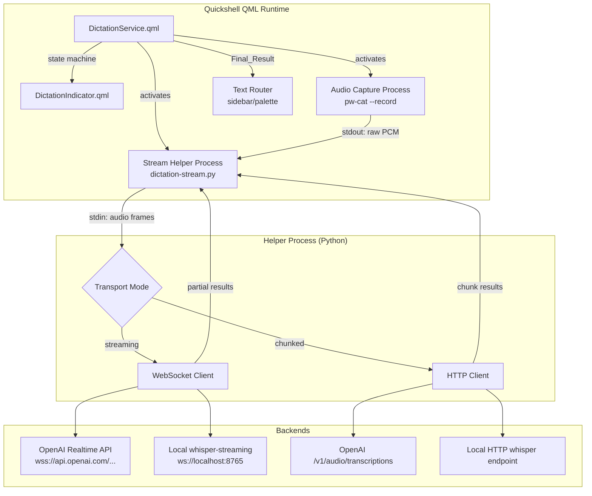
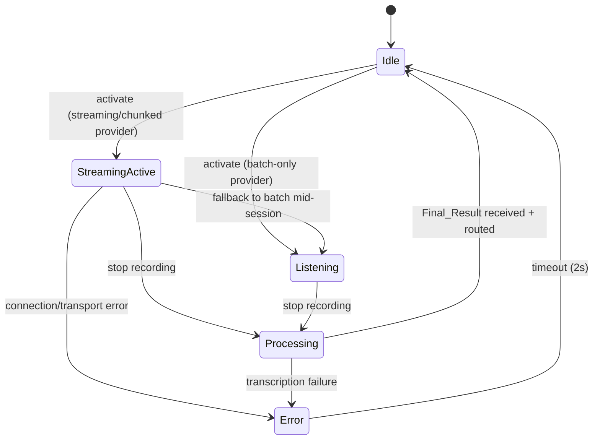

# Design: Streaming Dictation

## Overview

This design extends the existing `DictationService.qml` to support real-time streaming transcription alongside the current batch mode. The key enhancement is that transcribed text appears live in the `DictationIndicator` as the user speaks, providing immediate feedback. Three transport strategies are supported — WebSocket streaming (lowest latency), chunked HTTP (near-real-time for non-streaming backends), and batch fallback (existing behavior unchanged).

The architecture introduces a helper process pattern: since Quickshell's QML runtime lacks native WebSocket client support, a small Python script (`dictation-stream.py`) manages the WebSocket/HTTP transport externally. The QML Process component communicates with this helper via stdin/stdout line protocol, keeping the QML layer focused on state management and UI updates.

### Design Decisions

1. **Helper process over native QML WebSocket**: Quickshell doesn't expose a WebSocket QML type. Rather than embedding a C++ plugin, a Python helper (available in the Nix environment) handles transport. This keeps the shell pure QML and leverages the existing Process component pattern used throughout the codebase.

2. **State machine extension over separate service**: Adding a `StreamingActive` state to the existing `DictationService` rather than creating a parallel service avoids duplication of double-tap detection, policy enforcement, and routing logic.

3. **pw-cat piping over pw-record files**: For streaming/chunked modes, `pw-cat --record` writes to stdout which the helper process consumes directly. This avoids disk I/O latency and aligns with the privacy requirement of not persisting audio in streaming mode.

4. **Capability detection at activation time**: Rather than probing endpoints on shell startup, capability is determined when dictation activates. This avoids unnecessary network probes and handles transient endpoint availability.

## Architecture





## Components and Interfaces

### 1. DictationService.qml (Extended)

The singleton service gains new properties and internal components:

```qml
// New public properties
property string transcriptionMode: "batch"  // "streaming" | "chunked" | "batch"
property string partialText: ""             // Live transcription text (streaming/chunked)

// New state enum value
enum State {
    Idle,
    Listening,        // batch mode recording (existing)
    StreamingActive,  // streaming/chunked mode with live results
    Processing,
    Error
}

// New config shortcuts
property string streamingEndpoint: Config.options.dictation.streamingEndpoint || ""
property int chunkDurationMs: Config.options.dictation.chunkDurationMs || 3000
```

**New internal components:**

| Component | Role |
|-----------|------|
| `audioCaptureProcess` | Process running `pw-cat --record --format=s16 --rate=16000 --channels=1 -` (stdout piped) |
| `streamHelperProcess` | Process running `dictation-stream.py` (receives audio on stdin, emits results on stdout) |
| `capabilityProbe` | Function that determines provider capability based on config |

### 2. dictation-stream.py (New Helper Script)

Location: `configs/quickshell/ii/scripts/dictation-stream.py`

A Python script that manages the streaming/chunked transport. Communicates with QML via a line-based stdin/stdout protocol.

**Protocol (stdout → QML):**
```
READY:<mode>              # Transport established, mode confirmed
PARTIAL:<text>            # Partial transcription update
FINAL:<text>             # Final transcription result
ERROR:<message>          # Error occurred
FALLBACK:<reason>        # Falling back to batch mode
```

**Protocol (stdin ← QML / piped audio):**
```
Audio data is piped directly from pw-cat stdout to this process's stdin.
Control messages are sent on a separate channel (command-line args or signals).
```

**Actual architecture:** The helper is launched with command-line arguments specifying mode, endpoint, API key, and chunk duration. Audio arrives on stdin from a pipe. The helper handles:
- WebSocket connection lifecycle (connect, send frames, receive partials)
- Base64 encoding for OpenAI Realtime API
- Raw PCM forwarding for local whisper-streaming
- Chunked mode: buffering N seconds, HTTP POST, collect result
- Reconnection logic (one retry within 2s)
- Graceful shutdown on stdin EOF (end of recording)

### 3. Audio Pipeline

```mermaid
graph LR
    subgraph "Streaming/Chunked Mode"
        PW1[PipeWire<br>@DEFAULT_SOURCE@] -->|raw PCM| PWCAT[pw-cat --record<br>s16/16kHz/mono]
        PWCAT -->|stdout pipe| HELPER[dictation-stream.py<br>stdin]
    end

    subgraph "Batch Mode (unchanged)"
        PW2[PipeWire<br>@DEFAULT_SOURCE@] -->|WAV file| PWREC[pw-record<br>/tmp/...timestamp.wav]
        PWREC -->|file| CURL[curl / whisper-cpp]
    end
```

In streaming/chunked mode, there is **no intermediate file** — audio flows from PipeWire through pw-cat's stdout directly into the helper's stdin via a shell pipe:

```bash
pw-cat --record --target=@DEFAULT_SOURCE@ --format=s16 --rate=16000 --channels=1 - | \
  python3 dictation-stream.py --mode=streaming --endpoint=wss://... --api-key=...
```

This is implemented as a single Process component with a shell command that pipes the two together.

### 4. DictationIndicator.qml (Extended)

New visual elements for live transcription display:

| Element | Condition | Behavior |
|---------|-----------|----------|
| Partial text label | `state === StreamingActive && partialText !== ""` | Shows live text below mic icon |
| Text animation | On `partialText` change | Fade-in / slide-right for new content |
| Dynamic width | Always | `Math.min(textMetrics.width + padding, 400)` |
| Left truncation | When text exceeds 400px | `clip: true` with right-aligned text |

### 5. Provider Capability Detection

```javascript
function detectCapability(provider, streamingEndpoint) {
    // Explicit streaming endpoint configured → streaming
    if (streamingEndpoint) return "streaming"
    
    // Known streaming-capable providers
    if (provider === "openai") return "streaming"
    
    // Known local providers — check if streaming endpoint reachable
    var knownLocalProviders = ["whisper-cpp", "faster-whisper", "local-whisper"]
    if (knownLocalProviders.indexOf(provider) !== -1) {
        // Will attempt streaming, fall back to chunked, then batch
        return "streaming"  // Actual fallback handled by helper process
    }
    
    // Unknown provider → batch
    return "batch"
}
```

The helper process performs the actual reachability check and reports back via the `READY:<mode>` or `FALLBACK:<reason>` protocol messages.

### 6. Config Additions

New fields added to `Config.options.dictation`:

```qml
property JsonObject dictation: JsonObject {
    // ... existing fields ...
    property string streamingEndpoint: ""    // Custom WebSocket/HTTP endpoint
    property int chunkDurationMs: 3000       // Chunk duration for chunked mode
}
```

**Endpoint auto-derivation rules:**

| Provider | streamingEndpoint empty | Derived endpoint |
|----------|------------------------|------------------|
| `openai` | yes | `wss://api.openai.com/v1/realtime?model=gpt-4o-realtime-preview` |
| local providers | yes | `ws://localhost:8765` |
| any | no (user-set) | Use configured value verbatim |

## Data Models

### StreamHelperConfig (passed as CLI args to helper)

```python
@dataclass
class StreamHelperConfig:
    mode: str           # "streaming" or "chunked"
    endpoint: str       # WebSocket or HTTP URL
    api_key: str        # API key (empty for local)
    provider: str       # Provider name for protocol selection
    chunk_duration: int # Chunk duration in ms (chunked mode)
    sample_rate: int    # Audio sample rate (16000)
    channels: int       # Audio channels (1)
    sample_format: str  # Sample format ("s16")
```

### Protocol Messages (helper stdout)

```python
class MessageType(Enum):
    READY = "READY"        # Payload: mode string
    PARTIAL = "PARTIAL"    # Payload: partial transcription text
    FINAL = "FINAL"        # Payload: final transcription text
    ERROR = "ERROR"        # Payload: error description
    FALLBACK = "FALLBACK"  # Payload: reason for fallback
```

### OpenAI Realtime API Frame Format

```json
{
    "type": "input_audio_buffer.append",
    "audio": "<base64-encoded-pcm-frame>"
}
```

End-of-stream:
```json
{
    "type": "input_audio_buffer.commit"
}
```

Partial result event:
```json
{
    "type": "response.audio_transcript.delta",
    "delta": "partial text..."
}
```

### Local Whisper-Streaming Frame Format

Raw binary PCM frames sent directly over WebSocket (no JSON wrapping).

Partial result: plain text string on WebSocket text frame.

## Correctness Properties

*A property is a characteristic or behavior that should hold true across all valid executions of a system — essentially, a formal statement about what the system should do. Properties serve as the bridge between human-readable specifications and machine-verifiable correctness guarantees.*

### Property 1: Capability Detection Always Returns Valid Mode

*For any* provider string and streaming endpoint configuration, the capability detection function SHALL return exactly one of "streaming", "chunked", or "batch" — never an undefined or invalid value.

**Validates: Requirements 1.1, 1.5**

### Property 2: Audio Frame Forwarding Integrity

*For any* sequence of raw PCM audio frames produced by the capture process, every frame SHALL be forwarded to the backend connection without loss, corruption, or reordering.

**Validates: Requirements 2.2, 5.1**

### Property 3: Partial Result Updates Reflect Backend Output

*For any* partial result message received from any backend type (WebSocket streaming or chunked HTTP), the `partialText` property SHALL be updated to reflect the received content — accumulating for chunked mode, replacing for streaming mode.

**Validates: Requirements 2.3, 3.3, 10.3, 11.3**

### Property 4: Final Result Replaces Partial and Routes Correctly

*For any* Final_Result text received in the Processing state, the service SHALL (a) set `partialText` to the Final_Result, (b) transition state to Idle, and (c) route the Final_Result (not the last Partial_Result) to the correct destination based on sidebar state.

**Validates: Requirements 2.5, 7.5, 8.1, 8.2**

### Property 5: Connection Drop Recovery

*For any* streaming connection drop occurring at any point during an active session, the system SHALL either successfully reconnect within 2 seconds or fall back to batch mode — the session SHALL never hang indefinitely or lose audio.

**Validates: Requirements 2.6, 9.1**

### Property 6: Chunk Duration Compliance

*For any* audio stream and chunk duration configuration, the Audio_Chunker SHALL produce chunks whose duration is within ±100ms of the configured `chunkDurationMs`, except for the final chunk which may be shorter.

**Validates: Requirements 3.1, 6.4**

### Property 7: Chunk Submission Count

*For any* recording session of duration D with chunk duration C, the number of HTTP chunk submissions SHALL equal `ceil(D / C)` (accounting for the final partial chunk).

**Validates: Requirements 3.2, 3.4**

### Property 8: Chunk Failure Isolation

*For any* chunk failure at position N in a sequence of chunks, all subsequent chunks at positions > N SHALL still be submitted and their results accumulated into `partialText`.

**Validates: Requirements 3.6**

### Property 9: Indicator Width Constraint

*For any* `partialText` content, the DictationIndicator's computed width SHALL never exceed 400 pixels, and when the text exceeds this width, only the rightmost portion SHALL be visible.

**Validates: Requirements 4.3, 4.4**

### Property 10: Base64 PCM Round-Trip (OpenAI)

*For any* raw PCM audio frame, encoding it to base64 for the OpenAI Realtime API and decoding the base64 back SHALL produce the identical original frame.

**Validates: Requirements 10.2**

### Property 11: State Machine Transitions

*For any* activation with a streaming/chunked-capable provider, the state SHALL transition to StreamingActive (not Listening). *For any* stop-recording event in StreamingActive, the state SHALL transition to Processing. *For any* error in StreamingActive, the state SHALL transition to Error.

**Validates: Requirements 7.2, 7.4, 7.6**

### Property 12: Policy Enforcement for Remote Providers

*For any* remote provider configuration when `policies.ai` equals 2, activation SHALL be rejected with an error message. *For any* chunk endpoint when `policies.ai` equals 2, the endpoint SHALL be verified as local (localhost/127.0.0.1/::1) before audio is sent.

**Validates: Requirements 12.2, 12.4**

### Property 13: No Audio Persistence in Streaming Mode

*For any* completed streaming-mode session, no audio data SHALL remain on disk — audio is piped directly from PipeWire to the backend without intermediate file storage.

**Validates: Requirements 12.3, 8.4**

### Property 14: Custom Endpoint Override

*For any* non-empty `streamingEndpoint` configuration value, the system SHALL use that endpoint verbatim regardless of the provider type or auto-detection logic.

**Validates: Requirements 6.5**

## Error Handling

| Error Condition | Detection | Recovery | User Feedback |
|----------------|-----------|----------|---------------|
| WebSocket connection fails | Helper reports `ERROR:` within 3s | Fall back to batch mode, start pw-record | Indicator briefly shows "Streaming unavailable, using batch" |
| WebSocket drops mid-session | Helper reports `FALLBACK:` | Save buffered audio, switch to batch | Indicator hides partial text, shows standard recording UI |
| Chunk HTTP request fails | Helper reports per-chunk error | Skip failed chunk, continue with next | No visible indicator change (gap in partial text) |
| All chunks fail | Helper reports `FALLBACK:` | Concatenate buffered audio, batch transcribe | Switch to standard recording indicator |
| pw-cat process exits | Process `onExited` handler | Transition to Processing, process what we have | Show "Transcribing..." spinner |
| Helper process crashes | Process `onExited` with non-zero code | Fall back to batch with any recorded audio | Show error briefly, then attempt batch |
| API key missing | Pre-launch check in QML | Block activation, show error | "No API key for provider X" |
| Invalid endpoint URL | Helper fails to connect | Fall back to batch | "Streaming unavailable" message |
| policies.ai blocks streaming | Pre-launch check in QML | Block activation entirely | "Online transcription disallowed by policy" |

**Logging:** All fallback events and errors are logged via `console.warn()` which routes to the Quickshell journal (`journalctl --user -u quickshell`).

## Testing Strategy

### Property-Based Tests (fast-check / Hypothesis)

The helper script (`dictation-stream.py`) contains the core transport logic and is testable independently of the QML runtime. Property tests target the Python helper and any extracted pure-logic functions.

**Library:** Hypothesis (Python) for the helper script logic
**Configuration:** Minimum 100 iterations per property test
**Tag format:** `Feature: streaming-dictation, Property {N}: {description}`

Property tests cover:
- Capability detection (Property 1)
- Audio frame encoding/forwarding (Properties 2, 10)
- Chunk duration/count calculations (Properties 6, 7)
- Partial text accumulation logic (Property 3)
- State machine transitions (Property 11) — tested via a state machine model
- Policy enforcement logic (Property 12)
- Endpoint override logic (Property 14)

### Unit Tests (Example-Based)

- Provider capability detection for known providers (openai → streaming, unknown → batch)
- Endpoint auto-derivation for each provider type
- Config reading with defaults
- Indicator width calculation with short/medium/long text
- Fallback sequence: streaming → chunked → batch

### Integration Tests

- Full dictation flow with mocked WebSocket server (connect, send frames, receive partials, finalize)
- Chunked flow with mocked HTTP endpoint (submit chunks, collect results)
- Fallback from streaming to batch on connection failure
- Policy enforcement blocking remote streaming
- Helper process protocol parsing (READY/PARTIAL/FINAL/ERROR/FALLBACK lines)

### Manual Verification

- Visual inspection of partial text animation in DictationIndicator
- End-to-end test with real OpenAI Realtime API
- End-to-end test with local whisper-streaming server
- Latency measurement: time from speech to partial text appearing
