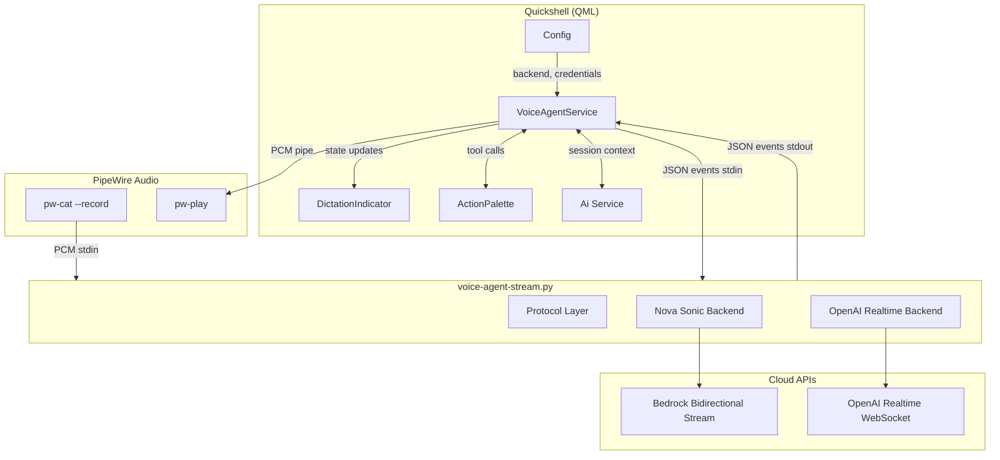
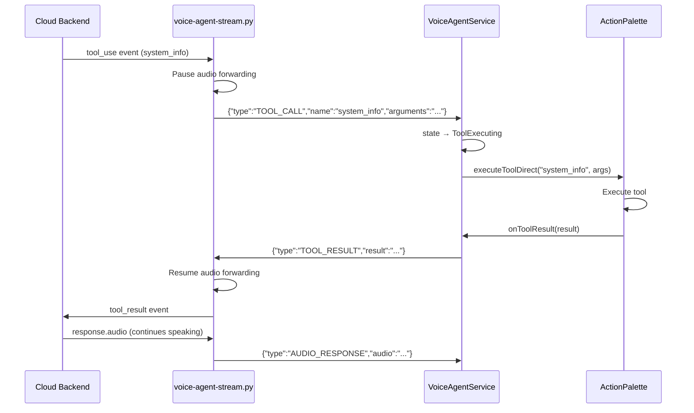

# Design Document: Streaming Voice Agent

## Overview

Replaces the existing batch voice pipeline (record → stop → upload → transcribe → LLM → TTS → play) with a bidirectional streaming voice conversation system. A single Python helper script (`voice-agent-stream.py`) maintains a persistent connection to either Amazon Nova Sonic (HTTP/2 bidirectional streaming) or OpenAI Realtime API (WebSocket), reading PCM audio from stdin and emitting structured JSON events on stdout. The QML `VoiceAgentService` (extending DictationService's state machine) orchestrates audio capture via `pw-cat`, audio playback via `pw-play`, tool call routing through ActionPalette, and session context injection — all through the proven subprocess piping pattern established by `dictation-stream.py`.

**Key design decisions:**
1. **Single helper script with backend selector** — `voice-agent-stream.py --backend=nova-sonic|openai-realtime` avoids code duplication for shared protocol logic (event framing, stdin/stdout I/O, graceful shutdown)
2. **Separate pw-cat and pw-play processes** — bidirectional audio requires two independent PipeWire pipes (capture → helper stdin, helper stdout events → pw-play stdin), not a single shell pipeline
3. **Tool calls route through existing ActionPalette** — the helper pauses audio input on TOOL_CALL, QML executes via `ActionPalette.submitQueryDirect`, and sends TOOL_RESULT back via helper stdin
4. **Fallback decision in QML** — VoiceAgentService owns the 5-second connection timeout; on failure it kills the helper and delegates to DictationService's batch pipeline
5. **DictationIndicator extends with streaming states** — new states (Listening+waveform, Thinking, Speaking, Ready) are driven by a `voiceAgentState` property alongside existing batch states

## Architecture



### Process Architecture (Bidirectional)

```
┌─────────────────────────────────────────────────────────────────────────┐
│ VoiceAgentService.qml                                                    │
│                                                                          │
│  ┌──────────┐    stdin (PCM)     ┌─────────────────────┐                │
│  │ pw-cat   │ ──────────────────►│                     │                │
│  │ --record │                    │ voice-agent-stream.py│                │
│  └──────────┘                    │                     │                │
│                                  │  stdout (JSON)      │                │
│  ┌──────────┐    PCM pipe        │◄────────────────────│                │
│  │ pw-play  │◄───────────────────│  stdin (JSON)       │                │
│  │          │                    │────────────────────►│                │
│  └──────────┘                    └─────────────────────┘                │
│                                                                          │
│  State Machine:                                                          │
│  Idle → Connecting → StreamingActive → (Thinking|Speaking) → Idle        │
│                                                                          │
│  Event routing:                                                          │
│  PARTIAL_TRANSCRIPT → partialText → DictationIndicator                   │
│  AUDIO_RESPONSE → decode base64 → pipe to pw-play                        │
│  TOOL_CALL → ActionPalette.executeToolDirect → TOOL_RESULT → stdin       │
│  TURN_END → "Thinking..." state                                          │
│  SESSION_END → cleanup → Idle                                            │
└─────────────────────────────────────────────────────────────────────────┘
```

## Components and Interfaces

### 1. VoiceAgentService.qml (New Singleton)

**Location:** `configs/quickshell/ii/services/VoiceAgentService.qml`

Extends the voice assistant concept from DictationService with a dedicated service for bidirectional streaming sessions. DictationService remains for batch/chunked STT; VoiceAgentService handles full speech-to-speech conversations.

**Public Properties:**
```qml
// State
property int voiceAgentState: VoiceAgentService.State.Idle
property string partialText: ""
property string responseText: ""
property string currentToolName: ""
property real audioLevel: 0.0  // 0.0–1.0 RMS from input audio

// Config-bound
property string voiceBackend: Config.options.dictation.voiceBackend || "none"
```

**State Enum:**
```qml
enum State {
    Idle,         // No session active
    Connecting,   // Helper launched, waiting for READY
    Listening,    // StreamingActive, user speaking
    Thinking,     // TURN_END received, waiting for response
    Speaking,     // AUDIO_RESPONSE playing
    ToolExecuting,// TOOL_CALL in progress
    Error         // Fatal error, session ended
}
```

**Key Functions:**
```qml
function activate()       // Launch helper + pw-cat, begin session
function deactivate()     // Send STOP, close helper, return to Idle
function bargeIn()        // Stop pw-play, send BARGE_IN to helper
function sendToolResult(name, result, isError)  // Send TOOL_RESULT JSON to helper stdin
```

**Internal Processes:**
- `helperProcess` — the Python subprocess (stdin/stdout JSON + PCM on stdin)
- `captureProcess` — `pw-cat --record` piped to a named pipe / fd that helperProcess reads
- `playbackProcess` — `pw-play` reading PCM from a pipe fed by AUDIO_RESPONSE events

### 2. voice-agent-stream.py (New Script)

**Location:** `configs/quickshell/ii/scripts/voice-agent-stream.py`

Single Python script with two backend implementations sharing a common protocol layer.

**CLI Interface:**
```
voice-agent-stream.py \
    --backend=nova-sonic|openai-realtime \
    --region=us-west-2 \
    --profile=bedrock \
    --api-key=<key> \
    --system-prompt=<text> \
    --context=<json-file-path> \
    --sample-rate=16000|24000 \
    --tools=<json-file-path>
```

**Architecture within the script:**
```python
class BaseVoiceBackend(ABC):
    async def connect(config) -> None
    async def send_audio(chunk: bytes) -> None
    async def send_tool_result(name, result) -> None
    async def disconnect() -> None

class NovaSonicBackend(BaseVoiceBackend): ...
class OpenAIRealtimeBackend(BaseVoiceBackend): ...
```

**I/O Architecture (FIFO-based separation):**

The key challenge is that QML's `Process` component exposes a single stdin for writing. Bidirectional voice requires sending both raw PCM audio (from pw-cat) AND JSON control messages (TOOL_RESULT, STOP, BARGE_IN) to the helper. Multiplexing binary audio and text JSON on the same fd would require a framing protocol and complicate both sides.

**Solution — named FIFO for audio, stdin for control:**
1. QML creates a temp FIFO: `/tmp/voice-agent-XXXX.pcm`
2. QML launches `pw-cat --record` writing to the FIFO
3. QML launches `voice-agent-stream.py --audio-fifo=/tmp/voice-agent-XXXX.pcm`
4. The helper opens the FIFO for reading audio (async reader task)
5. The helper reads JSON control messages from stdin (async stdin reader task)
6. The helper writes JSON events to stdout (parsed by QML's SplitParser)

This cleanly separates audio (FIFO) from control (stdin/stdout) using QML's existing Process capabilities.

**Async tasks within the helper:**
- **Audio reader task**: reads raw PCM from the FIFO, forwards chunks to the backend
- **Control reader task**: reads JSON lines from stdin for TOOL_RESULT/STOP/BARGE_IN
- **Backend event handler task**: receives backend events (transcripts, audio, tool calls), emits JSON on stdout

### 3. Audio Pipeline Design

```
                    ┌──────────────────────────────────────┐
                    │        VoiceAgentService.qml          │
                    │                                        │
 ┌─────────┐  FIFO │  ┌──────────────────────────────┐     │
 │ pw-cat   │──────►│  │  voice-agent-stream.py        │     │
 │ --record │       │  │  reads FIFO for audio         │     │
 └─────────┘       │  │  reads stdin for JSON ctrl     │     │
                    │  │  writes stdout JSON events     │     │
                    │  └──────────────────────────────┘     │
                    │                  │ stdout               │
                    │                  ▼                      │
                    │  SplitParser (JSON lines)              │
                    │       │                                 │
                    │       │ AUDIO_RESPONSE events           │
                    │       ▼                                 │
                    │  decode base64 → write to pipe          │
                    │       │                                 │
                    │       ▼                                 │
                    │  ┌──────────┐                          │
                    │  │ pw-play   │                          │
                    │  │ reads -   │                          │
                    │  └──────────┘                          │
                    └──────────────────────────────────────┘
```

**Audio format per backend:**
| Backend | Capture Rate | Playback Rate | Format |
|---------|-------------|---------------|--------|
| Nova Sonic | 16kHz | 16kHz | s16, mono |
| OpenAI Realtime | 24kHz | 24kHz | s16, mono |

**RMS amplitude calculation:** The `pw-cat` process runs with `--volume` monitoring or the helper calculates RMS from audio chunks and includes an `amplitude` field in periodic STATUS events (every 100ms). Simpler: QML runs a lightweight amplitude monitor process (same pattern as existing `silenceMonitor` in DictationService).

### 4. Voice Agent Helper Protocol (JSON Lines)

#### Output Events (helper → QML, stdout)

```jsonc
// Session ready, connection established
{"type": "READY", "backend": "nova-sonic", "session_id": "abc123"}

// Partial speech recognition
{"type": "PARTIAL_TRANSCRIPT", "text": "What's the weather"}

// Backend detected end of user speech
{"type": "TURN_END"}

// Complete user utterance (after backend confirms)
{"type": "TURN_COMPLETE", "text": "What's the weather like today?"}

// Audio response chunk (base64 PCM)
{"type": "AUDIO_RESPONSE", "audio": "<base64-encoded PCM>", "text": "It's sunny..."}

// Tool call from the AI
{"type": "TOOL_CALL", "id": "call_123", "name": "system_info", "arguments": "{\"query\": \"weather\"}"}

// Session ended normally
{"type": "SESSION_END", "reason": "user_stop"}

// Error (non-fatal: session continues; fatal: session ends)
{"type": "ERROR", "message": "Connection reset", "fatal": true}

// Falling back — helper cannot maintain stream
{"type": "FALLBACK", "reason": "Connection timeout after 5 retries"}
```

#### Input Events (QML → helper, stdin)

```jsonc
// Tool execution result
{"type": "TOOL_RESULT", "id": "call_123", "name": "system_info", "result": "CPU: 45%, RAM: 8.2GB used", "is_error": false}

// User requested stop (activation key pressed)
{"type": "STOP"}

// User interrupted playback (barge-in)
{"type": "BARGE_IN"}
```

### 5. Tool Call Flow



**Integration with ActionPalette:** The existing `submitQueryDirect` function handles full LLM → action plan → execution. For streaming voice agent tool calls, we need a more direct path since the LLM reasoning already happened in the cloud backend. We'll add a new function:

```qml
// In ActionPalette.qml — execute a single named tool directly (no LLM call)
function executeToolDirect(toolName, arguments, callback)
```

This maps tool names from the backend (e.g., `system_info`, `shell_exec`, `config_set`) to the existing action execution logic in ActionPalette. The `responseSummary` and `executionFailed` signals work the same way, but for streaming we route results back to the helper rather than to DictationIndicator.

### 6. Session Context and Transcript

**On session start:**
1. VoiceAgentService reads `Ai.messageIDs` / `Ai.messageByID` for the active session
2. Serializes last N messages (configurable, default 20) to a temp JSON file
3. Passes `--context=/tmp/voice-agent-context-XXXX.json` to the helper
4. Helper includes context in backend session setup (system prompt for Nova Sonic, instructions for OpenAI)

**On session end:**
1. Helper emits SESSION_END with transcript of all turns
2. VoiceAgentService appends each user utterance and AI response to `Ai.appendToFreeDictation` (or active session)

### 7. Fallback Logic

```
activate() called
    │
    ├─ voiceBackend == "none" → DictationService.activate() (batch)
    │
    ├─ credentials missing → Error state + indicator message
    │
    └─ Launch helper
         │
         ├─ READY within 5s → StreamingActive ✓
         │
         └─ Timeout / ERROR / unexpected exit
              │
              └─ Kill helper → DictationService.activate() (batch fallback)
```

### 8. DictationIndicator Extension

The indicator already binds to `DictationService.state` and `DictationService.partialText`. For streaming voice agent, it additionally binds to `VoiceAgentService`:

| VoiceAgentService State | Indicator Display |
|------------------------|-------------------|
| Idle | (hidden) |
| Connecting | "Connecting..." + spinner |
| Listening (no speech) | "Ready..." + muted mic icon |
| Listening (speech) | "Listening..." + animated waveform (audioLevel) |
| Listening + partialText | Live transcript text + waveform |
| Thinking | "Thinking..." + pulsing animation |
| Speaking | Response text + speaker icon |
| ToolExecuting | "Executing [tool]..." + gear icon |
| Error | Error message, auto-dismiss 5s |

## Data Models

### Config Extension

```qml
// In Config.qml → dictation JsonObject
property string voiceBackend: "none"  // "none" | "nova-sonic" | "openai-realtime"
```

### Helper Launch Configuration

```typescript
interface HelperLaunchConfig {
    backend: "nova-sonic" | "openai-realtime"
    audioFifo: string           // Path to named FIFO for PCM input
    sampleRate: 16000 | 24000   // Backend-specific
    region?: string             // AWS region (nova-sonic)
    profile?: string            // AWS profile (nova-sonic)
    apiKey?: string             // OpenAI key (openai-realtime)
    systemPrompt: string        // Voice assistant system prompt
    contextFile?: string        // Path to session context JSON
    toolsFile?: string          // Path to available tools JSON
}
```

### Tool Call Event

```typescript
interface ToolCallEvent {
    type: "TOOL_CALL"
    id: string          // Unique call ID (for matching results)
    name: string        // Tool name (maps to ActionPalette action types)
    arguments: string   // JSON-encoded arguments
}

interface ToolResultEvent {
    type: "TOOL_RESULT"
    id: string          // Matching call ID
    name: string        // Tool name
    result: string      // Serialized result (or error message)
    is_error: boolean   // Whether execution failed
}
```

### Session Transcript

```typescript
interface SessionTranscript {
    turns: Array<{
        user: string       // User utterance text
        assistant: string  // AI response text
        tools?: Array<{name: string, result: string}>
    }>
    duration_ms: number
    backend: string
}
```

## Correctness Properties

*A property is a characteristic or behavior that should hold true across all valid executions of a system — essentially, a formal statement about what the system should do. Properties serve as the bridge between human-readable specifications and machine-verifiable correctness guarantees.*

### Property 1: Protocol round-trip integrity

*For any* JSON event emitted by the helper on stdout, parsing the line as JSON and accessing the `type` field SHALL yield one of the defined event types (READY, PARTIAL_TRANSCRIPT, TURN_END, TURN_COMPLETE, AUDIO_RESPONSE, TOOL_CALL, SESSION_END, ERROR, FALLBACK), and all required fields for that event type SHALL be present and non-null.

**Validates: Requirements 12.1, 12.2, 12.5, 12.6, 12.7**

### Property 2: Audio format preservation

*For any* AUDIO_RESPONSE event emitted by the helper, decoding the `audio` field from base64 SHALL produce a byte sequence whose length is a multiple of 2 (16-bit samples), and the decoded PCM data SHALL be playable at the backend's configured sample rate (16kHz for Nova Sonic, 24kHz for OpenAI Realtime).

**Validates: Requirements 12.5, 13.1, 13.2, 13.3**

### Property 3: Tool call / result pairing

*For any* TOOL_CALL event emitted by the helper, the `id` field SHALL be unique within the session, and when a TOOL_RESULT with a matching `id` is sent back to the helper via stdin, the helper SHALL forward the result to the backend and resume normal operation. No TOOL_CALL SHALL be emitted while a previous TOOL_CALL's TOOL_RESULT is still pending.

**Validates: Requirements 8.1, 8.2, 8.3, 8.4, 12.3, 12.4, 12.7**

### Property 4: State machine valid transitions

*For any* sequence of events received from the helper, the VoiceAgentService state machine SHALL only transition along valid edges (Idle→Connecting→Listening→Thinking→Speaking→Listening, with ToolExecuting as a sub-state of Thinking), and SHALL never remain in Connecting for more than 5 seconds without either reaching Listening or transitioning to Error/fallback.

**Validates: Requirements 2.1, 2.2, 2.3, 2.4, 2.5, 2.6, 10.1**

### Property 5: Policy enforcement gate

*For any* combination of `policies.ai` value and `voiceBackend` setting, if `policies.ai` equals 0, activation SHALL be rejected; if `policies.ai` equals 2 and backend is "nova-sonic" or "openai-realtime", activation SHALL be rejected with an error message. No audio data SHALL be sent to remote endpoints when policy forbids it.

**Validates: Requirements 14.1, 14.2, 14.3**

### Property 6: Credential validation before connection

*For any* activation attempt, if `voiceBackend` is "nova-sonic" then `AwsCredentialReader.credentialsDetected` must be true, and if `voiceBackend` is "openai-realtime" then the "openai" key in KeyringStorage must be non-empty; otherwise activation SHALL fail with a descriptive error and the service SHALL remain in Idle state.

**Validates: Requirements 1.3, 1.4, 1.5**

### Property 7: Barge-in interrupts playback

*For any* state where VoiceAgentService is in Speaking state (pw-play active), if the user taps the activation key, pw-play SHALL be terminated, a BARGE_IN event SHALL be sent to the helper, and the service SHALL transition to Listening within 200ms.

**Validates: Requirements 4.5, 7.5**

### Property 8: Session context serialization round-trip

*For any* set of chat messages retrieved from Ai.messageByID, serializing them to the context JSON file and having the helper parse them SHALL produce messages with identical role and content fields (order preserved).

**Validates: Requirements 9.1, 9.2, 9.3**

## Error Handling

### Connection Failures
- **5-second timeout**: If READY not received within 5s of helper launch, kill helper and fall back to batch mode
- **Unexpected helper exit**: Capture exit code + stderr, display in indicator, transition to Error, auto-dismiss after 5s
- **Backend disconnection mid-session**: Helper attempts one reconnect (2s timeout); if that fails, emits FALLBACK with reason

### Audio Pipeline Failures
- **pw-cat exits unexpectedly**: Send STOP to helper stdin, transition to Error
- **pw-play exits unexpectedly**: Log warning, continue session (audio lost but transcripts still work)
- **FIFO creation failure**: Fall back to batch mode immediately

### Tool Execution Failures
- **ActionPalette timeout (15s)**: Send TOOL_RESULT with `is_error: true` and timeout message
- **ActionPalette execution error**: Forward error message as TOOL_RESULT so backend can inform user vocally
- **Unknown tool name**: Send TOOL_RESULT with error "Unknown tool: {name}"

### Policy Violations
- **AI disabled (policy=0)**: Reject activation, show "Voice agent disabled by policy"
- **Local-only (policy=2) with remote backend**: Reject with specific message about streaming requiring remote access
- **Credentials missing**: Reject with message identifying which credential is needed

### Graceful Degradation
- **All errors are non-catastrophic**: The system always falls back to batch dictation or shows an error and returns to Idle
- **No audio persisted to disk**: PCM flows through pipes only; temp context files are cleaned up on session end
- **Helper crash recovery**: VoiceAgentService monitors helper PID; unexpected exit always triggers cleanup

## Testing Strategy

### Unit Tests (Python — pytest)

- **Protocol serialization**: Verify all event types serialize/deserialize correctly
- **Policy enforcement**: Test all combinations of policy_ai × backend × endpoint locality
- **CLI argument parsing**: Test valid/invalid argument combinations
- **Audio format validation**: Verify PCM chunk sizes align with sample rates
- **Tool call ID generation**: Verify uniqueness guarantees

### Property-Based Tests (Python — Hypothesis)

Property-based testing is appropriate here because the helper protocol has clear input/output behavior with a large input space (arbitrary audio chunks, JSON events, tool call arguments).

- **Property 1**: Generate random JSON events, verify parse/emit round-trip
- **Property 2**: Generate random PCM byte sequences, verify base64 encode/decode preserves length and content
- **Property 3**: Generate random sequences of TOOL_CALL/TOOL_RESULT pairs, verify pairing invariants
- **Property 5**: Generate all valid policy/backend combinations, verify gate decisions
- **Property 8**: Generate random message histories, verify serialization round-trip

**Configuration:**
- Library: `hypothesis` (already used in this project — see `.hypothesis/` directory)
- Minimum 100 iterations per property
- Tag format: `# Feature: streaming-voice-agent, Property {N}: {description}`

### Integration Tests

- **End-to-end with mock backend**: Launch helper with a mock WebSocket server, verify full event flow
- **QML state machine**: Verify state transitions against sequences of simulated events
- **Fallback cascade**: Verify timeout → batch fallback path

### Manual Testing

- Real Nova Sonic session with barge-in and tool calls
- Real OpenAI Realtime session with multi-turn conversation
- Network disconnect during active session (verify graceful fallback)
- Credential rotation during session (verify re-auth or graceful failure)
