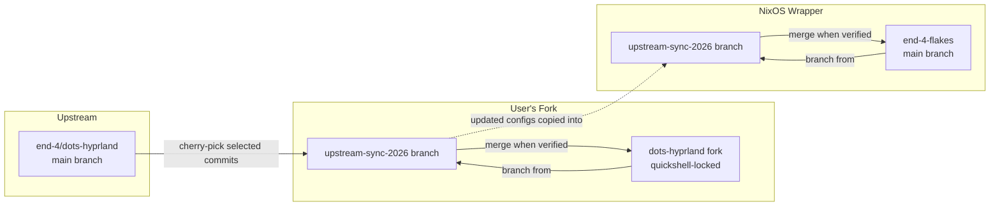
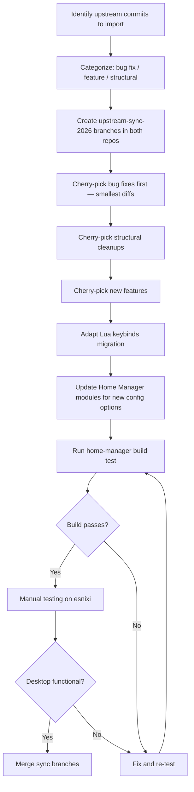
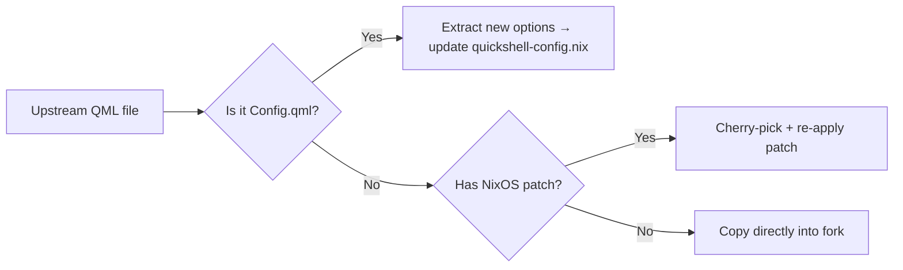
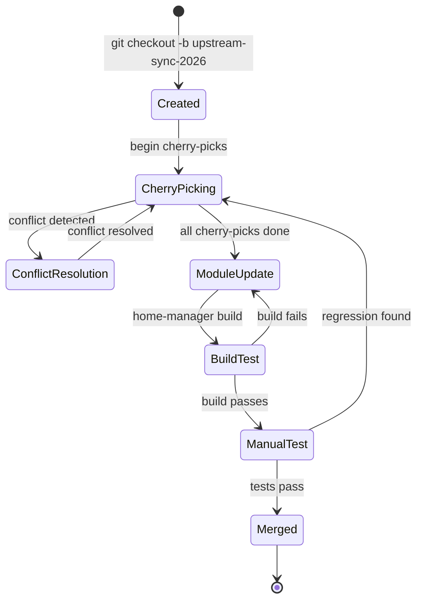

# Design Document: Upstream Sync 2025–2026

## Overview

This design covers the safe importation of ~11 months of upstream `end-4/dots-hyprland` changes (August 2025 → July 2026) into two coordinated repositories:

1. **dots-hyprland fork** (branch `quickshell-locked`) — the raw config files including QML, scripts, and templates
2. **end-4-flakes** — the NixOS wrapper flake with Home Manager modules, overlays, and the template processing system

The sync introduces bug fixes (Qt 6.11 notifications, DPMS syntax, XDG_DATA_DIRS, clipboard escaping, Super key hold), new features (hefty workspaces widget, anti-flashbang weak, light/dark wallpaper variants, emoji 17.0, notification force monitor, nwg-displays), structural cleanups, and the upstream migration from `.conf` to `.lua` keybinds.

The core challenge is that our fork maintains a layer of NixOS-specific adaptations (template system, Home Manager modules, custom color pipeline, RGB lighting, AppLauncher PATH patch) that have no upstream equivalent. The sync must import upstream improvements while preserving these adaptations, and cleanly handle the Lua keybinds migration without breaking the `@VARIABLE@` placeholder system.

## Architecture

### Repository Relationship



### Git Sync Strategy: Selective Cherry-Pick

A **selective cherry-pick** strategy is used rather than rebase or merge. Rationale:

- **Rebase** would replay all our custom commits on top of upstream, causing massive conflicts at every NixOS-specific change and losing our commit history structure
- **Full merge** would bring in all upstream changes including ones incompatible with our template system (raw `.lua` files, Arch-specific scripts)
- **Cherry-pick** allows importing each fix/feature individually, resolving conflicts in isolation, and skipping commits that are irrelevant (Arch packaging, non-NixOS CI)

#### Cherry-Pick Workflow



### Conflict Resolution Strategy

When a cherry-picked commit conflicts with our customizations:

| Conflict Type | Resolution |
|---|---|
| Upstream changes a file we've templated (`.conf` → `.conf.template`) | Apply the logical change to our template, preserve `@VARIABLE@` placeholders |
| Upstream changes a QML file we've patched (e.g., AppLauncher PATH) | Merge upstream changes around our patch, verify patch still applies |
| Upstream adds a new config option | Add corresponding Home Manager option with upstream default |
| Upstream removes a file/script we still use | Keep our version if no upstream equivalent; document in commit |
| Upstream restructures directory layout | Follow upstream structure, update Nix file references |

## Components and Interfaces

### Component 1: Git Sync Orchestration (Manual Process)

Responsible for the actual git operations in both repos.

**Interface:**
- Input: List of upstream commit SHAs categorized by type (bug fix, feature, structural)
- Output: Clean sync branches in both repos with all changes applied

**Procedure:**
1. `git remote add upstream https://github.com/end-4/dots-hyprland.git` (fork repo, if not already)
2. `git fetch upstream`
3. `git checkout -b upstream-sync-2026 quickshell-locked`
4. For each commit: `git cherry-pick <sha>`, resolve conflicts, commit
5. Mirror equivalent changes to end-4-flakes sync branch

### Component 2: Lua Keybinds Migration Adapter

Handles the upstream `.lua` keybind format while preserving the NixOS template system.

**Strategy: Maintain parallel `.conf.template`**

Upstream's Lua keybinds use `hl.bind()`, `hl.unbind()` etc. which allow:
- Lua expressions for dynamic paths
- `os.getenv("HOME")` for path expansion
- Programmatic keybind generation

Our template system needs:
- `@VARIABLE@` placeholders replaced at Nix build time
- Static keybind definitions (no runtime Lua evaluation on NixOS)
- Custom keybind injection via `@CUSTOM_KEYBINDS@`

**Decision: Keep `.conf.template` as the authoritative source**, updating it with upstream's logical changes (new keybinds, syntax fixes, removed bindings) but NOT migrating to `.lua` format. Rationale:
- Hyprland still supports `.conf` format for keybinds
- Our template system depends on text substitution which works with `.conf` but not easily with Lua
- The `@VARIABLE@` pattern maps cleanly to `sed`/Nix `substituteAll`
- Converting to Lua would require a completely new template mechanism (Nix generating Lua code)

**Interface:**
```
Input:  upstream keybinds.lua (reference)
        current keybinds.conf.template
Output: updated keybinds.conf.template with:
        - New keybinds from upstream
        - Syntax fixes (raw keycode prefix, fullscreen dispatcher)
        - Removed deprecated binds (hl.unbind() equivalents removed from .conf)
        - @VARIABLE@ placeholders preserved
        - @CUSTOM_KEYBINDS@ injection point preserved
```

### Component 3: QML Import Pipeline

Handles importing upstream QML changes into the fork's quickshell configuration.

**File Classification:**

| Category | Files | Import Method |
|---|---|---|
| Copied verbatim | Most QML modules, assets, services | Direct copy from upstream |
| Generated by Nix | `modules/common/Config.qml` | NOT copied — generated by `quickshell-config.nix` |
| Patched for NixOS | AppLauncher, PATH-related QML | Cherry-pick + manually re-apply patch |
| Custom (no upstream) | RGB lighting, idle panel | Preserve as-is |
| Color pipeline scripts | `scripts/colors/*` | Cherry-pick upstream changes, preserve custom extensions (foot, fuzzel, wofi) |

**Import Process:**


### Component 4: Template File Updater

Updates `.conf.template` files to incorporate upstream changes while preserving the `@VARIABLE@` system.

**Template Processing Flow (at Nix build time):**
```
.conf.template → substituteAll (Nix) → .conf (placed in ~/.config/hypr/)
```

**Update Process for Each Template:**
1. Diff upstream's equivalent `.conf` (or new `.lua`) against our template's non-variable content
2. Apply logical changes (new settings, removed settings, syntax fixes)
3. Verify all `@VARIABLE@` placeholders still present and valid
4. Add new `@VARIABLE@` placeholders for newly exposed settings
5. Update corresponding Home Manager module with new option definitions

**Affected Templates:**
- `hyprland.conf.template` — monitor config, source directives
- `general.conf.template` — gestures syntax, decoration updates
- `keybinds.conf.template` — new binds, syntax fixes, dark/light toggle
- `hypridle.conf.template` — DPMS syntax, dispatch format
- `execs.conf.template` — custom config auto-creation
- `rules.conf.template` — JetBrains windowrule removal

### Component 5: Home Manager Module Extensions

New configuration options needed for imported features.

**New Options to Add:**

```nix
# In quickshell-config.nix
bar.workspaces.variant = mkOption {
  type = types.enum [ "default" "hefty" ];
  default = "default";
  description = "Workspace widget variant";
};

appearance.antiFlashbang = mkOption {
  type = types.enum [ "off" "weak" "strong" ];
  default = "off";
  description = "Anti-flashbang overlay during workspace transitions";
};

notifications.forceMonitor = mkOption {
  type = types.nullOr types.str;
  default = null;
  description = "Force notifications to a specific monitor (e.g., 'eDP-1')";
};

# In hyprland-config.nix
night.colorTemperature = mkOption {
  type = types.int;
  default = 4500;  # Corrected upstream default
  description = "Night light color temperature in Kelvin";
};

keybinds.darkLightToggle = mkOption {
  type = types.bool;
  default = true;
  description = "Enable Ctrl+Super+Shift+D dark/light mode toggle";
};

# Package set additions
packages.includeNwgDisplays = mkOption {
  type = types.bool;
  default = false;
  description = "Include nwg-displays monitor management tool";
};
```

### Component 6: Color Pipeline Preservation

The custom `applycolor.sh` pipeline (foot, fuzzel, wofi, terminal escape sequences) must be preserved since upstream only handles terminal escape sequences natively.

**Sync approach:**
- Cherry-pick upstream's `sleep 0` removal (Requirement 12)
- Cherry-pick upstream's light/dark wallpaper variant logic into `switchwall.sh` (Requirement 14)
- Preserve custom `apply_foot()`, `apply_fuzzel()`, `apply_wofi()` functions
- Preserve custom `kde-material-you-colors-wrapper.sh` integration

## Data Models

### Template Variable Registry

All `@VARIABLE@` placeholders used across template files:

| Variable | Template File | Home Manager Source |
|---|---|---|
| `@MONITOR_CONFIG@` | general.conf.template | `hyprland.monitors` |
| `@GAPS_IN@` | general.conf.template | `hyprland.general.gapsIn` |
| `@GAPS_OUT@` | general.conf.template | `hyprland.general.gapsOut` |
| `@BORDER_SIZE@` | general.conf.template | `hyprland.general.borderSize` |
| `@BLUR_ENABLED@` | general.conf.template | `hyprland.decoration.blurEnabled` |
| `@ROUNDING@` | general.conf.template | `hyprland.decoration.rounding` |
| `@TERMINAL_APPS@` | keybinds.conf.template | package resolution |
| `@BROWSER_APPS@` | keybinds.conf.template | package resolution |
| `@QUICKSHELL_BIN@` | keybinds.conf.template | `${pkgs.quickshell}/bin/quickshell` |
| `@CUSTOM_KEYBINDS@` | keybinds.conf.template | user-defined extra bindings |
| `@FUZZEL_BIN@` | keybinds.conf.template | `${pkgs.fuzzel}/bin/fuzzel` |
| `@KEYBOARD_LAYOUT@` | general.conf.template | `hyprland.input.kbLayout` |

**New Variables (post-sync):**

| Variable | Template File | Purpose |
|---|---|---|
| `@DARK_LIGHT_TOGGLE_BIND@` | keybinds.conf.template | Ctrl+Super+Shift+D toggle (Req 17) |
| `@HYPRSUNSET_TEMP@` | hypridle.conf.template | Corrected color temperature (Req 23) |
| `@NWG_DISPLAYS_BIN@` | keybinds.conf.template | nwg-displays path (Req 24) |

### Upstream Commit Classification Schema

```
CommitCategory = BugFix | Feature | Structural | Irrelevant

BugFix:
  - Qt 6.11 NotificationItem fix (Req 2)
  - XDG_DATA_DIRS fix (Req 3)
  - DPMS syntax fix (Req 6)
  - Multi-monitor screen corners (Req 5)
  - Clipboard escaped text (Req 8)
  - Super key hold state (Req 9)
  - Konachan/waifu.im fixes (Req 10)
  - HOME env for Lua (Req 11)
  - Keybind fixes: raw keycode, fullscreen, workspace (Req 7)
  - Hyprsunset default temp (Req 23)

Feature:
  - Hefty workspaces widget (Req 13)
  - Light/dark wallpaper variants (Req 14)
  - Anti-flashbang weak (Req 15)
  - Notification force monitor (Req 16)
  - Dark/light toggle keybind (Req 17)
  - Emoji 17.0 (Req 18)
  - Cheatsheet categories (Req 19)
  - nwg-displays (Req 24)
  - Custom config auto-creation (Req 25)

Structural:
  - Hyprland Lua-schema compatibility (Req 4)
  - Remove sleep delays (Req 12)
  - JetBrains windowrule removal (Req 22)
  - Unlock refocus hack removal (Req 22)
  - Custom stuff made optional (Req 22)
  - Lua keybinds migration (Req 20) — adapted, not directly imported
```

### Sync Branch State Machine



## Correctness Properties

*A property is a characteristic or behavior that should hold true across all valid executions of a system — essentially, a formal statement about what the system should do. Properties serve as the bridge between human-readable specifications and machine-verifiable correctness guarantees.*

### Property 1: Template Placeholder Integrity

*For any* `.conf.template` file in the `configs/hypr/` directory, all `@VARIABLE@` placeholders listed in the template variable registry SHALL be present in the file after the sync, and no placeholder shall be partially corrupted or removed by upstream changes.

**Validates: Requirements 4.3, 7.4, 17.3, 20.3**

### Property 2: Wallpaper Variant Selection

*For any* wallpaper filename and current color mode (dark/light), if a variant file exists with the corresponding `-dark` or `-light` suffix, the pipeline SHALL select that variant; if no variant exists, it SHALL use the original filename unchanged.

**Validates: Requirements 14.1, 14.2, 14.3**

### Property 3: Lua-Conf Keybind Equivalence

*For any* keybind defined in the upstream `keybinds.lua` (excluding Arch-specific or incompatible binds), there SHALL exist a functionally equivalent `bind` entry in our `keybinds.conf.template` that dispatches the same action with the same modifier+key combination.

**Validates: Requirements 20.1, 20.2**

### Property 4: Custom Keybind Injection

*For any* string value substituted for `@CUSTOM_KEYBINDS@`, the processed keybind configuration SHALL contain that exact string content at the designated injection point, after all other bind declarations.

**Validates: Requirements 20.3**

### Property 5: Binary Placeholder Resolution

*For any* binary path placeholder (`@TERMINAL_APPS@`, `@BROWSER_APPS@`, `@QUICKSHELL_BIN@`, `@FUZZEL_BIN@`, `@BRIGHTNESSCTL_BIN@`, `@WPCTL_BIN@`, `@PLAYERCTL_BIN@`, etc.) referenced in template files, the Nix substitution SHALL resolve it to a valid path under `/nix/store/` that points to an executable file.

**Validates: Requirements 20.4**

### Property 6: Configuration Option Preservation

*For any* Home Manager option path that existed in the module system before the sync (e.g., `programs.dots-hyprland.quickshell.bar.bottom`, `programs.dots-hyprland.hyprland.general.gapsIn`), that option SHALL still be defined with a compatible type after the sync is complete.

**Validates: Requirements 21.7**

### Property 7: Custom Config Persistence

*For any* content written by the user to a custom config file (e.g., `~/.config/hypr/custom/*.conf`), that content SHALL be preserved unchanged after a `home-manager switch` operation.

**Validates: Requirements 25.3**


## Error Handling

### Cherry-Pick Conflict Errors

| Error | Handling |
|---|---|
| Cherry-pick fails with merge conflict | Resolve manually; if file is templated, apply logical change to `.conf.template` rather than the raw upstream `.conf` |
| Cherry-pick introduces syntax error in template | `home-manager build` will fail; fix template syntax before proceeding |
| Cherry-pick removes a file referenced by Nix module | Update module to remove reference or add conditional check |

### Build-Time Errors

| Error | Handling |
|---|---|
| Missing `@VARIABLE@` after template update | Add the variable back to the template; update the variable registry |
| New QML import not found | Add missing QML module to the fork; regenerate `qmldir` files |
| Nix evaluation error (undefined option) | Add the option definition to the appropriate module |
| Package not in nixpkgs | Add to overlay or skip feature with a TODO comment |

### Runtime Errors

| Error | Handling |
|---|---|
| Quickshell fails to start after sync | Check `journalctl --user -u quickshell.service`; common causes: missing QML import, Config.qml mismatch |
| Color pipeline produces no output | Verify `generate_colors_material.py` has correct Python environment; check SCSS/JSON file generation |
| Keybinds not working | Verify template substitution produced valid Hyprland config; check `hyprctl binds` |
| Notification loop on Qt 6.11 | Verify the NotificationItem fix was correctly applied; check QML recursion guard |

### Rollback Strategy

If the sync introduces a critical regression:
1. `git checkout quickshell-locked` (fork) — immediately return to known-good state
2. `git checkout main` (flake) — return to pre-sync configuration
3. `home-manager switch` — rebuild with the working config
4. Investigate the issue on the sync branch without affecting daily use

## Testing Strategy

### Unit Tests (Example-Based)

These verify specific behaviors with concrete examples:

| Test | What It Verifies | Requirement |
|---|---|---|
| Template has correct DPMS syntax | `hyprctl dispatch dpms on` not legacy format | Req 4, 6 |
| Template has corrected hyprsunset temp | Default is 4500K not old value | Req 23 |
| JetBrains windowrule absent | Not in rules.conf.template | Req 22 |
| Sleep 0 absent from applycolor.sh | No zero-duration delays | Req 12 |
| Keybind syntax fixes | Raw keycode `code:` prefix, fullscreen dispatcher | Req 7 |
| Dark/light toggle keybind present | Ctrl+Super+Shift+D in template | Req 17 |
| New Home Manager options exist | `bar.workspaces.variant`, `appearance.antiFlashbang`, `notifications.forceMonitor` | Req 13, 15, 16 |
| Custom config auto-creation | `source` directives handle missing files | Req 25 |

### Property-Based Tests

These verify universal properties across generated inputs. Each runs minimum 100 iterations.

| Property | Test Approach | Library |
|---|---|---|
| Property 1: Template Placeholder Integrity | Generate random edits to template files; verify all required `@VAR@` patterns survive | `hypothesis` (Python) |
| Property 2: Wallpaper Variant Selection | Generate random filenames with/without `-dark`/`-light` suffixes and modes; verify correct selection | `hypothesis` (Python) |
| Property 3: Lua-Conf Equivalence | Parse upstream lua binds; for each, verify equivalent in conf.template | Custom parser + `hypothesis` for input generation |
| Property 4: Custom Keybind Injection | Generate random multi-line keybind strings; substitute into template; verify presence | `hypothesis` (Python) |
| Property 5: Binary Placeholder Resolution | For each placeholder, verify Nix store path resolution | Nix evaluation test |
| Property 6: Option Preservation | Enumerate all pre-sync options; verify each still defined post-sync | Nix evaluation test |
| Property 7: Custom Config Persistence | Write random content to custom config files; run activation; verify content unchanged | `hypothesis` (Python) |

**PBT Library:** `hypothesis` (Python) — already available in the project's Python environment.

**Tag Format:** Each property test is tagged with:
```python
# Feature: upstream-sync-2025-2026, Property {N}: {property_text}
```

**Minimum iterations:** 100 per property test.

### Integration Tests

These verify end-to-end behavior requiring a running system:

| Test | What It Verifies | Requirements |
|---|---|---|
| `home-manager build` succeeds | All Nix modules evaluate without error | All |
| Quickshell service starts | Service comes up after `home-manager switch` | Req 21.5 |
| Notifications display | No Qt 6.11 loop, force monitor works | Req 2, 16 |
| Multi-monitor corners | Screen corners render on all displays | Req 5 |
| Color pipeline runs | `switchwall.sh` → colors applied to foot, fuzzel, wofi | Req 12, 14, 21.1 |
| Cheatsheet categories | Keybinds grouped correctly | Req 19 |
| Emoji picker has 17.0 | Can search and select new emoji | Req 18 |

### Smoke Tests

One-shot verifications that critical infrastructure is intact:

- [ ] Sync branches exist in both repos
- [ ] `home-manager build` passes on sync branch
- [ ] Quickshell service file generated
- [ ] All template files present in configs/hypr/
- [ ] Custom features present (RGB, idle panel, AppLauncher patch)
- [ ] Overlay still patches quickshell and kde-material-you-colors
- [ ] Emoji data file updated
- [ ] nwg-displays optionally available

### Test Execution Order

1. **Smoke tests** — verify basic structure is intact
2. **Unit tests** — verify specific fixes are applied correctly
3. **Property tests** — verify universal invariants hold
4. **Build test** — `home-manager build` must pass
5. **Integration tests** — full system testing on esnixi
