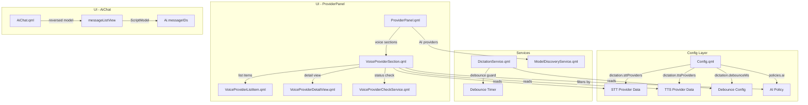

# Design Document: Voice Sidebar Fixes

## Overview

This design addresses three related UX issues in the Quickshell sidebar and dictation system:

1. **Voice Provider Panel** — Extending ProviderPanel to display STT/TTS provider entries from `Config.options.dictation.sttProviders` and `ttsProviders`, with connectivity status indicators and AI policy compliance.
2. **Dictation Debounce** — Adding a configurable debounce guard to `DictationService.onKeyTap()` that suppresses rapid duplicate signals from hardware like Logitech buttons that triple-fire within ~300ms.
3. **Chat ListView Ordering** — Fixing the `AiChat` message list so that `BottomToTop` layout direction correctly displays messages in chronological order (oldest at top, newest at bottom).

All three changes touch the existing QML component architecture without introducing new services or external dependencies. The design preserves existing patterns from `ModelDiscoveryService`/`ProviderPanel` for consistency.

## Architecture



### Design Decisions

1. **New QML components for voice providers** rather than adding to `ModelDiscoveryService` — voice providers have fundamentally different config shapes (endpoint/protocol/model vs. API key/chat endpoint) and simpler discovery (just connectivity checks, no model listing). A separate `VoiceProviderCheckService` keeps concerns separated.

2. **Debounce inside `onKeyTap()`** rather than at the GlobalShortcut level — the guard must distinguish between activation taps (from Idle, should be debounced) and stop taps (from Listening/StreamingActive, should be immediate after window expires). This state-aware logic belongs in the service.

3. **Model array reversal via `.slice().reverse()`** rather than changing `verticalLayoutDirection` — BottomToTop is needed to keep new messages anchored at the viewport bottom without manual scroll management. The fix reverses the model so Qt's "index 0 at visual bottom" renders as "newest at bottom".

## Components and Interfaces

### Area 1: Voice Provider Panel

#### VoiceProviderSection.qml (new)
A reusable section component placed inside `ProviderPanel.qml` below the AI provider list.

```qml
Item {
    id: root
    property string sectionTitle      // "Voice: Speech-to-Text" or "Voice: Text-to-Speech"
    property string providerType      // "stt" or "tts"
    property var providerData         // JsonObject from Config (sttProviders or ttsProviders)
    property int aiPolicy             // Config.options.policies.ai
    
    signal providerSelected(string providerKey)
    signal back()
    
    // Computed filtered provider list based on policy
    property var filteredProviders: {
        // Returns array of {key, config} objects filtered by policy
    }
}
```

#### VoiceProviderListItem.qml (new)
Delegate for voice provider entries in the list view. Mirrors `ProviderListItem.qml` pattern.

```qml
RippleButton {
    required property string providerKey
    required property var providerConfig
    required property string statusState  // "idle" | "checking" | "reachable" | "unreachable" | "local"
    signal clicked()
}
```

#### VoiceProviderDetailView.qml (new)
Detail view for editing voice provider settings. Adapts fields based on provider shape.

```qml
Item {
    required property string providerKey
    required property string providerType  // "stt" | "tts"
    required property var providerConfig
    signal back()
    
    // Dynamically renders fields based on which properties exist in providerConfig
    // Persists via Config.setNestedValue("dictation.<type>Providers.<key>.<field>", value)
}
```

#### VoiceProviderCheckService.qml (new singleton)
Handles async connectivity checks for voice provider endpoints.

```qml
Singleton {
    // State: { "whisperCpp": { status: "reachable", message: "" }, ... }
    property var checkStates: ({})
    
    function checkEndpoint(providerKey, endpoint, protocol)
    // Launches curl HEAD (HTTP) or timeout-wrapped connect (WebSocket/TCP)
    // Updates checkStates on completion
    
    function isLocal(endpoint): bool
    // Returns true if endpoint matches localhost/127.0.0.1/10.x/192.168.x
}
```

### Area 2: Dictation Debounce

#### DictationService.qml modifications

```qml
// New property binding
property int debounceMs: Config.options.dictation.debounceMs

// New debounce state
property bool _debounceActive: false

// New timer
Timer {
    id: debounceTimer
    interval: root.debounceMs
    repeat: false
    onTriggered: {
        root._debounceActive = false
    }
}

// Modified onKeyTap()
function onKeyTap() {
    // If debounce is active and we're in Listening/StreamingActive (just activated), reject
    if (root._debounceActive) {
        console.log("[DictationService] GATE_REJECT | reason=debounce")
        return
    }
    
    if (root.state === DictationService.State.Listening || 
        root.state === DictationService.State.StreamingActive) {
        // Recording — stop (debounce window already expired if we get here)
        stopRecording()
        return
    }
    
    // Idle → activate with debounce
    if (root.debounceMs > 0) {
        root._debounceActive = true
        debounceTimer.restart()
    }
    activate()
}
```

#### Config.qml addition

```qml
property JsonObject dictation: JsonObject {
    // ... existing properties ...
    property int debounceMs: 500  // New: 0-2000, default 500
}
```

### Area 3: Chat ListView Ordering Fix

#### AiChat.qml modifications

The `ScriptModel` for `messageListView` currently provides `Ai.messageIDs` filtered for visibility. Since `verticalLayoutDirection: ListView.BottomToTop` renders index 0 at the visual bottom, we need to reverse the array so the newest message (last in chronological order) ends up at index 0 (visual bottom).

```qml
model: ScriptModel {
    values: Ai.messageIDs.filter(id => {
        const message = Ai.messageByID[id];
        return message?.visibleToUser ?? true;
    }).slice().reverse()
}
```

The `index` property in the delegate now maps inversely to chronological position — index 0 is the newest message at the visual bottom. Existing delegate logic that uses `index` for anything chronological must be audited (currently only used for positional access).

## Data Models

### Config Schema Additions

#### `dictation.debounceMs` (new property)

| Field | Type | Default | Range | Description |
|-------|------|---------|-------|-------------|
| debounceMs | int | 500 | 0–2000 | Debounce window in milliseconds after activation |

Clamping: Values outside 0–2000 are clamped to the nearest bound before persisting. A value of 0 disables debounce entirely.

### Existing Data Shapes (reference)

#### STT Provider Config Shape (from `Config.options.dictation.sttProviders`)

```json
{
  "whisperCpp": { "endpoint": "http://localhost:8080", "protocol": "rest", "model": "base.en", "language": "en", "temperature": 0.0 },
  "fasterWhisper": { "endpoint": "http://localhost:8000", "protocol": "rest", "model": "base", "language": "en", "temperature": 0.0 },
  "vosk": { "endpoint": "ws://localhost:2700", "protocol": "websocket", "model": "vosk-model-en-us-0.22", "language": "en" },
  "whisperLive": { "endpoint": "ws://localhost:9090", "protocol": "websocket", "model": "base.en", "language": "en" }
}
```

#### TTS Provider Config Shape (from `Config.options.dictation.ttsProviders`)

```json
{
  "piper": { "endpoint": "tcp://localhost:10200", "protocol": "wyoming", "voice": "en_US-lessac-medium", "model": "" },
  "coqui": { "endpoint": "http://localhost:5002", "protocol": "rest", "voice": "tts_models/en/ljspeech/tacotron2-DDC", "language": "en" },
  "mimic3": { "endpoint": "http://localhost:59125", "protocol": "rest", "voice": "en_US/ljspeech_low", "language": "en" },
  "espeakNg": { "voice": "en", "speed": 175, "pitch": 50 }
}
```

### Voice Provider Check State Model

```typescript
interface CheckState {
    status: "idle" | "checking" | "reachable" | "unreachable" | "local";
    message: string;  // Error reason when unreachable, empty otherwise
}

// Stored as: { [providerKey: string]: CheckState }
```

### Policy Filtering Logic

The `isLocal(endpoint)` function determines endpoint locality:

```
isLocal(endpoint) → true when endpoint starts with:
  - http://localhost, http://127.0.0.1
  - ws://localhost, ws://127.0.0.1  
  - tcp://localhost, tcp://127.0.0.1
  - http://10., ws://10., tcp://10.
  - http://192.168., ws://192.168., tcp://192.168.
```

Provider filtering rules by policy:
- `policies.ai === 0`: Hide voice sections entirely
- `policies.ai === 1`: Show all providers
- `policies.ai === 2`: Show only providers where `isLocal(endpoint) === true` OR provider has no endpoint (e.g., espeakNg)


## Correctness Properties

*A property is a characteristic or behavior that should hold true across all valid executions of a system — essentially, a formal statement about what the system should do. Properties serve as the bridge between human-readable specifications and machine-verifiable correctness guarantees.*

### Property 1: Endpoint URL Validation

*For any* string input to the endpoint validation function, the function SHALL return `true` if and only if the string begins with one of `http://`, `https://`, `tcp://`, or `ws://`. All other strings SHALL return `false`.

**Validates: Requirements 2.5**

### Property 2: Connectivity Status Mapping

*For any* HTTP status code returned by a connectivity check, if the code is in the range [200, 499] (inclusive), the `mapConnectivityResult` function SHALL return status `"reachable"`. For status code 0 (network error) or codes >= 500 or timeout, it SHALL return `"unreachable"`.

**Validates: Requirements 3.3, 3.4**

### Property 3: Debounce State Machine

*For any* sequence of Dictation_Tap_Signal events with timestamps, given `debounceMs > 0` and initial state Idle:
- The first tap SHALL transition state to Listening/StreamingActive (activation).
- Any subsequent tap arriving within `debounceMs` of the first tap SHALL be discarded (no state change).
- Any tap arriving after `debounceMs` from the first tap SHALL stop recording (transition to Processing).

**Validates: Requirements 4.1, 4.2, 4.3, 4.4**

### Property 4: Debounce Idle Invariant

*For any* DictationService state snapshot, if `state === Idle` then `_debounceActive === false` and `debounceTimer.running === false`.

**Validates: Requirements 4.5**

### Property 5: Debounce Disabled at Zero

*For any* sequence of Dictation_Tap_Signal events with `debounceMs === 0`, no tap SHALL ever be discarded due to debounce. Every tap from Idle state SHALL activate, and every tap from Listening/StreamingActive SHALL stop recording.

**Validates: Requirements 5.3**

### Property 6: Debounce Value Clamping

*For any* integer value `x` passed to the debounceMs setter, the persisted value SHALL equal `Math.max(0, Math.min(2000, x))`.

**Validates: Requirements 5.4**

### Property 7: Message Chronological Ordering

*For any* array of message IDs in chronological order (oldest first), when the model transformation is applied for `BottomToTop` layout, the resulting model array SHALL be the reverse of the input — placing the newest message at index 0 (visual bottom) and the oldest at the last index (visual top), preserving top-to-bottom chronological reading order.

**Validates: Requirements 6.1, 6.2**

### Property 8: Voice Provider Policy Filtering

*For any* list of voice provider configurations (with mixed local and remote endpoints) and a policy value:
- When `policy === 1`, the filtered list SHALL equal the full input list (no filtering).
- When `policy === 2`, the filtered list SHALL contain only providers whose endpoint satisfies `isLocal(endpoint)` or providers that have no endpoint defined.
- When `policy === 0`, the filtered list SHALL be empty (voice sections hidden).

**Validates: Requirements 7.1, 7.4, 7.2**

### Property 9: TTS Detail View Field Derivation

*For any* TTS provider configuration object, the set of editable fields displayed in the detail view SHALL be exactly the set of keys present in that provider's configuration object (excluding the provider key name itself which is displayed as a read-only label).

**Validates: Requirements 2.2**

## Error Handling

### Voice Provider Connectivity Checks

| Error Condition | Handling |
|----------------|----------|
| HTTP timeout (3s) | Set status to "unreachable", show "Connection timed out" |
| Network error (DNS failure, refused) | Set status to "unreachable", show curl error message |
| WebSocket connect failure | Set status to "unreachable", show "WebSocket connection failed" |
| Invalid endpoint URL format | Show inline validation error, do not attempt check |
| Provider has no endpoint (CLI tool) | Display "local" status, skip network check |

### Debounce Guard

| Error Condition | Handling |
|----------------|----------|
| debounceMs set to negative value | Clamp to 0, log warning |
| debounceMs set above 2000 | Clamp to 2000, log warning |
| Timer fired but state already transitioned to Idle | No-op (timer stop is idempotent) |
| Rapid state cycling (Error → Idle → Listening) | debounceTimer.stop() on Idle transition ensures clean state |

### Chat ListView

| Error Condition | Handling |
|----------------|----------|
| Empty message array | Display placeholder (existing behavior preserved) |
| Message ID in model no longer in `Ai.messageByID` | Delegate gracefully handles `undefined` messageData |
| Rapid message additions during scroll | BottomToTop + reversed model ensures correct anchoring |

## Testing Strategy

### Property-Based Testing

This feature is suitable for property-based testing. The pure logic functions (URL validation, connectivity mapping, debounce state machine, array reversal, policy filtering, clamping) have clear input/output behavior with universal properties across large input spaces.

**Library**: [fast-check](https://github.com/dubzzz/fast-check) (JavaScript/TypeScript) for testing extracted pure logic functions.

**Configuration**: Minimum 100 iterations per property test.

**Tag format**: `Feature: voice-sidebar-fixes, Property {N}: {property_text}`

### Test Organization

#### Property Tests (fast-check)

Extract the following pure functions for property testing:

1. `validateEndpointUrl(url: string): boolean` — Property 1
2. `mapConnectivityResult(httpStatus: number, timedOut: boolean): CheckState` — Property 2
3. `debounceStateMachine(taps: TapEvent[], debounceMs: number, initialState: State): StateTransition[]` — Properties 3, 4, 5
4. `clampDebounceMs(value: number): number` — Property 6
5. `prepareMessageModel(ids: string[], layoutDirection: "BottomToTop" | "TopToBottom"): string[]` — Property 7
6. `filterProvidersByPolicy(providers: ProviderEntry[], policy: number): ProviderEntry[]` — Property 8
7. `deriveDetailFields(providerConfig: object): string[]` — Property 9

#### Unit Tests (example-based)

- STT/TTS provider list extraction from config snapshots
- Detail view field rendering for each known provider shape
- Back navigation preserves config state
- Policy=0 hides voice sections
- Policy change from 1→2 deselects remote provider
- Empty endpoint → "local" status

#### Integration Tests

- Config persistence round-trip (set field → read back)
- Debounce timer integration with QML runtime
- Auto-scroll behavior with message additions
- Connectivity check async non-blocking verification
