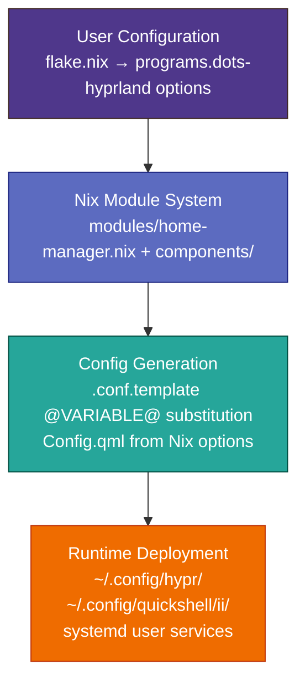
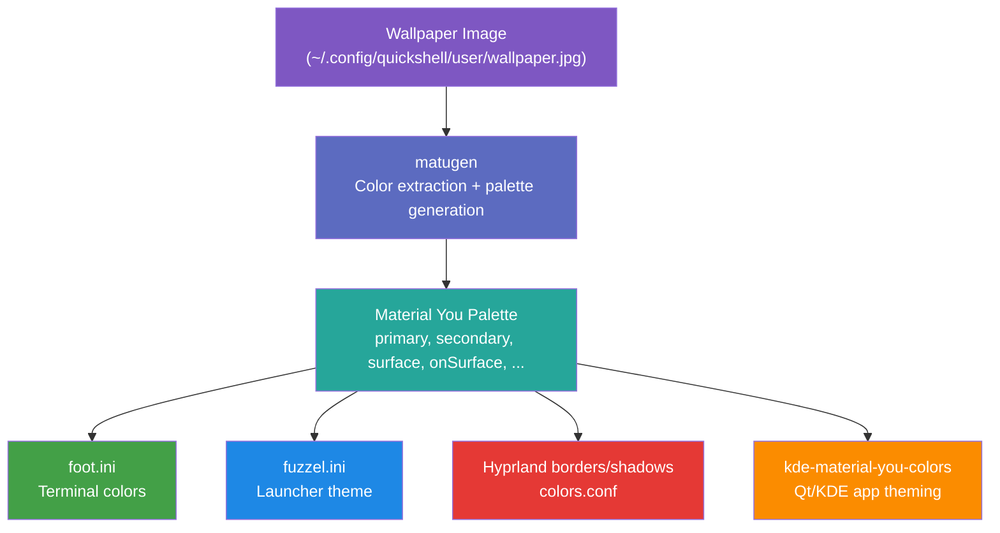
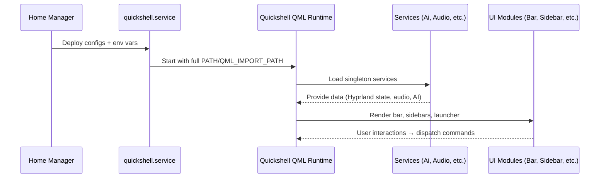
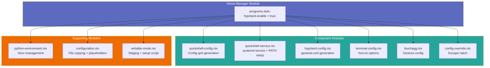
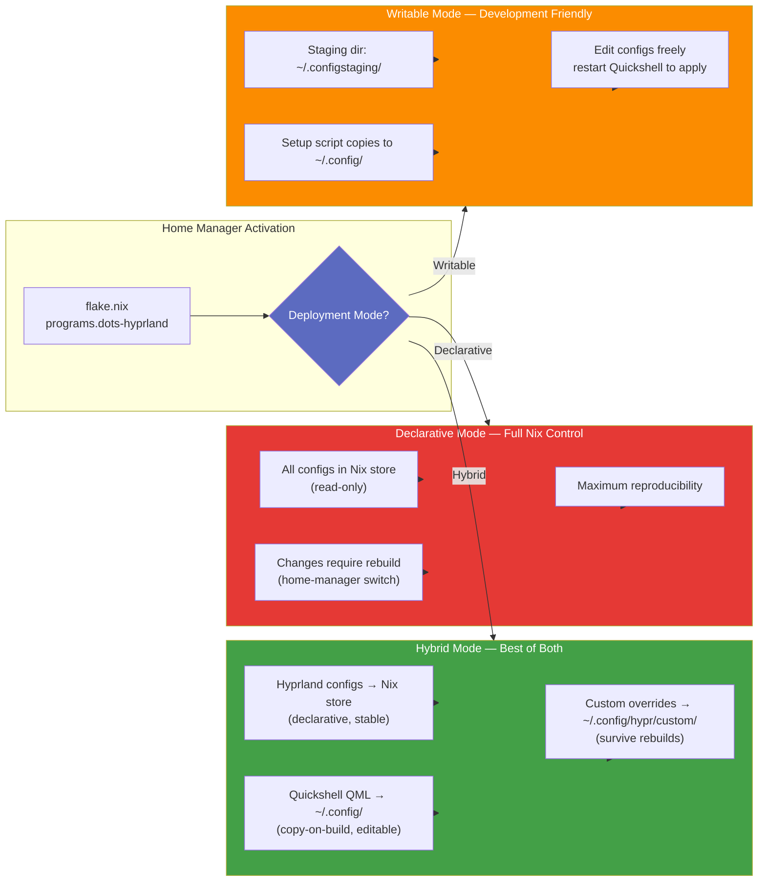
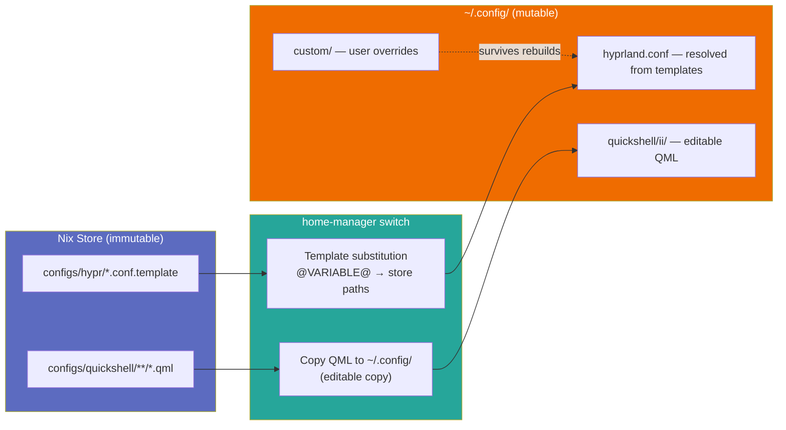

# Architecture Overview

## System Design

This project implements a declarative NixOS desktop environment using:
- **Hyprland** as the Wayland compositor
- **Quickshell** for the UI layer (bar, sidebar, launcher)
- **NixOS modules** for configuration management
- **Material You theming** via matugen and kde-material-you-colors

## Component Layers



## Data Flow

### Configuration Path

1. **User writes Nix options** in their flake:
   ```nix
   programs.dots-hyprland = {
     enable = true;
     quickshell.bar.bottom = false;
     hyprland.general.gapsIn = 4;
   };
   ```

2. **Home Manager module processes options**:
   - `modules/home-manager.nix` collects all component modules
   - Each component module (e.g., `quickshell-config.nix`) generates config files from Nix options

3. **Template substitution** at build time:
   - `.conf.template` files have `@VARIABLE@` placeholders
   - Nix substitutes these with actual values (binary paths, config content)

4. **Files deployed to user home**:
   - Hyprland configs → `~/.config/hypr/`
   - Quickshell QML → `~/.config/quickshell/ii/`
   - Terminal configs → `~/.config/foot/`

### Theming Pipeline



### Quickshell Service Flow



## Module System

### Home Manager Module (`modules/home-manager.nix`)

Main entry point. Imports all component modules:



Imports:

```nix
imports = [
  ./python-environment.nix      # Python venv setup
  ./configuration.nix           # File copying logic
  ./writable-mode.nix           # Writable mode support
  ./components/quickshell-service.nix  # systemd service
  ./components/quickshell-config.nix   # Config.qml generation
  ./components/hyprland-config.nix     # general.conf generation
  ./components/terminal-config.nix     # foot.ini options
  ./components/touchegg.nix            # Gesture config
  ./components/config-override.nix     # Escape hatch
];
```

### Component Modules

Each component module defines:
1. **Options** (`options.programs.dots-hyprland.<component>`)
2. **Config generation** (how options become files)
3. **Activation scripts** (post-deployment setup)

Example: `quickshell-config.nix` generates `Config.qml` from Nix options.

## Deployment Modes



### Mode Comparison

| Aspect | Hybrid (Recommended) | Declarative | Writable |
|--------|---------------------|-------------|----------|
| Hyprland configs | Nix store (read-only) | Nix store (read-only) | Nix store (read-only) |
| Quickshell QML | Copy to `~/.config/` | Nix store (read-only) | Staging → copy to `~/.config/` |
| Edit at runtime | Yes | No — rebuild required | Yes |
| Reproducibility | High | Maximum | Medium |
| Best for | Production use | CI/testing | Development iteration |

### How Hybrid Mode Works



## Key Files

| File | Purpose |
|------|---------|
| [`flake.nix`](../flake.nix) | Flake definition, overlays, dev shells |
| [`modules/home-manager.nix`](../modules/home-manager.nix) | Main HM module entry point |
| [`modules/components/quickshell-config.nix`](../modules/components/quickshell-config.nix) | Quickshell Config.qml generation |
| [`modules/components/hyprland-config.nix`](../modules/components/hyprland-config.nix) | Hyprland general.conf generation |
| [`packages/default.nix`](../packages/default.nix) | Utility scripts (generate-qmldir, etc.) |
| [`packages/dots-hyprland-packages.nix`](../packages/dots-hyprland-packages.nix) | Package sets (minimal/essential/all) |

## Upstream Integration

This flake wraps [end-4/dots-hyprland](https://github.com/end-4/dots-hyprland). The integration:

1. **Pins upstream commit** in `flake.lock`
2. **Applies overlays** to patch quickshell + kde-material-you-colors
3. **Adapts configs** for NixOS template system (`@VARIABLE@` substitution)
4. **Adds AI/voice features** on top of upstream Quickshell

### Sync Process

```bash
# Update to latest upstream commit
nix run .#update-flake -- <commit-hash-or-branch>

# Or manually edit flake.nix inputs
```

See [`docs/upstream-sync.md`](./upstream-sync.md) for detailed sync procedure.

## Testing Strategy

### Python Tests (`tests/*.py`)
- 34 test files using Hypothesis property-based testing
- Cover: template placeholders, wallpaper variants, keybind injection, voice assistant
- Run: `cd tests && python -m pytest`

### NixOS VM Test (`tests/vm-test.nix`)
- Full integration test in QEMU VM
- Verifies: config generation, placeholder resolution, service creation
- Run: `nix run .#vm` (interactive) or `nix flake check` (CI)

### JS Tests (`tests/js/`)
- Quickshell UI logic tests using Vitest
- Cover: action palette, chat sessions, dictation, model discovery
- Run: `cd tests/js && npm test`

## Development Workflow

```bash
# Enter dev shell
nix develop

# Test changes (temporary)
rsync -av configs/quickshell/ii/ ~/.config/quickshell/ii/
systemctl --user restart quickshell

# Run tests
cd tests && python -m pytest

# Build and apply
nix build .#homeConfigurations.declarative.activationPackage
./result/activate
```

## Security Considerations

- **Quickshell service sandbox**: `ProtectSystem=strict`, 2GB memory limit
- **API keys**: Stored via libsecret (system keyring), not in config files
- **Python venv**: Isolated dependencies, no system Python pollution
- **No network at build time**: All downloads happen at fetch phase only

## Performance Notes

- **Template compilation**: Happens once at build time, cached in store
- **Quickshell startup**: ~2s on modern hardware (QML cache helps)
- **Color generation**: ~500ms per wallpaper change (matugen + Python scripts)
- **Voice assistant**: Streaming adds ~100ms latency (negligible)
