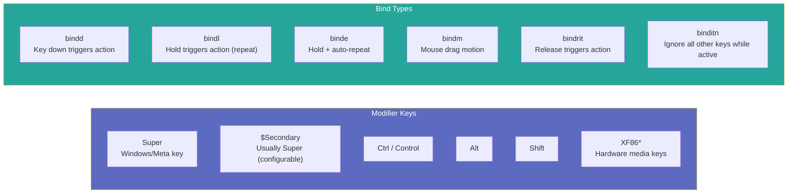

# Keybinds Reference

This document provides a comprehensive reference for all keyboard shortcuts in the dots-hyprland desktop environment, covering both the **NixOS fork** (`.conf.template` format) and the **upstream** (Lua `hl.bind()` format).

## Legend



---

## Shell / Launcher

| Key Combo | Action | Type | Notes |
|-----------|--------|------|-------|
| `Super` (tap) | Toggle overview/launcher | `bindd` | Full-screen workspace grid + search bar |
| `$Secondary + Space` | Toggle overview (upstream: Super+Super_L/R release) | `bindid` | Alternative launcher trigger |
| `Super + Tab` | Toggle workspaces overview | `bindd` | Signal: `quickshell:overviewWorkspacesToggle` |
| `Super + V` | Clipboard history | `bindd` | Fuzzy search via cliphist/fuzzel |
| `Super + .` (Period) | Emoji picker | `bindd` | Unicode 17.0 searchable |
| `Super + A` | Left sidebar (AI chat) | `bindd` | Signal: `quickshell:sidebarLeftToggle` |
| `Super + Alt + A` | Detach left sidebar | `bind` | Floating detached window |
| `Super + B` | Toggle left sidebar (alt) | `bind` | Same as Super+A |
| `Super + O` | Toggle left sidebar (alt) | `bind` | Same as Super+A |
| `Super + N` | Right sidebar (toggles/notifications) | `bindd` | Signal: `quickshell:sidebarRightToggle` |
| `Super + /` | Cheatsheet (all keybinds reference) | `bindd` | Parsed from config, organized by section |
| `Super + K` | On-screen keyboard | `bindd` | QWERTY full layout, pinnable |
| `Super + M` | Media controls overlay | `bindd` | Play/pause/next/prev with progress bar |
| `Super + G` | Widget overlay toggle (new) | `bindd` | Signal: `quickshell:overlayToggle` |
| `Ctrl + Alt + Delete` | Session/power menu | `bindd` | Fallback: wlogout |
| `Shift + Super + Alt + /` | Welcome/first-run screen | `bind` | Launches welcome.qml |

## Brightness & Volume (Hardware Keys)

| Key Combo | Action | Type | Notes |
|-----------|--------|------|-------|
| `XF86MonBrightnessUp` | Increase brightness | `bindle` | Quickshell IPC → brightnessctl fallback |
| `XF86MonBrightnessDown` | Decrease brightness | `bindle` | Quickshell IPC → brightnessctl fallback |
| `XF86AudioRaiseVolume` | Increase volume (limit 1.5x) | `bindle` | Updated from -l 1 to -l 1.5 |
| `XF86AudioLowerVolume` | Decrease volume | `bindle` | wpctl set-volume 2% step |
| `XF86AudioMute` | Toggle master mute | `bindl` | wpctl set-mute @DEFAULT_SINK@ toggle |
| `Super + Shift + M` | Toggle master mute (alt) | `bindld` | Same as XF86AudioMute |
| `Alt + XF86AudioMute` | Toggle mic mute | `bindl` | wpctl set-mute @DEFAULT_SOURCE@ toggle |
| `XF86AudioMicMute` | Toggle mic mute (alt) | `bindl` | Same as Alt+XF86AudioMute |
| `Super + Alt + M` | Toggle mic mute (alt2) | `bindld` | Same as above |

## Media Controls

| Key Combo | Action | Type | Notes |
|-----------|--------|------|-------|
| `Super + Shift + N` | Next track | `bindl` | playerctl next with position tracking |
| `XF86AudioNext` | Next track (hardware) | `bindl` | Same as Super+Shift+N |
| `XF86AudioPrev` | Previous track (hardware) | `bindl` | playerctl previous |
| `Super + Shift + B` | Previous track | `bindl` | playerctl previous |
| `Super + Shift + P` | Play/pause | `bindl` | playerctl play-pause |
| `XF86AudioPlay` | Play (hardware) | `bindl` | Same as Super+Shift+P |
| `XF86AudioPause` | Pause (hardware) | `bindl` | Same as Super+Shift+P |
| `Super + Shift + Alt + mouse:275` | Previous track (mouse) | `bind` | Side button 1 |
| `Super + Shift + Alt + mouse:276` | Next track (mouse) | `bind` | Side button 2 |

## Window Management

| Key Combo | Action | Type | Notes |
|-----------|--------|------|-------|
| `Super + Q` | Close window | `bind` | killactive |
| `Super + Shift + Alt + Q` | Force kill window | `bind` | hyprctl kill |
| `Super + Alt + Space` | Toggle float/tile | `bind` | togglefloating |
| `Super + D` | Maximize (size 1) | `bind` | fullscreen, 1 |
| `Super + F` | True fullscreen | `bind` | fullscreen, 0 |
| `Super + Alt + F` | Fullscreen spoof (no border) | `bind` | fullscreenstate, 0 3 |
| `Super + P` | Pin window (always on top) | `bind` | pin |
| `Super + ;` (Semicolon) | Decrease split ratio | `binde` | splitratio -0.1 (repeat) |
| `Super + '` (Apostrophe) | Increase split ratio | `binde` | splitratio +0.1 (repeat) |
| `Super + mouse:272` | Drag to move window | `bindm` | movewindow |
| `Super + mouse:274` | Drag to move window (alt) | `bindm` | movewindow |
| `Super + mouse:273` | Drag to resize window | `bindm` | resizewindow |
| `Super + Left/Right/Up/Down` | Focus in direction | `bind` | movefocus l/r/u/d |
| `Super + BracketLeft/BracketRight` | Focus left/right (alt) | `bind` | movefocus l/r |
| `Super + Shift + Left/Right/Up/Down` | Move window in direction | `bind` | movewindow l/r/u/d |

## Workspace Navigation

### Switching Workspaces

| Key Combo | Action | Type | Notes |
|-----------|--------|------|-------|
| `Super + 1-0` | Focus workspace N | `bind` | Via workspace_action.sh |
| `Super + code:10-19` (numpad top row) | Focus workspace N | `bind` | Same as above, numpad keys |
| `Ctrl + Super + Right/Left` | Focus relative workspace | `bind` | workspace r+1 / r-1 |
| `Ctrl + Super + Alt + Right/Left` | Focus next busy workspace | `bind` | workspace m+1 / m-1 |
| `Super + Page_Down/Page_Up` | Focus next/prev workspace | `bind` | +1 / -1 (upstream uses r+1/r-1) |
| `Ctrl + Super + Page_Down/Page_Up` | Focus relative workspace | `bind` | r+1 / r-1 |
| `Super + mouse_up/mouse_down` | Focus next/prev workspace | `bind` | +1 / -1 |
| `Ctrl + Super + mouse_up/mouse_down` | Focus relative workspace | `bind` | r+1 / r-1 |
| `Ctrl + Super + Up/Down` | Jump 5 workspaces | `bind` | r-5 / r+5 |
| `Super + BracketLeft/BracketRight` | Focus left/right 1 workspace | `bind` | -1 / +1 |

### Sending Windows to Workspaces

| Key Combo | Action | Type | Notes |
|-----------|--------|------|-------|
| `Super + Alt + 1-0` | Send window to workspace N | `bind` | movetoworkspacesilent via script |
| `Super + Shift + mouse_down/up` | Send to prev/next workspace | `bind` | movetoworkspace r-1 / r+1 |
| `Super + Alt + mouse_down/up` | Send to relative workspace | `bind` | movetoworkspace -1 / +1 |
| `Super + Shift + Page_Down/Page_Up` | Send to prev/next workspace | `bind` | movetoworkspace r-1 / r+1 |
| `Ctrl + Super + Shift + Left/Right` | Send to relative workspace | `bind` | movetoworkspace r-1 / r+1 |

### Special Workspace (Scratchpad)

| Key Combo | Action | Type | Notes |
|-----------|--------|------|-------|
| `Super + Alt + S` | Send to scratchpad | `bind` | movetoworkspacesilent special:special |
| `Ctrl + Super + S` | Toggle scratchpad | `bind` | togglespecialworkspace |
| `Super + S` | Toggle scratchpad (alt) | `bind` | togglespecialworkspace |
| `Super + mouse:275` | Toggle scratchpad (mouse) | `bind` | togglespecialworkspace |

## Screen Utilities

| Key Combo | Action | Type | Notes |
|-----------|--------|------|-------|
| `Super + Shift + S` | Region screenshot | `bindd` | quickshell:regionScreenshot → slurp/grim/hyprshot |
| `Print` (single) | Fullscreen screenshot → clipboard | `bindld` | grim -o active monitor → wl-copy |
| `Ctrl + Print` | Fullscreen screenshot → file + clipboard | `bindld` | Per-monitor save to ~/Pictures/Screenshots |
| `Super + Shift + C` | Color picker | `bindd` | hyprpicker -a → clipboard |
| `Super + Shift + X` | OCR region → clipboard | `bindd` | slurp → tesseract → wl-copy (upstream: Super+Shift+T) |
| `Super + Shift + T` | Screen translate (new) | `bindd` | quickshell:screenTranslate |
| `Super + Shift + A` | Google Lens / region search (new) | `bindd` | quickshell:regionSearch |
| `Super + Shift + R` | Record region (primary, new) | `bindd` | record.sh (upstream: Super+Alt+R) |
| `Super + Alt + R` | Record region (secondary) | `bindd` | record.sh (no sound) |
| `Ctrl + Alt + R` | Record fullscreen (no sound) | `bindd` | record.sh --fullscreen |
| `Super + Shift + Alt + R` | Record fullscreen + sound | `bindd` | record.sh --fullscreen --sound |
| `Super + Shift + Alt + mouse:273` | AI summary of selected text | `bindd` | primary-buffer-query.sh |
| `Ctrl + Super + T` | Change wallpaper | `bindd` | quickshell:wallpaperSelectorToggle (primary) → switchwall.sh (fallback) |
| `Ctrl + Super + Alt + T` | Random wallpaper (new) | `bindd` | quickshell:wallpaperSelectorRandom |
| `Ctrl + Super + P` | Cycle panel family (new) | `bindd` | quickshell:panelFamilyCycle |
| `Super + = / Super + -` | Zoom in/out | `binde` | Quickshell IPC zoom (upstream: Lua stateful zoom) |

## Applications

| Key Combo | Action | Type | Notes |
|-----------|--------|------|-------|
| `Super + Return` | Open terminal | `bind` | launch_first_available.sh with @TERMINAL_APPS@ |
| `Super + T` | Open terminal (alt) | `bind` | Same as above |
| `Ctrl + Alt + T` | Open terminal (Ubuntu style) | `bind` | Same as above |
| `Super + E` | File manager | `bind` | dolphin/nautilus/nemo/thunar |
| `Super + W` | Web browser | `bind` | firefox/chrome/brave/etc. |
| `Super + C` | Code editor | `bind` | vscode/codium/zed/kate/emacs/nvim |
| `Ctrl + Super + Shift + Alt + W` | Office software (new) | `bind` | wps/onlyoffice (upstream: Super+Shift+W) |
| `Super + X` | Text editor | `bind` | kate/gnome-text-editor/emacs |
| `Ctrl + Super + V` | Volume mixer | `bind` | pavucontrol-qt/pavucontrol |
| `Super + I` | Settings app | `bind` | quickshell settings / systemsettings / gnome-control-center |
| `Ctrl + Shift + Escape` | Task manager | `bind` | plasma-systemmonitor / htop / btop |

## Session & Power

| Key Combo | Action | Type | Notes |
|-----------|--------|------|-------|
| `Super + L` | Lock screen | `bindd` | loginctl lock-session (via hyprlock) |
| `Super + Shift + L` | Suspend system | `bindld` | systemctl suspend \|\| loginctl suspend |
| `Ctrl + Shift + Alt + Super + Delete` | Power off | `bindd` | systemctl poweroff \|\| loginctl poweroff |

## Special Modes

### Virtual Machine Passthrough (`Super + Alt + F1`)

Enters a submap that passes all keys to the VM:
```conf
bind = Super+Alt, F1, submap, virtual-machine
submap = virtual-machine
# All keybinds disabled in this submap; keys pass through to VM
bind = Super+Alt, F1, submap, reset  # Exit VM mode
```

### Testing Keys

| Key Combo | Action | Notes |
|-----------|--------|-------|
| `Super + Alt + F11` | Test notification with image + actions | Complex notification test |
| `Super + Alt + F12` | Test notification with random image | Image notification test |
| `Super + Alt + Equal` | Urgent critical notification | "Ah hell no" |

### Cursed / Fun

| Key Combo | Action | Notes |
|-----------|--------|-------|
| `Ctrl + Super + Backslash` | Resize active window to 640×480 | "Not amogus large" |

---

## Scroll Actions (Bar)

| Location | Scroll Direction | Action |
|----------|-----------------|--------|
| Left bar | Scroll up/down | Adjust brightness |
| Right bar | Scroll up/down | Adjust volume |

## Touchpad Gestures (Hyprland Native)

| Gesture | Action |
|---------|--------|
| 3-finger horizontal swipe | Switch workspace |
| 3-finger pinch (touchegg) | Close window |
| 3-finger swipe up (touchegg) | Overview |
| 4-finger swipe (touchegg) | Move window |
| 2-finger pinch (browser) | Zoom in/out |

## Touchpad Settings

```ini
input {
    touchpad {
        natural_scroll = yes
        disable_while_typing = true
        clickfinger_behavior = true
        scroll_factor = 0.5
    }
}
```

---

## Template Variables (NixOS Fork)

These `@VARIABLE@` placeholders are resolved at build time by the Nix template system:

| Variable | Resolves To | Example Values |
|----------|-------------|----------------|
| `@TERMINAL_APPS@` | Terminal launch command list | `foot`, `kitty -1`, `alacritty` |
| `@BROWSER_APPS@` | Browser launch command list | `firefox`, `zen-browser`, `brave` |
| `@FILE_MANAGER_APPS@` | File manager command list | `dolphin`, `nautilus`, `thunar` |
| `@CODE_EDITOR_APPS@` | Code editor command list | `code`, `codium`, `zed` |
| `@OFFICE_APPS@` | Office suite command list | `wps`, `onlyoffice-desktopeditors` |
| `@TEXT_EDITOR_APPS@` | Text editor command list | `kate`, `gnome-text-editor`, `emacs` |
| `@VOLUME_MIXER_APPS@` | Volume mixer command list | `pavucontrol-qt`, `pavucontrol` |
| `@SETTINGS_APPS@` | Settings app command list | `systemsettings`, `gnome-control-center` |
| `@TASK_MANAGER_APPS@` | Task manager command list | `plasma-systemmonitor`, `btop` |
| `@QUICKSHELL_BIN@` | Quickshell binary path | `/nix/store/...-quickshell/bin/quickshell` |
| `@FUZZEL_BIN@` | Fuzzel launcher path | `/nix/store/...-fuzzel/bin/fuzzel` |
| `@BRIGHTNESSCTL_BIN@` | Brightness control path | `/nix/store/...-brightnessctl/bin/brightnessctl` |
| `@WPCTL_BIN@` | WirePlumber control path | `/nix/store/...-wireplumber/bin/wpctl` |
| `@PLAYERCTL_BIN@` | Player control path | `/nix/store/...-playerctl/bin/playerctl` |
| `@WL_COPY_BIN@` | Wayland clipboard copy | `/nix/store/...-wl-clipboard/bin/wl-copy` |
| `@GRIM_BIN@` | Screenshot tool | `/nix/store/...-grim/bin/grim` |
| `@HYPRSHOT_BIN@` | Hyprshot screenshot | `/nix/store/...-hyprshot/bin/hyprshot` |
| `@TESSERACT_BIN@` | OCR engine | `/nix/store/...-tesseract/bin/tesseract` |
| `@HYPRPICKER_BIN@` | Color picker | `/nix/store/...-hyprpicker/bin/hyprpicker` |
| `@CLIPHIST_BIN@` | Clipboard history | `/nix/store/...-cliphist/bin/cliphist` |
| `@CUSTOM_KEYBINDS@` | User custom keybinds injection point | Empty by default |

---

## Keybind File Format Reference

### NixOS Fork (`.conf.template`)

```conf
# Section header
#!
##! Shell

# Basic bind (press + release)
bindd = Super, A, ..., global, quickshell:sidebarLeftToggle

# Hold-to-repeat bind
bindle = , XF86MonBrightnessUp, exec, ...

# Auto-repeating bind (hold for continuous action)
binde = Super, Semicolon, splitratio, -0.1

# Mouse drag bind
bindm = Super, mouse:272, movewindow

# Release-triggered bind
bindrit = , Super_L, global, quickshell:workspaceNumber

# Ignore-all-keys-while-active bind
binditn = Super, catchall, global, quickshell:overviewToggleReleaseInterrupt

# Comment format for cheatsheet display
# Description text appears in cheatsheet; [hidden] hides it
```

### Upstream (Lua `keybinds.lua`)

```lua
-- Basic bind
hl.bind("SUPER + A", function()
    quickshell:call("global", "quickshell:sidebarLeftToggle")
end, { global = true })

-- Hold-to-repeat with repeating option
hl.bind("SUPER + Semicolon", function()
    hl.dispatch("splitratio -0.1")
end, { repeating = true })

-- Submap definition
hl.define_submap("virtual-machine", function()
    hl.bind("SUPER + ALT + F1", function()
        -- Toggle submap
    end, { submap_universal = true })
end)
```

---

## Notes on Differences Between Fork and Upstream

| Aspect | NixOS Fork | Upstream |
|--------|-----------|----------|
| Overview trigger | `$Secondary + Space` | `SUPER_L/R release` |
| Zoom implementation | IPC via Quickshell | Lua stateful (`hl.get_config`) |
| Volume limit | `-l 1.5` (150%) | `-l 1.5` (same, upstream updated) |
| OCR keybind | `Super+Shift+X` | `Super+Shift+X` (upstream updated from T) |
| Record primary key | `Super+Shift+R` | `Super+Shift+R` (upstream updated from Alt) |
| Record flags | `--fullscreen --sound` | `--fullscreen --sound` (upstream updated) |
| Suspend command | No `sleep 0.1` prefix | Same (upstream removed sleep) |
| Scratchpad name | `special:special` | `special:special` (upstream updated) |
| Alt+F4 behavior | `killactive` | Notification + non_consuming (upstream changed) |
| Office keybind | `Ctrl+Super+Shift+Alt+W` | Same (upstream updated from Super+Shift+W) |
