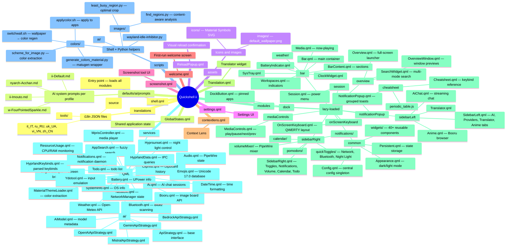
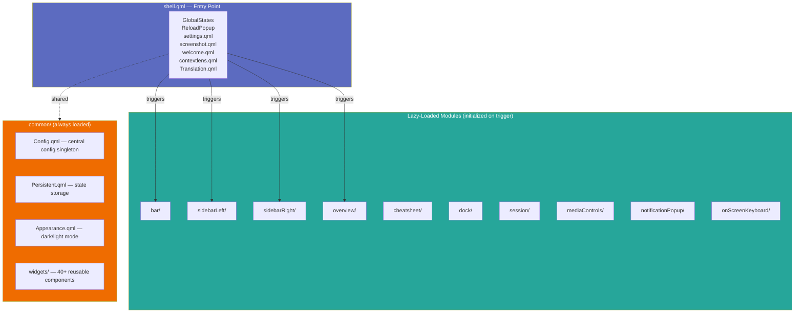
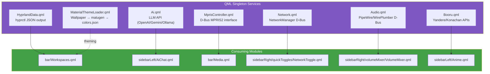
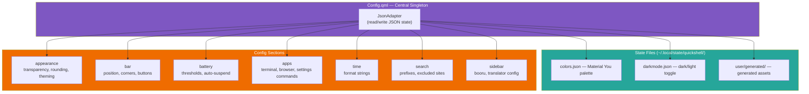

# Upstream dots-hyprland Quickshell Architecture

This document describes the architecture of [end-4/dots-hyprland](https://github.com/end-4/dots-hyprland) — specifically the **illogical-impulse** Quickshell desktop environment. This is the upstream codebase that [`end-4-flakes`](../flake.nix) wraps and extends for NixOS.

## Overview

The illogical-impulse (ii) desktop is built on:
- **Hyprland** — Wayland compositor with dwindle tiling
- **Quickshell** — QtQuick-based widget system (by [outfoxxed](https://github.com/outfoxxed))
- **Material You theming** — Wallpaper-driven color pipeline via matugen + kde-material-you-colors

The entire desktop UI lives in QML under `.config/quickshell/ii/`. Quickshell runs as a layer-shell client, compositing bar, sidebars, launcher, and overlays on top of Hyprland windows.

## Directory Structure



## Module Loading (shell.qml)

The [`shell.qml`](../configs/quickshell/shell.qml) entry point uses **lazy loading** — modules only initialize when triggered:

```qml
LazyLoader { active: enableBar; component: Bar {} }
LazyLoader { active: enableSidebarLeft; component: SidebarLeft {} }
// ... etc.
```

Each module has its own `qmldir` file declaring QML types for import resolution. The [`generate-qmldir.sh`](../packages/scripts/generate-qmldir.sh) script in the NixOS fork auto-generates these from directory structure.



## Service Architecture

Services are **QML singletons** that provide data to modules via D-Bus, IPC, or file I/O:



| Service | Data Source | Used By |
|---------|-------------|---------|
| [`HyprlandData.qml`](../configs/quickshell/services/HyprlandData.qml) | `hyprctl` JSON output | Bar workspaces, overview windows |
| [`Ai.qml`](../configs/quickshell/services/Ai.qml) | LLM API (OpenAI/Gemini/Ollama/etc.) | Sidebar AI chat |
| [`MaterialThemeLoader.qml`](../configs/quickshell/services/MaterialThemeLoader.qml) | Wallpaper image → matugen → colors.json | All theming |
| [`MprisController.qml`](../configs/quickshell/services/MprisController.qml) | D-Bus MPRIS2 interface | Bar media widget, media controls overlay |
| [`Network.qml`](../configs/quickshell/services/Network.qml) | NetworkManager D-Bus | Right sidebar toggle, status indicator |
| [`Audio.qml`](../configs/quickshell/services/Audio.qml) | PipeWire/WirePlumber D-Bus | Volume mixer, bar mute indicator |
| [`Booru.qml`](../configs/quickshell/services/Booru.qml) | Yandere/Konachan/Waifu.im APIs | Sidebar anime tab |

## Configuration System (Config.qml)

[`Config.qml`](../configs/quickshell/modules/common/Config.qml) is the **central configuration singleton**. It uses a `JsonAdapter` to read/write settings from `~/.config/quickshell/ii/user/generated/colors.json` and related state files.



Key config sections:
- `appearance` — transparency, rounding, anti-flashbang, wallpaper theming
- `bar` — position, corner style, utility buttons, workspace count
- `battery` — low/critical thresholds, auto-suspend
- `apps` — terminal, bluetooth, network, task manager commands
- `time` — format strings for clock display
- `search` — prefixes (`?`, `;`, `:`), excluded sites, debounce timing
- `sidebar` — booru settings, translator config, keep-right-loaded

## Keybinds Architecture (upstream)

The upstream uses **Lua-based keybinds** via Hyprland's `hl.bind()` API in [`keybinds.lua`](https://github.com/end-4/dots-hyprland/blob/main/dots/.config/hypr/hyprland/keybinds.lua). This is a significant architectural difference from the NixOS fork which uses `.conf.template` format.

Key differences:
| Aspect | Upstream (Lua) | NixOS Fork (.conf.template) |
|--------|----------------|----------------------------|
| Format | `hl.bind("KEY", function() ... end)` | `bind = Key, Modifier, dispatcher, args` |
| Variables | Lua `variables.lua` | `@VARIABLE@` placeholders |
| Loops | `for i=1,10 do hl.bind(...) end` | Individual lines per workspace |
| Submaps | `hl.define_submap("name", ...)` | `submap = name` / `submap = reset` blocks |
| Stateful zoom | `hl.get_config("cursor:zoom_factor")` | IPC via Quickshell (separate state) |

See [`docs/keybind-analysis.md`](./keybind-analysis.md) and [`docs/keybind-equivalence-verification.md`](./keybind-equivalence-verification.md) for detailed comparison.

## Hyprland Configuration (upstream)

The upstream Hyprland config is split across multiple files sourced from `hyprland.conf`:

| File | Purpose |
|------|---------|
| [`general.conf`](../configs/hypr/general.conf.template) | Gaps, borders, blur, animations, input, plugins |
| [`keybinds.conf`](../configs/hypr/keybinds.conf.template) | ~145 keybind entries with `@VARIABLE@` paths |
| [`rules.conf`](../configs/hypr/rules.conf.template) | Window rules (float/size/position), layer rules, workspace rules |
| [`colors.conf`](../configs/hypr/colors.conf.template) | Border colors, hyprbars plugin styling |
| [`env.conf`](../configs/hypr/env.conf.template) | Environment variables (IM, themes, venv path) |
| [`execs.conf`](../configs/hypr/execs.conf.template) | Autostart programs (Quickshell, hypridle, clipboard monitor) |
| [`hypridle.conf`](../configs/hypr/hypridle.conf.template) | 5-stage idle cascade: dim → lock → DPMS off → suspend |

### Custom Config Override System

Both upstream and NixOS fork support `~/.config/hypr/custom/` files that survive rebuilds:
- `custom/general.conf` — user overrides for gaps, rounding, etc.
- `custom/keybinds.conf` — additional keybinds without editing the template
- `custom/rules.conf` — custom window/layer rules
- `custom/env.conf` — extra environment variables

These are sourced at the end of each config file via:
```conf
source = ~/.config/hypr/custom/general.conf
```

## Python Environment

The upstream uses a **virtual environment** at `~/.local/state/quickshell/.venv` for Material You color generation. Dependencies (from [`requirements.txt`](https://github.com/end-4/dots-hyprland/blob/main/scriptdata/requirements.txt)):

| Package | Purpose |
|---------|---------|
| `materialyoucolor` | Google's Material You algorithm — extracts palette from wallpaper |
| `pillow` (PIL) | Image processing for color extraction and region detection |
| `numpy` | Array operations for image analysis |
| `boto3` | AWS SDK for Bedrock API access (NixOS fork addition) |
| `websockets` | WebSocket client for streaming voice (NixOS fork addition) |

In the NixOS fork, this is managed declaratively via [`modules/python-environment.nix`](../modules/python-environment.nix).

## Upstream Package System (Arch Linux)

The upstream uses **PKGBUILD meta-packages** in `arch-packages/` for Arch-based distros. Each meta-package groups dependencies:

| Meta-Package | Contents |
|-------------|----------|
| `illogical-impulse-basic` | axel, bc, cliphist, curl, jq, meson, ripgrep, rsync, wget |
| `illogical-impulse-widgets` | fuzzel, hypridle, hyprlock, hyprpicker, quickshell, translate-shell, wlogout + Qt/KDE deps |
| `illogical-impulse-hyprland` | hyprcursor, hyprlang, hyprutils, wl-clipboard, xdg-desktop-portal-hyprland |
| `illogical-impulse-python` | clang, gtk4, libadwaita, libsoup3, opencv4, sassc (build deps) |
| `illogical-impulse-audio` | pipewire, wireplumber, pavucontrol, playerctl |
| `illogical-impulse-fonts-themes` | noto-fonts, nerd-fonts, material-design-icons, font-awesome |

The NixOS fork maps these to [`packages/dots-hyprland-packages.nix`](../packages/dots-hyprland-packages.nix) with three package sets: `minimal`, `essential`, and `all`.

## Keybind Reference (upstream Lua → .conf mapping)

| Upstream Lua | NixOS .conf Equivalent |
|-------------|----------------------|
| `hl.bind("SUPER + A", ...)` | `bindd = Super, A, ..., global, quickshell:sidebarLeftToggle` |
| `hl.bind("Ctrl+Super+T", ...)` | `bindd = Ctrl+Super, T, ..., exec, @QUICKSHELL_BIN@ -c $qsConfig ipc call wallpaperSelectorToggle` |
| `hl.bind("SUPER + G", fn, { global = true })` | `bindd = Super, G, ..., global, quickshell:overlayToggle` |
| `hl.bind("SUPER + ALT + F1", ...)` (submap) | `bind = Super+Alt, F1, submap, virtual-machine` + `submap = virtual-machine` block |

## NixOS Fork Additions Beyond Upstream

The [`end-4-flakes`](../flake.nix) fork adds these features not present in upstream:

1. **Multi-provider AI** — 7 LLM providers (OpenAI, Anthropic, Gemini, Mistral, OpenRouter, AWS Bedrock, Ollama + custom endpoints) vs upstream's Gemini/Ollama only
2. **Streaming voice dictation** — Real-time transcription via WebSocket or chunked HTTP
3. **Bidirectional voice agent** — Full duplex conversations via Amazon Nova Sonic / OpenAI Realtime API
4. **AI Action Palette** — Natural language → structured desktop actions (`?` prefix in launcher)
5. **Context Lens** — `Super+Shift+A` screen capture + AI vision analysis
6. **HyprMCP server** — Model Context Protocol for programmatic desktop control
7. **Demo Driver** — Automated ydotool-based desktop demonstration (30+ scenes)
8. **Declarative NixOS modules** — Full Home Manager integration replacing imperative install.sh
9. **Template system** — `.conf.template` with `@VARIABLE@` substitution for Nix store paths
10. **Dark/Light wallpaper variants** — Automatic theme switching based on image analysis
